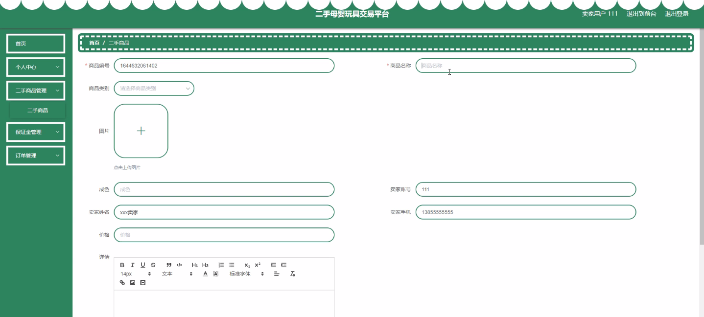
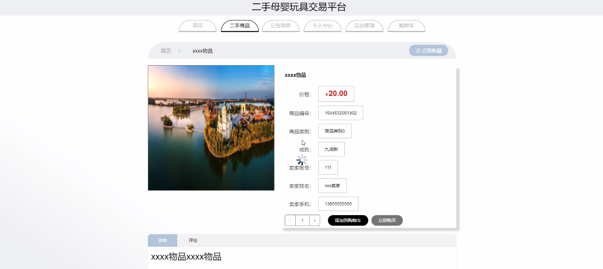
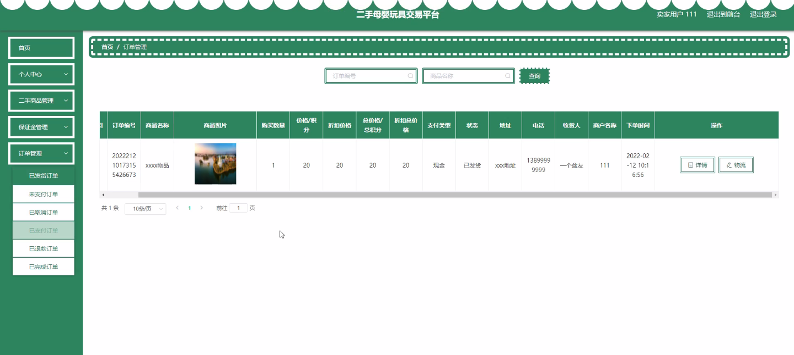

****本项目包含程序+源码+数据库+LW+调试部署环境，文末可获取一份本项目的java源码和数据库参考。****

## ******开题报告******

研究背景：
随着社会经济的发展和人们生活水平的提高，母婴玩具市场逐渐兴起。然而，随之而来的问题是，许多家庭在孩子长大后会面临处理闲置母婴玩具的困扰。同时，许多家庭希望购买二手母婴玩具以节省开支。因此，建立一个专门的二手母婴玩具交易平台对于解决这一问题具有重要意义。

研究意义：
二手母婴玩具交易平台的建立可以满足家庭间的需求匹配，实现资源的有效利用。通过这个平台，卖家可以方便地出售闲置的母婴玩具，减少浪费；买家可以以较低的价格购买到质量良好的二手母婴玩具，降低了家庭的经济压力。此外，该平台还可以促进社区内的互助和共享精神，加强社会联系。

研究目的：
本研究旨在设计和开发一个二手母婴玩具交易平台，为家庭提供一个安全、便捷的交易环境，实现闲置母婴玩具的再利用。通过该平台，用户可以轻松找到合适的二手母婴玩具，并进行交易。同时，该平台还将提供保证金、咨询卖家和卖家回复等功能，以确保交易的安全性和可靠性。

研究内容： 本研究的主要内容包括以下系统功能：

  1. 用户管理：设计并实现用户注册、登录、个人信息管理等功能，确保用户身份的真实性和安全性。
  2. 卖家用户管理：为卖家用户提供发布商品、编辑商品信息、管理订单等功能，方便他们出售自己的闲置母婴玩具。
  3. 商品类别管理：建立商品分类体系，使用户能够快速准确地找到所需的二手母婴玩具。
  4. 二手商品展示与搜索：设计并实现二手商品的展示页面和搜索功能，使用户能够浏览和筛选感兴趣的商品。
  5. 保证金管理：引入保证金机制，提高交易的可靠性和信任度，减少虚假交易和欺诈行为。
  6. 咨询卖家与卖家回复：为买家提供向卖家咨询问题的功能，并确保卖家能够及时回复买家的咨询。

拟解决的主要问题：

  1. 如何确保用户信息的安全性和隐私保护？
  2. 如何设计一个用户友好的界面，使用户能够方便快捷地进行交易？
  3. 如何建立一个可靠的评价体系，提供对卖家信誉的评估？
  4. 如何处理交易纠纷和投诉问题，保证交易的公平性和顺利进行？
  5. 如何防止虚假交易和欺诈行为的发生？

研究方案和预期成果：
本研究将采用软件开发的方法，结合用户需求和市场调研结果，设计和开发一个二手母婴玩具交易平台。通过系统功能的实现，预期可以解决上述提到的问题，并为家庭提供一个安全、便捷的交易环境。预期成果包括一个完善的交易平台系统，能够满足用户的需求，促进二手母婴玩具的再利用，减少资源浪费。同时，该平台还将促进社区内的互助和共享精神，增强社会联系。

进度安排：

2022年9月至10月：需求分析和规划，明确系统功能和目标，制定项目计划。

2022年11月至2023年1月：系统设计和编码，完成详细的系统设计并开始编写代码。

2023年2月至3月：用户界面开发和数据库开发，开发用户友好的界面和设计数据库结构。

2023年4月至5月：功能测试、文档编写和上线部署，对系统进行全面的功能测试并编写用户手册。

2023年5月：维护和升级，定期对系统进行维护和升级，修复bug和添加新功能。

参考文献：

[1]邱小群,邓丽艳,陈海潮.基于B/S的信息管理系统设计和实现[J].信息与电脑(理论版),2022,(20):146-148.

[2]谢霜.基于Java技术的网络管理体系结构的应用[J].网络安全技术与应用,2022,(10):14-15.

[3]宋锦华.高职院校Java程序设计课程改革研究[J].科技视界,2022,(20):133-135.

[4]曹嵩彭,王鹏宇.浅析Java语言在软件开发中的应用[J].信息记录材料,2022,(03):114-116.

[5]朱澈,余俊达.武汉东湖学院.基于Java的软硬件信息管理系统V1.0[Z].项目立项编号.鉴定单位.鉴定日期:

****以上是本项目程序开发之前开题报告内容，最终成品以下面界面为准，大家可以酌情参考使用。要源码参考请在文末进行获取！！****

## ******本项目的界面展示******

