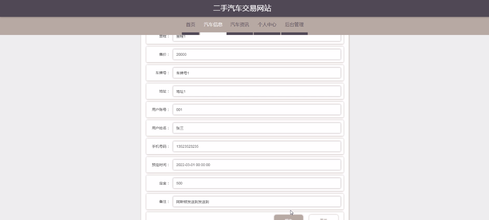
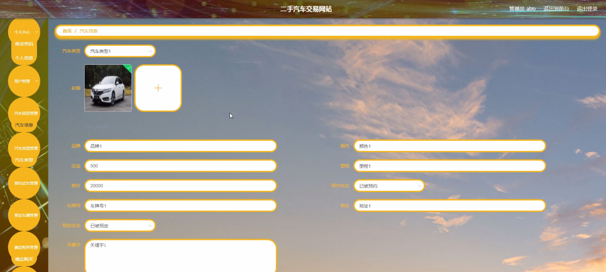

****本项目包含程序+源码+数据库+LW+调试部署环境，文末可获取一份本项目的java源码和数据库参考。****

## ******开题报告******

研究背景：
随着社会经济的发展和人们生活水平的提高，汽车已经成为现代人生活中不可或缺的交通工具。然而，购买一辆全新的汽车往往需要巨额的资金投入，对于许多消费者来说是一项负担。因此，二手汽车市场逐渐兴起，并成为了一个重要的选择。

研究意义：
二手汽车交易网站的出现为消费者提供了一个方便、快捷、安全的购买二手汽车的平台。通过这样的网站，消费者可以更加容易地找到心仪的二手汽车，并且能够获取详细的汽车信息，从而做出明智的购买决策。同时，二手汽车交易网站也促进了二手汽车市场的规范化和透明化发展，提高了交易的安全性和可靠性。

研究目的：
本研究旨在探究二手汽车交易网站的运作机制和用户需求，以及分析其对二手汽车市场的影响。通过深入研究，我们希望能够为二手汽车交易网站的发展提供参考和指导，进一步提升其服务质量和用户体验，促进二手汽车市场的健康发展。

研究内容： 本研究将围绕二手汽车交易网站的系统功能展开研究，主要包括以下几个方面：

  1. 用户需求分析：通过调查问卷、访谈等方式，了解用户对于二手汽车交易网站的需求和期望，探究他们在使用过程中遇到的问题和困惑。

  2. 汽车信息管理：研究如何有效地管理和展示二手汽车的相关信息，包括车辆基本信息、车况报告、历史维修记录等，以提供给用户全面准确的汽车信息。

  3. 汽车类型分类与搜索：设计合理的汽车类型分类和搜索功能，使用户能够快速准确地找到符合自己需求的二手汽车，提高用户的搜索效率和体验。

  4. 预约试车与预定车辆：研究如何实现在线预约试车和预定车辆的功能，为用户提供便捷的服务，同时保障交易的安全性和可靠性。

  5. 确定购买与交易流程：探究用户在确定购买后的交易流程，包括价格谈判、车辆过户、支付方式等，以提供用户参考和指导，保障交易的顺利进行。

拟解决的主要问题： 在研究过程中，我们将重点解决以下几个问题：

  1. 如何提高二手汽车交易网站的用户体验和满意度？
  2. 如何确保二手汽车信息的真实性和可靠性？
  3. 如何防范二手汽车交易中的欺诈行为？
  4. 如何优化二手汽车交易流程，提高交易效率？
  5. 如何促进二手汽车市场的规范化和透明化发展？

研究方案和预期成果：
本研究将采用综合研究方法，包括文献调研、实地调查、数据分析等，结合二手汽车交易网站的实际情况，进行深入的研究和分析。预期的研究成果包括：对二手汽车交易网站的用户需求和使用行为的深入理解；针对问题的解决方案和改进措施；推荐二手汽车交易网站的运营策略和服务模式，以及促进二手汽车市场健康发展的相关政策建议。

进度安排：

2022年9月至10月：需求分析和规划，进行用户需求调研和分析，确定系统功能和目标。

2022年11月至2023年1月：系统设计和开发，完成系统架构设计和技术选型，并开始编写代码。

2023年2月至3月：测试和优化，进行单元测试和集成测试，修复问题并优化系统性能。

2023年4月至5月：文档编写和培训，编写用户手册和系统文档，并进行相关人员的培训。

2023年5月：上线部署和维护，将系统部署到生产环境中，并定期进行维护和升级。

参考文献：

[1]王振华.SpringBoot在教学效果评估系统中的应用[J].电子技术,2023,(05):67-69.

[2]王明泉.基于SpringBoot远程热部署的探索和应用[J].信息与电脑(理论版),2023,(07):1-4.

[3]王亚东,李晓霞,陈强强,剡美娜.基于SpringBoot的需求发布平台设计[J].信息与电脑(理论版),2023,(01):105-107.

[4]陈新府豪.基于SpringBoot和Vue框架的创新方法推理系统的设计与实现[D].导师：黄静.浙江理工大学,2022.

[5]霍福华,韩慧.基于SpringBoot微服务架构下前后端分离的MVVM模型[J].电子技术与软件工程,2022,(01):73-76.

[6]韩策,张娜,王松亭,张凯,何方,袁峰.SpringBoot OPC客户端设计与研究[J].电子世界,2021,(19):25-26.

****以上是本项目程序开发之前开题报告内容，最终成品以下面界面为准，大家可以酌情参考使用。要源码参考请在文末进行获取！！****

## ******本项目的界面展示******

