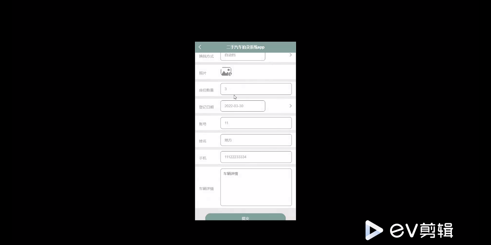

****本项目包含程序+源码+数据库+LW+调试部署环境，文末可获取一份本项目的java源码和数据库参考。****

## ******开题报告******

研究背景：
随着社会经济的发展和人们生活水平的提高，汽车已经成为现代人生活中不可或缺的交通工具。然而，购买一辆全新的汽车对于许多人来说是一个昂贵的投资。因此，二手汽车市场逐渐兴起，成为了人们购买汽车的另一个选择。然而，当前的二手汽车交易存在一些问题，如信息不对称、价格不透明等，这给消费者带来了困扰。

研究意义：
二手汽车拍卖系统的建立和研究具有重要的现实意义。首先，该系统可以提供一个透明、公正、高效的交易平台，消除信息不对称和价格不透明的问题，保护消费者的权益。其次，通过建立会员评价和在线咨询等功能，可以增加交易的信任度和安全性，促进二手汽车市场的健康发展。最后，该系统还可以为汽车行业提供更多的销售渠道，促进经济的发展。

研究目的：
本研究旨在设计和开发一套完善的二手汽车拍卖系统，以解决当前二手汽车交易中存在的问题。通过引入会员、汽车资讯、车友圈、员工、车辆信息、车辆品牌、会员竞拍、汽车视频、在线咨询、会员评价、我要卖车、安排验车、报价收车等系统功能，提供一个全面、便捷、安全的二手汽车交易平台，为消费者和汽车行业提供更好的服务。

研究内容： 本研究的主要内容包括以下系统功能的设计和实现：

  1. 会员：建立会员注册和登录功能，使用户可以方便地进行交易和查询相关信息。
  2. 汽车资讯：提供最新的汽车资讯和市场动态，帮助用户了解行业发展趋势。
  3. 车友圈：建立车友社区，促进用户之间的交流和分享经验。
  4. 员工：管理系统内部员工的权限和工作任务，确保系统运行的顺利进行。
  5. 车辆信息：收集并展示二手汽车的详细信息，包括车型、年份、里程数等。
  6. 车辆品牌：提供各个汽车品牌的介绍和推荐，帮助用户选择合适的汽车。
  7. 会员竞拍：开设二手汽车竞拍功能，让用户以竞拍的方式购买汽车。
  8. 汽车视频：提供汽车展示和试驾视频，帮助用户更好地了解汽车性能。
  9. 在线咨询：为用户提供在线咨询服务，解答他们的疑问和需求。
  10. 会员评价：建立会员评价系统，让用户对交易进行评价和反馈。
  11. 我要卖车：提供用户发布二手汽车信息的功能，吸引潜在买家。
  12. 安排验车：协助买家和卖家安排验车时间和地点，确保交易的真实性。
  13. 报价收车：提供给卖家报价并收购二手汽车的服务。

拟解决的主要问题：
通过上述系统功能的设计和实现，本研究旨在解决二手汽车交易中存在的信息不对称、价格不透明、信任度低等问题，提高交易的透明度和可靠性，促进二手汽车市场的健康发展。

研究方案和预期成果：
本研究将采用软件开发的方法，结合市场调研和用户需求分析，设计和开发一套完善的二手汽车拍卖系统。预期成果包括一个功能齐全、界面友好、操作便捷的系统，能够满足用户的需求，并提供安全、高效的二手汽车交易平台。同时，预期通过该系统的实施和推广，促进二手汽车市场的规范化和健康发展。

进度安排：

2022年9月至10月：需求分析和规划，进行用户需求调研和分析，确定系统功能和目标。

2022年11月至2023年1月：系统设计和开发，完成系统架构设计和技术选型，并开始编写代码。

2023年2月至3月：测试和优化，进行单元测试和集成测试，修复问题并优化系统性能。

2023年4月至5月：文档编写和培训，编写用户手册和系统文档，并进行相关人员的培训。

2023年5月：上线部署和维护，将系统部署到生产环境中，并定期进行维护和升级。

参考文献：

[1]王振华.SpringBoot在教学效果评估系统中的应用[J].电子技术,2023,(05):67-69.

[2]王明泉.基于SpringBoot远程热部署的探索和应用[J].信息与电脑(理论版),2023,(07):1-4.

[3]王亚东,李晓霞,陈强强,剡美娜.基于SpringBoot的需求发布平台设计[J].信息与电脑(理论版),2023,(01):105-107.

[4]陈新府豪.基于SpringBoot和Vue框架的创新方法推理系统的设计与实现[D].导师：黄静.浙江理工大学,2022.

[5]霍福华,韩慧.基于SpringBoot微服务架构下前后端分离的MVVM模型[J].电子技术与软件工程,2022,(01):73-76.

[6]韩策,张娜,王松亭,张凯,何方,袁峰.SpringBoot OPC客户端设计与研究[J].电子世界,2021,(19):25-26.

****以上是本项目程序开发之前开题报告内容，最终成品以下面界面为准，大家可以酌情参考使用。要源码参考请在文末进行获取！！****

## ******本项目的界面展示******

