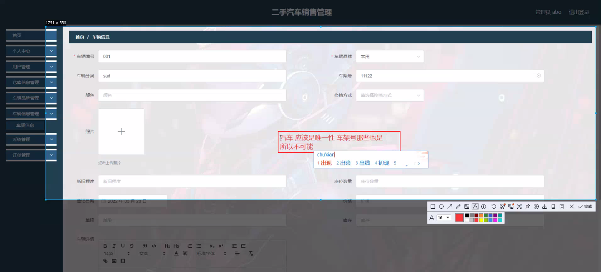
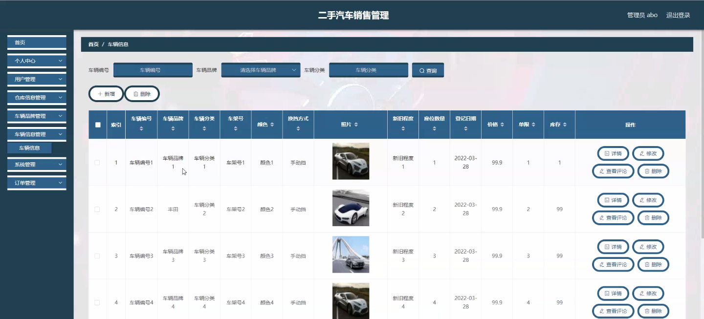
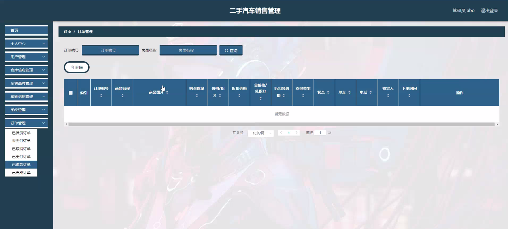

****本项目包含程序+源码+数据库+LW+调试部署环境，文末可获取一份本项目的java源码和数据库参考。****

## ******开题报告******

研究背景：
随着社会经济的发展和人们生活水平的提高，汽车已经成为现代人生活中不可或缺的交通工具。然而，购买一辆全新的汽车对于很多人来说是一项巨大的投资，因此，二手汽车市场逐渐兴起并蓬勃发展。二手汽车销售管理在这个市场中扮演着重要的角色，它涉及到汽车交易的各个环节，包括车辆评估、信息发布、交易过程管理等。因此，深入研究二手汽车销售管理的相关问题具有重要的现实意义。

研究意义：
二手汽车销售管理的研究对于促进二手汽车市场的健康发展具有重要的意义。通过对二手汽车销售管理进行深入研究，可以帮助企业更好地了解市场需求和消费者行为，提升销售效率和服务质量。同时，研究结果还可以为政府制定相关政策提供参考，推动二手汽车市场的规范化和可持续发展。

研究目的：
本研究旨在探讨二手汽车销售管理的关键问题，提出相应的解决方案，以促进二手汽车市场的健康发展。具体目标包括：1）分析二手汽车销售管理的现状和存在的问题；2）探讨二手汽车销售管理的优化策略和方法；3）提出改进二手汽车销售管理的建议，以提升市场竞争力和用户满意度。

研究内容： 本研究将主要围绕二手汽车销售管理的关键问题展开研究。根据系统功能，研究内容将涵盖以下几个方面：

  1. 用户管理：研究如何通过有效的用户管理来提升用户体验和忠诚度，包括用户注册、身份验证、个人信息管理等方面。

  2. 仓库信息管理：研究如何建立高效的仓库信息管理系统，包括车辆入库、出库、库存管理等环节，以确保车辆信息的准确性和及时性。

  3. 车辆品牌管理：研究如何对不同品牌的二手汽车进行分类管理，包括品牌特点、市场需求、价格走势等方面的分析，以帮助企业制定合理的销售策略。

  4. 车辆信息管理：研究如何完善车辆信息管理系统，包括车辆评估、车况检测、车辆描述等方面，以提供准确、全面的车辆信息给用户。

拟解决的主要问题：
在二手汽车销售管理中存在一些问题，例如信息不对称、交易风险高、服务质量参差不齐等。本研究将重点解决以下主要问题：1）如何提升二手汽车销售管理的透明度和可信度；2）如何优化用户体验和满意度；3）如何降低交易风险和纠纷发生率；4）如何提高销售效率和市场竞争力。

研究方案和预期成果：
本研究将采用文献研究、案例分析、问卷调查等方法，结合实地调研和数据分析，从理论和实践两个层面进行研究。预期成果包括：1）提出针对二手汽车销售管理的优化策略和方法；2）构建完善的二手汽车销售管理模型；3）提供相关政策建议和实施指导，促进二手汽车市场的健康发展。

进度安排：

2022年9月至10月：开题报告编写和提交，完成开题报告的撰写并提交给指导教师进行审核。

2022年11月至2023年1月：系统设计和开发，根据开题报告的要求，进行系统设计和编码工作。

2023年2月至3月：论文撰写和初稿完成，开始撰写论文，并在这个阶段完成论文的初稿。

2023年4月至5月：论文修改和最终定稿，根据指导教师的意见对论文进行修改，并完成最终的定稿。

2023年5月：论文答辩和提交，参加论文答辩并根据答辩结果进行修改，最后将论文提交给学院或学校。

参考文献：

[1]喻佳,吴丹新.基于SpringBoot的Web快速开发框架[J].电脑编程技巧与维护,2021,(09):31-33.

[2]李鹏.基于SpringBoot快速开发平台的实现[J].电子技术与软件工程,2021,(12):36-37.

[3]叶开平,蔡维晟,陈家敏,邓斯妮.基于SpringBoot的综测可视化管理系统的研究与设计[J].电脑知识与技术,2021,(12):100-104.

[4]江健锋,徐振平.Springboot最小系统的设计与实现[J].电脑知识与技术,2021,(04):62-63.

[5]赵炯,司圣杰,周奇才,熊肖磊.通用信息获取系统设计与实现[J].起重运输机械,2020,(16):89-97.

[6]吴英宾.一种内外网数据交互系统的设计与实现[J].软件工程,2020,(08):25-27.

****以上是本项目程序开发之前开题报告内容，最终成品以下面界面为准，大家可以酌情参考使用。要源码参考请在文末进行获取！！****

## ******本项目的界面展示******

