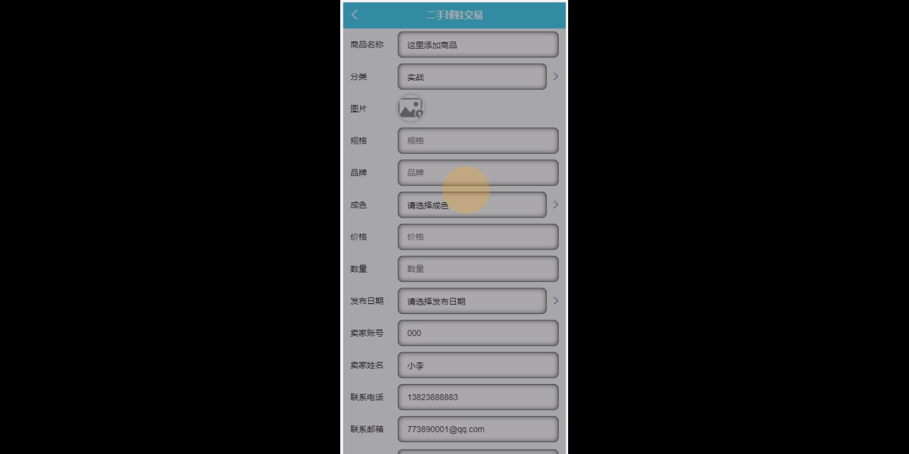

****本项目包含程序+源码+数据库+LW+调试部署环境，文末可获取一份本项目的java源码和数据库参考。****

## ******开题报告******

研究背景：
随着时尚文化的兴起和球鞋市场的蓬勃发展，二手球鞋交易逐渐成为了一个热门的领域。越来越多的球鞋爱好者和收藏家开始关注二手球鞋市场，并积极参与其中。然而，由于市场的不规范和信息的不对称，二手球鞋交易存在一些问题，如虚假宣传、售假、交易纠纷等。因此，有必要进行相关研究，以提高二手球鞋交易的可信度和安全性。

研究意义：
二手球鞋交易的研究具有重要的实践意义。首先，通过深入了解二手球鞋交易市场的运作机制和问题所在，可以为球鞋爱好者和收藏家提供更加可靠和安全的交易环境。其次，研究二手球鞋交易还能够促进市场的规范化发展，提升整个行业的形象和声誉。最后，对于电商平台和交易平台来说，优化二手球鞋交易系统也是提升用户体验和增加用户黏性的重要途径。

研究目的：
本研究的目的是通过对二手球鞋交易进行深入研究，分析其运作机制和存在的问题，并提出相应的解决方案，以改善二手球鞋交易的可信度和安全性。具体来说，本研究将重点关注球鞋分类、卖家管理、球鞋信息发布、用户管理、订单信息管理、订单配送、订单评价、用户球鞋鉴定和卖家球鞋鉴定等系统功能，旨在优化二手球鞋交易的各个环节，提供更好的用户体验和服务质量。

研究内容： 本研究将围绕以下系统功能展开研究：

  1. 球鞋分类：通过对二手球鞋进行分类，便于用户快速找到自己想要的球鞋款式和品牌。

  2. 卖家管理：建立健全的卖家管理机制，筛选出有资质和信誉的卖家，确保交易的可靠性和安全性。

  3. 球鞋信息发布：提供一个规范的平台，让卖家能够准确、详细地发布球鞋的相关信息，避免虚假宣传和误导消费者。

  4. 用户管理：建立完善的用户管理系统，保护用户隐私，提供个性化的推荐和服务。

  5. 订单信息管理：优化订单信息管理流程，确保订单的准确性和及时性。

  6. 订单配送：建立高效的配送系统，提供快速、安全的物流服务，确保球鞋能够准时送达买家手中。

  7. 订单评价：鼓励用户对交易进行评价，提供参考和反馈，促进交易的透明度和可信度。

  8. 用户球鞋鉴定：为用户提供球鞋鉴定服务，确保购买到正品球鞋，避免受到假货的损失。

  9. 卖家球鞋鉴定：对卖家发布的球鞋进行鉴定，筛选出真实的商品，杜绝售假行为。

拟解决的主要问题：
本研究旨在解决二手球鞋交易中存在的虚假宣传、售假、交易纠纷等问题，通过优化系统功能和加强管理机制，提高交易的可信度和安全性。具体而言，研究将解决以下主要问题：

  1. 如何建立一个规范的球鞋分类系统，方便用户查找和选择合适的球鞋款式？

  2. 如何筛选并管理卖家，确保他们的资质和信誉，杜绝售假行为？

  3. 如何提供准确、详细的球鞋信息发布平台，避免虚假宣传和误导消费者？

  4. 如何建立完善的用户管理系统，保护用户隐私，提供个性化的推荐和服务？

  5. 如何优化订单信息管理流程，确保订单的准确性和及时性？

研究方案和预期成果：
本研究将采用文献研究、实地调查、数据分析等方法，深入研究二手球鞋交易市场的运作机制和问题所在。通过对现有系统功能的优化和管理机制的加强，预期可以提高二手球鞋交易的可信度和安全性，为球鞋爱好者和收藏家提供更好的交易环境。同时，研究还将为电商平台和交易平台提供改进建议，以提升用户体验和增加用户黏性。

进度安排：

2022年9月至10月：需求分析和规划，明确系统功能和目标，制定项目计划。

2022年11月至2023年1月：系统设计和编码，完成详细的系统设计并开始编写代码。

2023年2月至3月：用户界面开发和数据库开发，开发用户友好的界面和设计数据库结构。

2023年4月至5月：功能测试、文档编写和上线部署，对系统进行全面的功能测试并编写用户手册。

2023年5月：维护和升级，定期对系统进行维护和升级，修复bug和添加新功能。

参考文献：

[1]邱小群,邓丽艳,陈海潮.基于B/S的信息管理系统设计和实现[J].信息与电脑(理论版),2022,(20):146-148.

[2]谢霜.基于Java技术的网络管理体系结构的应用[J].网络安全技术与应用,2022,(10):14-15.

[3]宋锦华.高职院校Java程序设计课程改革研究[J].科技视界,2022,(20):133-135.

[4]曹嵩彭,王鹏宇.浅析Java语言在软件开发中的应用[J].信息记录材料,2022,(03):114-116.

[5]朱澈,余俊达.武汉东湖学院.基于Java的软硬件信息管理系统V1.0[Z].项目立项编号.鉴定单位.鉴定日期:

****以上是本项目程序开发之前开题报告内容，最终成品以下面界面为准，大家可以酌情参考使用。要源码参考请在文末进行获取！！****

## ******本项目的界面展示******

