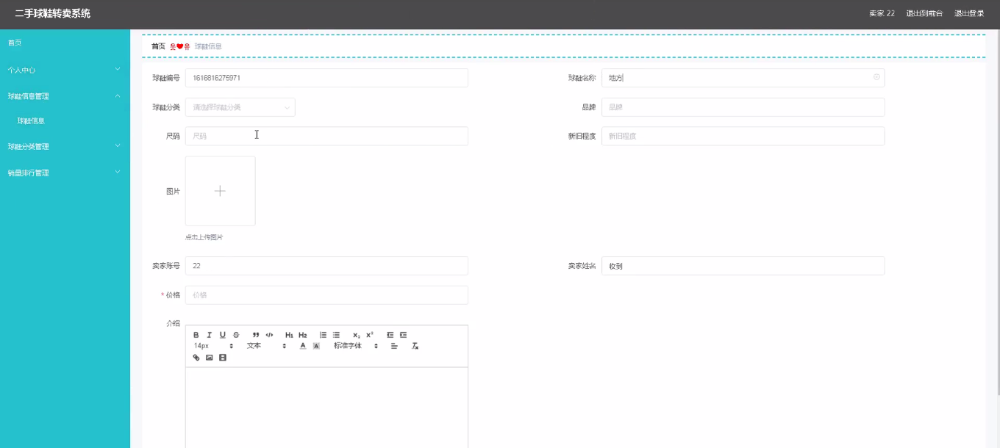

****本项目包含程序+源码+数据库+LW+调试部署环境，文末可获取一份本项目的java源码和数据库参考。****

## ******开题报告******

研究背景：
随着时尚文化的普及和球鞋市场的兴起，越来越多的人开始关注和追求球鞋的潮流。然而，原装球鞋价格昂贵，很多人无法承受，因此二手球鞋市场逐渐兴起。在这个市场中，球鞋爱好者可以买到自己喜欢的球鞋，而卖家也能通过转卖获得一定的收益。然而，目前存在着许多问题，如信息不对称、交易不安全等，这些问题制约了二手球鞋市场的发展。因此，建立一个高效、安全的二手球鞋转卖系统具有重要的研究意义。

研究意义：
二手球鞋转卖系统的建立对于促进球鞋市场的健康发展具有重要的意义。首先，该系统可以提供更多的选择和机会给球鞋爱好者，使他们能够以合理的价格购买到心仪的球鞋。其次，对于卖家来说，该系统可以提供一个安全、便捷的平台，增加其转卖球鞋的机会和收益。最后，通过建立规范的交易流程和信息披露机制，可以减少交易中的不确定性和风险，提高用户的信任度，促进市场的稳定发展。

研究目的：
本研究旨在构建一个高效、安全的二手球鞋转卖系统，以解决当前存在的问题并推动二手球鞋市场的健康发展。通过该系统，用户可以方便地浏览和购买到心仪的二手球鞋，同时卖家也能够更加便捷地转卖自己的球鞋，并获得合理的收益。通过优化系统功能和设计合理的交易流程，我们希望能够提高用户的满意度和信任度，从而促进整个二手球鞋市场的良性循环。

研究内容： 本研究的主要内容包括以下几个方面：

  1. 用户管理：建立用户注册和登录系统，确保用户身份的真实性和安全性。
  2. 卖家管理：为卖家提供一个简单易用的平台，使其能够方便地发布和管理自己的球鞋信息。
  3. 球鞋信息管理：建立完善的球鞋信息数据库，包括品牌、型号、尺码、颜色等详细信息，方便用户进行筛选和选择。
  4. 球鞋分类：根据不同的品牌、系列和风格，对球鞋进行分类管理，提供更精准的搜索和推荐功能。
  5. 销量排行：根据用户购买记录和评价，统计和展示热门球鞋的销量排行，为用户提供参考和指导。

拟解决的主要问题：

  1. 信息不对称：通过建立完善的球鞋信息数据库和信息披露机制，减少买家和卖家之间的信息不对称，提高交易的透明度和公平性。
  2. 交易不安全：通过加强用户身份认证和支付安全措施，保障交易过程的安全性，防止欺诈和纠纷的发生。
  3. 用户体验不佳：通过优化系统界面和交互设计，提高用户的使用便捷性和满意度，提升整个系统的竞争力。

研究方案和预期成果：
本研究将采用软件工程的方法，结合用户需求调研和系统设计原则，构建一个基于互联网的二手球鞋转卖系统。通过系统开发和测试，我们预期可以实现以下成果：

  1. 建立一个高效、安全的二手球鞋转卖系统，满足用户的购买和转卖需求。
  2. 提供全面、准确的球鞋信息和分类管理，方便用户进行筛选和选择。
  3. 优化交易流程和支付安全措施，提高交易的安全性和可靠性。
  4. 提升用户体验，简化操作流程，提高系统的易用性和用户满意度。

进度安排：

2022年9月至10月：需求分析和规划，进行用户需求调研和分析，确定系统功能和目标。

2022年11月至2023年1月：系统设计和开发，完成系统架构设计和技术选型，并开始编写代码。

2023年2月至3月：测试和优化，进行单元测试和集成测试，修复问题并优化系统性能。

2023年4月至5月：文档编写和培训，编写用户手册和系统文档，并进行相关人员的培训。

2023年5月：上线部署和维护，将系统部署到生产环境中，并定期进行维护和升级。

参考文献：

[1]王振华.SpringBoot在教学效果评估系统中的应用[J].电子技术,2023,(05):67-69.

[2]王明泉.基于SpringBoot远程热部署的探索和应用[J].信息与电脑(理论版),2023,(07):1-4.

[3]王亚东,李晓霞,陈强强,剡美娜.基于SpringBoot的需求发布平台设计[J].信息与电脑(理论版),2023,(01):105-107.

[4]陈新府豪.基于SpringBoot和Vue框架的创新方法推理系统的设计与实现[D].导师：黄静.浙江理工大学,2022.

[5]霍福华,韩慧.基于SpringBoot微服务架构下前后端分离的MVVM模型[J].电子技术与软件工程,2022,(01):73-76.

[6]韩策,张娜,王松亭,张凯,何方,袁峰.SpringBoot OPC客户端设计与研究[J].电子世界,2021,(19):25-26.

****以上是本项目程序开发之前开题报告内容，最终成品以下面界面为准，大家可以酌情参考使用。要源码参考请在文末进行获取！！****

## ******本项目的界面展示******

