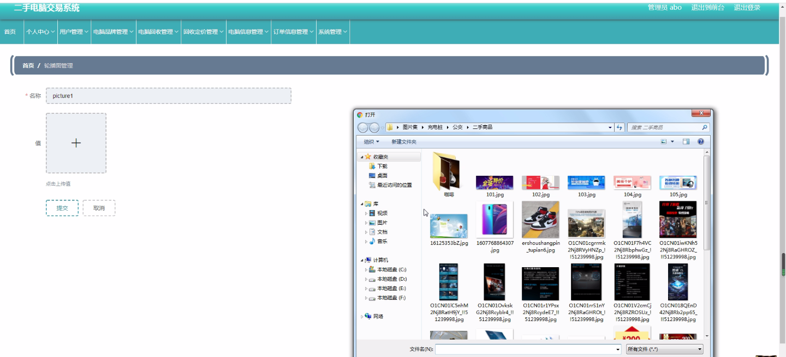

****本项目包含程序+源码+数据库+LW+调试部署环境，文末可获取一份本项目的java源码和数据库参考。****

## ******开题报告******

研究背景：
随着科技的不断发展和更新换代，电子产品的更新速度越来越快。其中，电脑作为一种常见的电子设备，也面临着更加频繁的更替和淘汰。这导致了大量的二手电脑市场的出现，人们可以通过回收和交易二手电脑来实现资源的再利用和价值的最大化。然而，当前的二手电脑交易系统存在一些问题，如信息不对称、价格不透明等，需要进行深入的研究和改进。

研究意义：
建立一个高效、公平、透明的二手电脑交易系统对于推动二手电脑市场的健康发展具有重要意义。首先，它可以提供一个便捷的平台，让用户能够方便地买卖二手电脑，满足他们的需求。其次，它可以促进资源的再利用，减少环境污染和资源浪费。此外，通过建立规范的交易流程和价格体系，可以增加交易的公平性和可靠性，提高用户的信任度，进一步推动二手电脑市场的发展。

研究目的：
本研究的目的是设计和开发一个二手电脑交易系统，旨在解决当前二手电脑市场存在的问题，提高交易的效率和公平性。具体而言，我们将通过以下几个方面进行研究：用户管理、电脑品牌管理、电脑回收管理、回收定价管理、电脑信息管理以及订单信息管理等系统功能。

研究内容：

  1. 用户管理：包括用户注册、登录、个人信息管理等功能，确保用户能够方便地使用系统进行交易。
  2. 电脑品牌管理：建立电脑品牌库，方便用户查询和选择合适的二手电脑品牌。
  3. 电脑回收管理：建立回收渠道，接收用户提交的二手电脑，并进行评估和检修，为后续交易做好准备。
  4. 回收定价管理：根据电脑的实际情况和市场行情，对回收的二手电脑进行定价，确保价格的合理性和公正性。
  5. 电脑信息管理：包括对二手电脑的详细信息进行记录和管理，方便用户查询和了解电脑的相关信息。
  6. 订单信息管理：处理用户的交易请求，生成订单并进行管理，确保交易的顺利进行。

拟解决的主要问题：

  1. 信息不对称：通过建立系统功能，提供准确、详尽的电脑信息，消除买卖双方的信息不对称问题。
  2. 价格不透明：建立回收定价管理功能，确保回收的二手电脑价格公正合理，提高交易的透明度。
  3. 交易效率低下：通过优化系统流程和提供便捷的操作方式，提高交易的效率，减少用户的等待时间。

研究方案和预期成果：
本研究将采用软件工程的方法，设计和开发一个二手电脑交易系统，并进行实际的应用测试。预期成果包括一个完善的系统架构和各项功能的实现，能够满足用户的需求并提高交易的效率和公平性。同时，通过用户反馈和市场调研，进一步改进系统，使其更加符合用户的期望和市场需求。

进度安排：

2022年9月至10月：需求分析和规划，明确系统功能和目标，制定项目计划。

2022年11月至2023年1月：系统设计和编码，完成详细的系统设计并开始编写代码。

2023年2月至3月：用户界面开发和数据库开发，开发用户友好的界面和设计数据库结构。

2023年4月至5月：功能测试、文档编写和上线部署，对系统进行全面的功能测试并编写用户手册。

2023年5月：维护和升级，定期对系统进行维护和升级，修复bug和添加新功能。

参考文献：

[1]邱小群,邓丽艳,陈海潮.基于B/S的信息管理系统设计和实现[J].信息与电脑(理论版),2022,(20):146-148.

[2]谢霜.基于Java技术的网络管理体系结构的应用[J].网络安全技术与应用,2022,(10):14-15.

[3]宋锦华.高职院校Java程序设计课程改革研究[J].科技视界,2022,(20):133-135.

[4]曹嵩彭,王鹏宇.浅析Java语言在软件开发中的应用[J].信息记录材料,2022,(03):114-116.

[5]朱澈,余俊达.武汉东湖学院.基于Java的软硬件信息管理系统V1.0[Z].项目立项编号.鉴定单位.鉴定日期:

****以上是本项目程序开发之前开题报告内容，最终成品以下面界面为准，大家可以酌情参考使用。要源码参考请在文末进行获取！！****

## ******本项目的界面展示******

