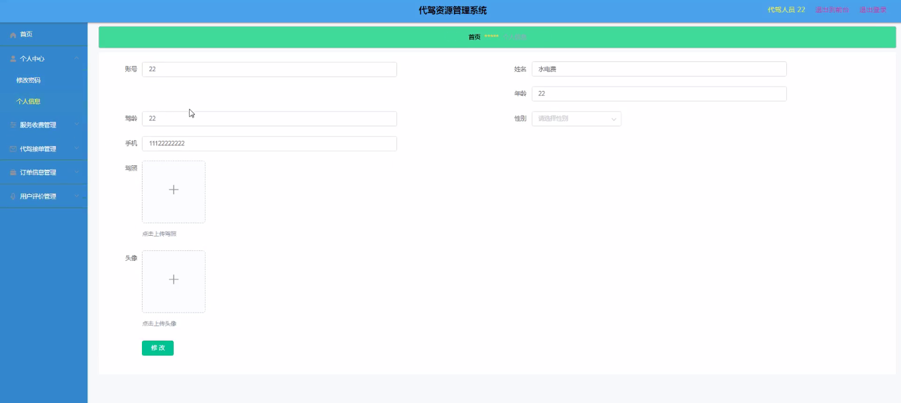
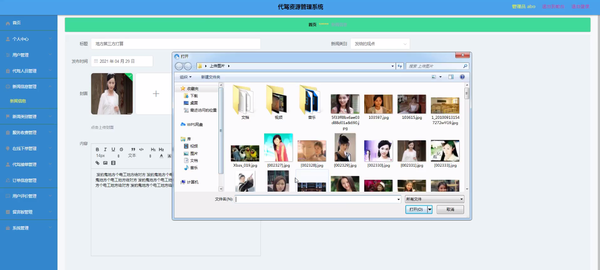
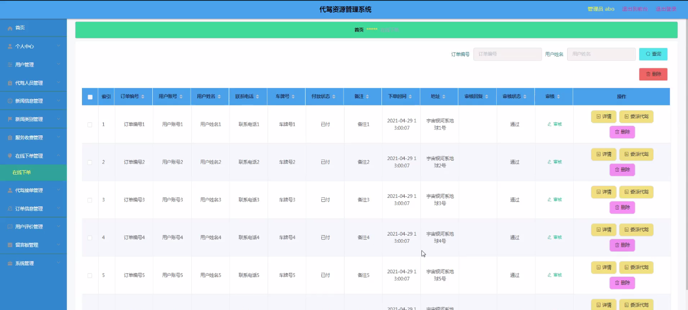
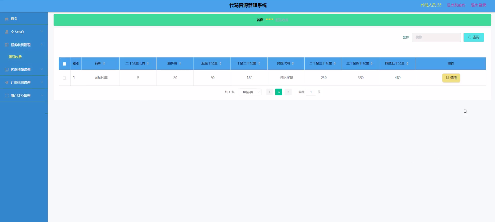
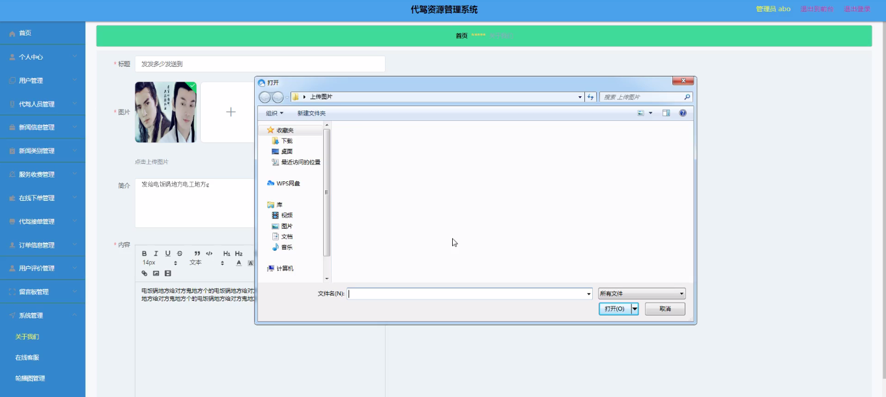
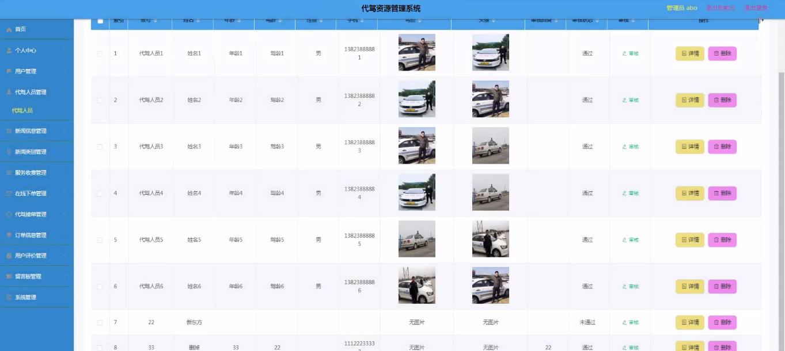

****本项目包含程序+源码+数据库+LW+调试部署环境，文末可获取一份本项目的java源码和数据库参考。****

## ******开题报告******

研究背景：
随着社会的发展和人们生活水平的提高，私家车的普及率逐渐增加。然而，由于酒后驾驶等原因导致的交通事故也屡禁不止。为了解决这一问题，代驾服务应运而生。代驾服务通过为酒后驾驶者提供专业的代驾司机，有效地减少了交通事故的发生，保障了公共安全。然而，目前代驾服务市场存在着资源分散、信息不对称等问题，需要建立一个高效的代驾资源管理系统来优化代驾服务的供需关系。

研究意义：
代驾资源管理系统的建立对于提升代驾服务的质量和效率具有重要意义。首先，通过集中管理代驾资源，可以提高代驾服务的可及性和响应速度，为用户提供更加便捷的服务体验。其次，通过统一管理代驾人员的资质和信誉信息，可以提高代驾服务的安全性和可靠性，降低交通事故的风险。此外，代驾资源管理系统还可以促进代驾行业的规范化发展，推动行业竞争力的提升。

研究目的：
本研究旨在设计和开发一种代驾资源管理系统，以解决当前代驾服务市场存在的问题。通过该系统，用户可以方便地在线下单，并获得实时的代驾接单信息；代驾人员可以及时了解订单信息，并提供高质量的代驾服务；同时，系统还将提供新闻信息、用户评价、服务收费等功能，以提升用户体验和服务质量。

研究内容：
本研究的主要内容包括以下系统功能的设计和实现：用户管理模块、代驾人员管理模块、在线下单模块、新闻信息模块、代驾接单模块、订单信息模块、新闻类别模块、用户评价模块、服务收费模块和代驾展示模块。具体而言，用户管理模块用于注册、登录和管理用户信息；代驾人员管理模块用于审核和管理代驾人员的资质和信誉信息；在线下单模块用于用户提交代驾需求；新闻信息模块用于发布代驾相关的新闻和公告；代驾接单模块用于代驾人员接受用户订单；订单信息模块用于记录和管理用户的代驾订单；新闻类别模块用于分类管理新闻信息；用户评价模块用于用户对代驾服务的评价和反馈；服务收费模块用于计算和管理代驾服务的费用；代驾展示模块用于展示代驾人员的资质和信誉信息。

拟解决的主要问题：

  1. 代驾资源分散、信息不对称的问题；
  2. 代驾服务可及性和响应速度不高的问题；
  3. 代驾服务安全性和可靠性不足的问题；
  4. 代驾行业规范化发展的问题；
  5. 用户体验和服务质量提升的问题。

研究方案和预期成果：
本研究将采用软件工程的方法，设计和开发一个代驾资源管理系统。通过需求分析、系统设计、编码实现和系统测试等阶段，逐步完成系统的建设。预期成果包括一个功能完善、界面友好、稳定可靠的代驾资源管理系统。该系统能够有效地解决代驾服务市场存在的问题，提升代驾服务的质量和效率，为用户提供更加便捷、安全、可靠的代驾服务体验。

进度安排：

2022年9月至10月：需求分析和规划，明确系统功能和目标，制定项目计划。

2022年11月至2023年1月：系统设计和编码，完成详细的系统设计并开始编写代码。

2023年2月至3月：用户界面开发和数据库开发，开发用户友好的界面和设计数据库结构。

2023年4月至5月：功能测试、文档编写和上线部署，对系统进行全面的功能测试并编写用户手册。

2023年5月：维护和升级，定期对系统进行维护和升级，修复bug和添加新功能。

参考文献：

[1]邱小群,邓丽艳,陈海潮.基于B/S的信息管理系统设计和实现[J].信息与电脑(理论版),2022,(20):146-148.

[2]谢霜.基于Java技术的网络管理体系结构的应用[J].网络安全技术与应用,2022,(10):14-15.

[3]宋锦华.高职院校Java程序设计课程改革研究[J].科技视界,2022,(20):133-135.

[4]曹嵩彭,王鹏宇.浅析Java语言在软件开发中的应用[J].信息记录材料,2022,(03):114-116.

[5]朱澈,余俊达.武汉东湖学院.基于Java的软硬件信息管理系统V1.0[Z].项目立项编号.鉴定单位.鉴定日期:

****以上是本项目程序开发之前开题报告内容，最终成品以下面界面为准，大家可以酌情参考使用。要源码参考请在文末进行获取！！****

## ******本项目的界面展示******

