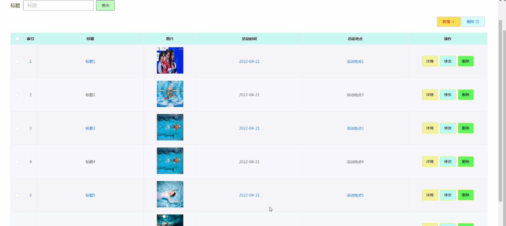

****本项目包含程序+源码+数据库+LW+调试部署环境，文末可获取一份本项目的java源码和数据库参考。****

## ******开题报告******

研究背景：
随着人们对健康生活方式的追求和冬泳运动的兴起，冬泳爱好者的数量逐渐增加。然而，目前关于冬泳的信息分享平台相对较少，缺乏一个专门针对冬泳爱好者的综合性网站。因此，开发一个冬泳爱好者分享网站具有重要的研究背景和意义。

研究意义：
该网站的建立将为冬泳爱好者提供一个交流、分享和学习的平台。通过这个网站，冬泳爱好者可以相互交流经验、分享精彩的赛事照片和视频，并了解最新的冬泳活动和相关资讯。同时，该网站还可以为冬泳爱好者提供参与活动的机会，促进冬泳运动的普及和发展。因此，研究开发一个冬泳爱好者分享网站具有积极的社会影响和推动力。

研究目的：
本研究旨在开发一个专门针对冬泳爱好者的分享网站，以满足他们的需求和期望。通过该网站，冬泳爱好者可以方便地获取相关信息，与其他爱好者交流互动，并参与到各种冬泳活动中。同时，该网站也将为冬泳组织和赛事提供一个宣传平台，增加其曝光度和影响力。通过这一研究，我们希望能够推动冬泳运动的发展，促进人们更加健康、积极地参与其中。

研究内容： 本研究的主要内容是设计和开发一个冬泳爱好者分享网站，其中包括以下系统功能：

  1. 用户：用户注册、登录、个人信息管理等功能，以便用户可以方便地使用网站的各项服务。
  2. 冬泳相册：用户可以上传和分享自己的冬泳照片和视频，与其他用户交流和展示。
  3. 精彩赛事：展示各类冬泳赛事的信息，包括比赛时间、地点、参赛选手等，让用户了解最新的冬泳赛事动态。
  4. 活动类型：介绍不同类型的冬泳活动，如公开赛、社交活动等，帮助用户选择适合自己的参与方式。
  5. 冬泳活动：提供冬泳活动的报名和参与信息，让用户可以方便地参与到各种冬泳活动中。
  6. 申请参加：用户可以通过网站申请参加特定的冬泳活动，提供个人信息和相关证明材料。
  7. 活动邀请：冬泳组织可以通过网站向用户发送活动邀请，方便用户了解和参与到更多的冬泳活动中。
  8. 活动签到：用户可以通过网站进行活动签到，记录自己的参与情况和成绩。
  9. 签到信息：展示用户的签到信息和成绩排名，激励用户积极参与冬泳活动。
  10. 排行榜：根据用户的活动参与情况和成绩，生成排行榜，展示用户的冬泳水平和活跃度。

拟解决的主要问题： 通过开发这个冬泳爱好者分享网站，我们希望解决以下问题：

  1. 冬泳爱好者信息分散、交流不便的问题；
  2. 冬泳赛事宣传和参与方式不够便捷的问题；
  3. 冬泳活动组织和管理不够高效的问题；
  4. 缺乏一个专门针对冬泳爱好者的综合性平台的问题。

研究方案和预期成果：
本研究将采用用户需求调研、系统设计和开发等方法，通过构建一个冬泳爱好者分享网站来解决上述问题。预期成果包括一个功能完善、界面友好的冬泳爱好者分享网站，并通过实际应用和用户反馈不断优化和改进。通过这一研究，我们希望能够提供一个方便、安全、高效的冬泳信息分享平台，促进冬泳爱好者之间的交流和互动，推动冬泳运动的发展。

进度安排：

2022年9月至10月：需求分析和规划，进行用户需求调研和分析，确定系统功能和目标。

2022年11月至2023年1月：系统设计和开发，完成系统架构设计和技术选型，并开始编写代码。

2023年2月至3月：测试和优化，进行单元测试和集成测试，修复问题并优化系统性能。

2023年4月至5月：文档编写和培训，编写用户手册和系统文档，并进行相关人员的培训。

2023年5月：上线部署和维护，将系统部署到生产环境中，并定期进行维护和升级。

参考文献：

[1]王振华.SpringBoot在教学效果评估系统中的应用[J].电子技术,2023,(05):67-69.

[2]王明泉.基于SpringBoot远程热部署的探索和应用[J].信息与电脑(理论版),2023,(07):1-4.

[3]王亚东,李晓霞,陈强强,剡美娜.基于SpringBoot的需求发布平台设计[J].信息与电脑(理论版),2023,(01):105-107.

[4]陈新府豪.基于SpringBoot和Vue框架的创新方法推理系统的设计与实现[D].导师：黄静.浙江理工大学,2022.

[5]霍福华,韩慧.基于SpringBoot微服务架构下前后端分离的MVVM模型[J].电子技术与软件工程,2022,(01):73-76.

[6]韩策,张娜,王松亭,张凯,何方,袁峰.SpringBoot OPC客户端设计与研究[J].电子世界,2021,(19):25-26.

****以上是本项目程序开发之前开题报告内容，最终成品以下面界面为准，大家可以酌情参考使用。要源码参考请在文末进行获取！！****

## ******本项目的界面展示******

