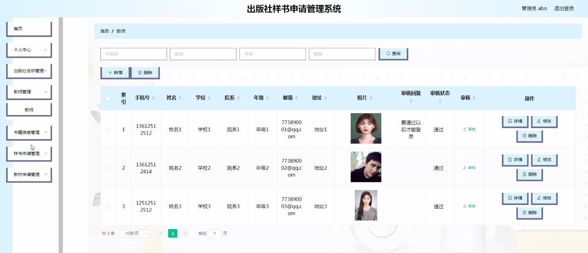
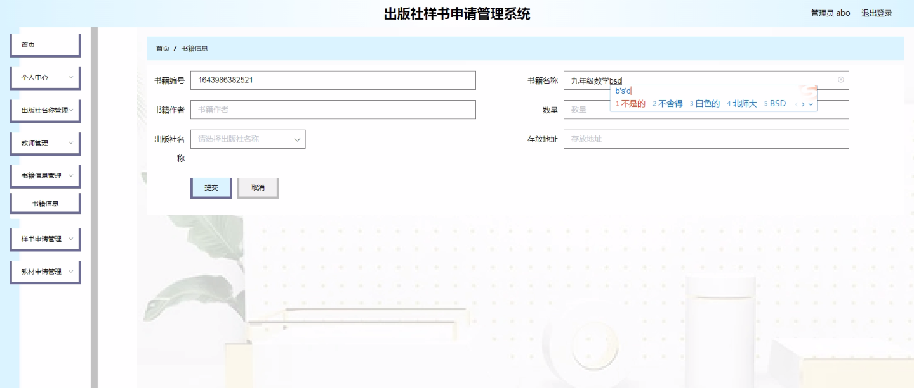
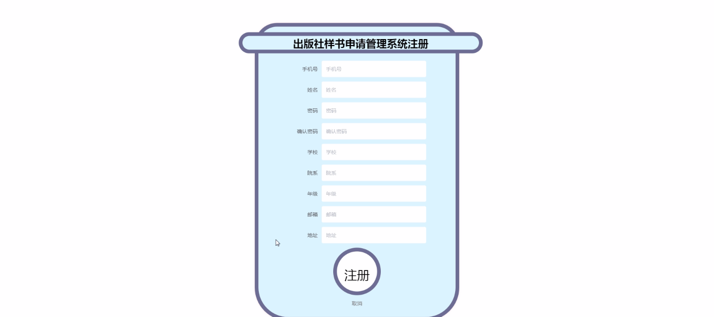
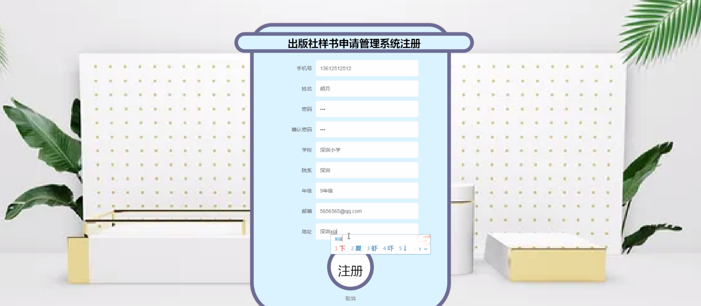
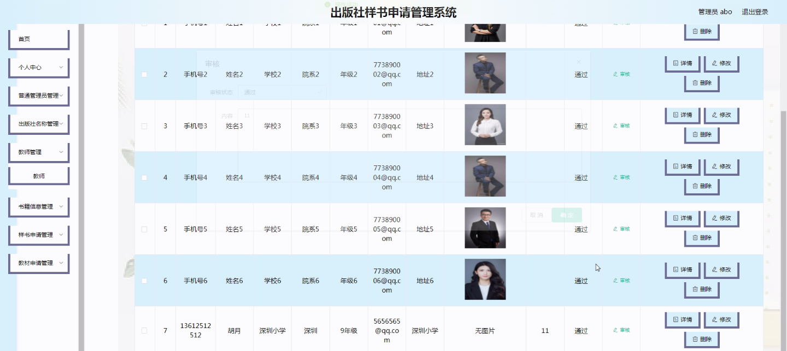
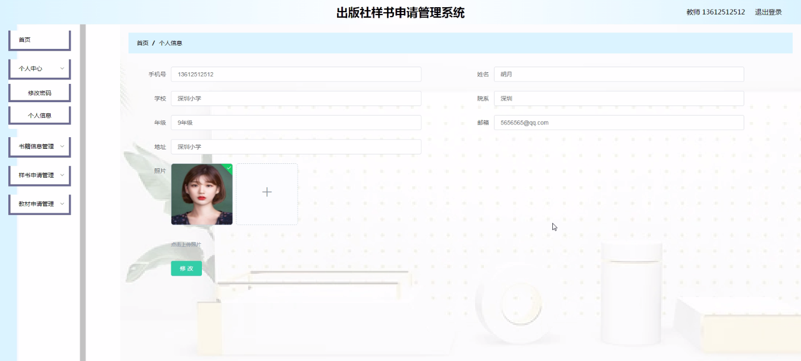
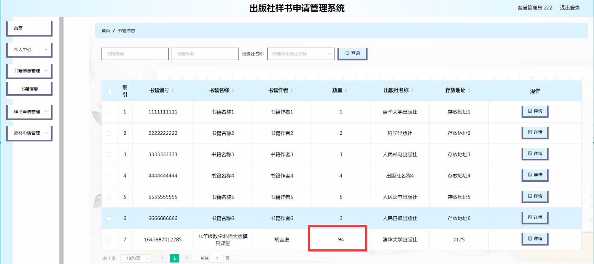

****本项目包含程序+源码+数据库+LW+调试部署环境，文末可获取一份本项目的java源码和数据库参考。****

## ******开题报告******

研究背景、意义和目的：

在当今数字化时代，出版社样书申请管理系统的开发与应用具有重要的研究背景、意义和目的。随着信息技术的快速发展，传统的纸质样书申请方式已经无法满足出版社的需求。因此，开发一套高效、便捷的样书申请管理系统对于提升出版社的工作效率和服务质量具有重要意义。

首先，研究背景是指当前出版社样书申请过程中存在的问题和挑战。传统的样书申请方式需要教师或管理员手动填写纸质表格，并通过邮寄或传真等方式提交给出版社，这种方式存在着信息传递不及时、流程繁琐、易丢失等问题。而基于信息技术的样书申请管理系统可以有效解决这些问题，提高样书申请的效率和准确性。

其次，研究意义在于探索如何利用现代信息技术来改进出版社样书申请管理流程。通过引入在线留言、教材申请、普通管理员等功能，可以实现教师和出版社之间的快速沟通和信息交流，提高样书申请的处理速度和质量。同时，该系统还可以提供数据分析和统计功能，为出版社决策提供科学依据。

最后，研究目的是设计和开发一套出版社样书申请管理系统，以提升出版社的工作效率和服务质量。通过该系统，教师可以方便地提交样书申请，并实时了解申请进度；出版社可以快速处理申请并与教师进行及时沟通；管理员可以对系统进行维护和管理，确保系统的正常运行。这将有助于提高出版社的竞争力和用户满意度。

研究内容：

根据系统功能要求，出版社样书申请管理系统的研究内容包括以下几个方面：

  1. 出版社名称：设计和实现一个出版社信息管理模块，包括出版社基本信息、联系方式、业务范围等内容的录入和查询功能。

  2. 教师：开发一个教师账号管理模块，包括教师信息的注册、登录、修改和删除功能，以及密码找回和权限管理等功能。

  3. 书籍信息：建立一个书籍信息管理模块，包括书籍的基本信息、作者、出版日期、ISBN号等内容的录入、查询和编辑功能。

  4. 样书申请：设计一个样书申请管理模块，包括教师提交样书申请、出版社审核和处理申请、教师查看申请进度等功能。

  5. 教材申请：实现一个教材申请管理模块，包括教师提交教材申请、出版社审核和处理申请、教师查看申请进度等功能。

  6. 普通管理员：开发一个管理员账号管理模块，包括管理员信息的注册、登录、修改和删除功能，以及权限管理和系统维护等功能。

  7. 在线留言：建立一个在线留言模块，供教师和出版社之间进行沟通和交流，包括留言的发布、回复和查看功能。

通过以上研究内容的设计和实现，出版社样书申请管理系统将能够提供高效、便捷的样书申请服务，提升出版社的工作效率和用户满意度。

进度安排：

2022年9月至10月：开题报告编写和提交，完成开题报告的撰写并提交给指导教师进行审核。

2022年11月至2023年1月：系统设计和开发，根据开题报告的要求，进行系统设计和编码工作。

2023年2月至3月：论文撰写和初稿完成，开始撰写论文，并在这个阶段完成论文的初稿。

2023年4月至5月：论文修改和最终定稿，根据指导教师的意见对论文进行修改，并完成最终的定稿。

2023年5月：论文答辩和提交，参加论文答辩并根据答辩结果进行修改，最后将论文提交给学院或学校。

参考文献：

[1]喻佳,吴丹新.基于SpringBoot的Web快速开发框架[J].电脑编程技巧与维护,2021,(09):31-33.

[2]李鹏.基于SpringBoot快速开发平台的实现[J].电子技术与软件工程,2021,(12):36-37.

[3]叶开平,蔡维晟,陈家敏,邓斯妮.基于SpringBoot的综测可视化管理系统的研究与设计[J].电脑知识与技术,2021,(12):100-104.

[4]江健锋,徐振平.Springboot最小系统的设计与实现[J].电脑知识与技术,2021,(04):62-63.

[5]赵炯,司圣杰,周奇才,熊肖磊.通用信息获取系统设计与实现[J].起重运输机械,2020,(16):89-97.

[6]吴英宾.一种内外网数据交互系统的设计与实现[J].软件工程,2020,(08):25-27.

****以上是本项目程序开发之前开题报告内容，最终成品以下面界面为准，大家可以酌情参考使用。要源码参考请在文末进行获取！！****

## ******本项目的界面展示******

