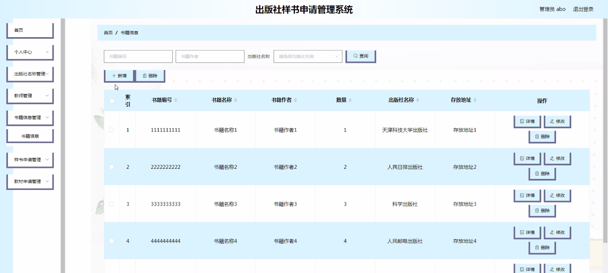
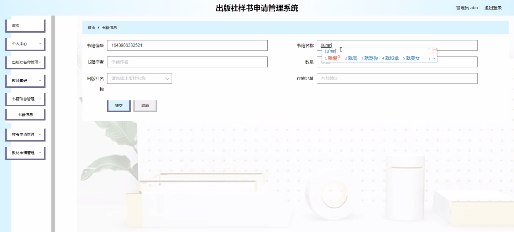
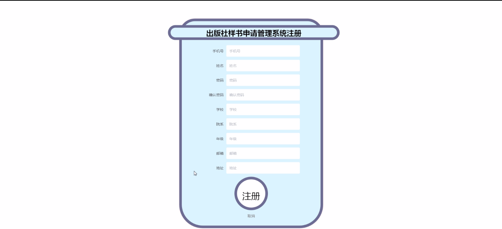
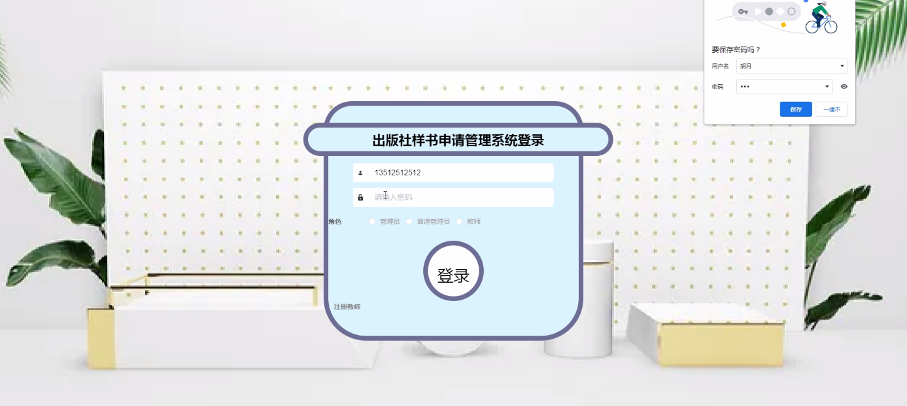
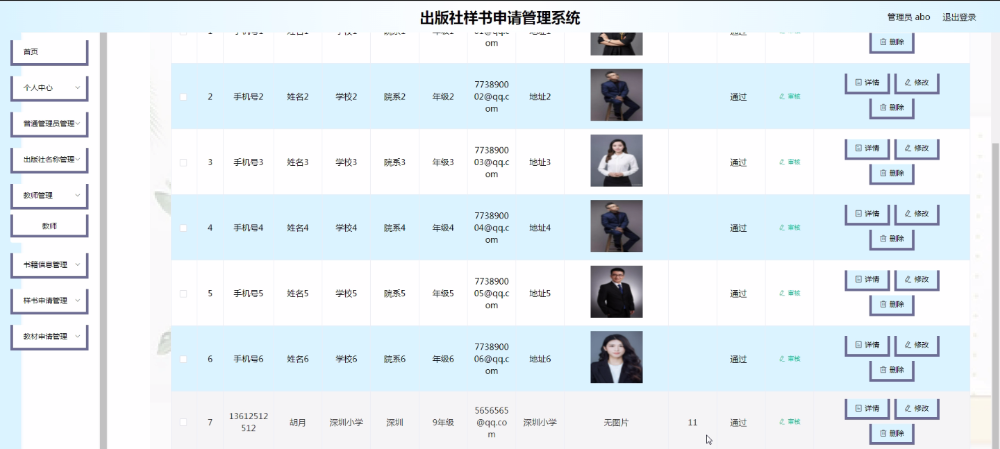
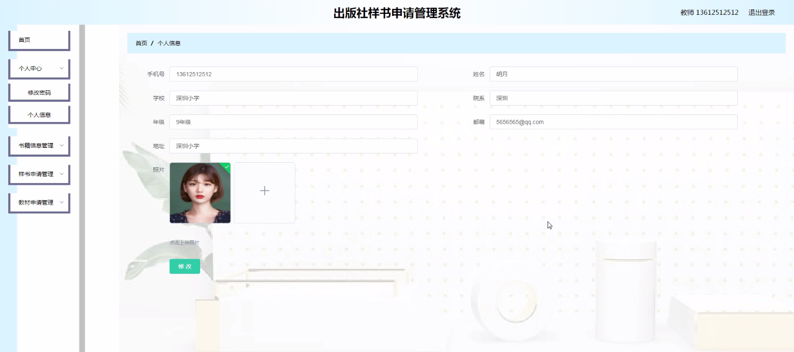
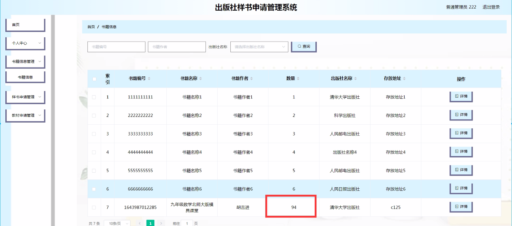

****本项目包含程序+源码+数据库+LW+调试部署环境，文末可获取一份本项目的java源码和数据库参考。****

## ******开题报告******

研究背景、意义和目的：

在当今数字化时代，出版社面临着日益增长的图书出版需求和复杂的管理任务。为了提高出版效率、优化资源配置以及提供更好的服务质量，开发一个出版社样书申请管理系统具有重要的背景、意义和目的。

首先，随着教育事业的不断发展，各级各类学校对教材和参考书的需求量不断增加。传统的样书申请流程繁琐、耗时，无法满足快速、高效的需求。因此，开发一个出版社样书申请管理系统可以极大地提高样书申请的处理效率，减少人力资源的浪费，为教育工作者提供更便捷、高效的服务。

其次，出版社需要与教师、学校等多个角色进行信息交流和协作。传统的沟通方式存在信息传递不及时、易丢失等问题，导致沟通效率低下。通过开发一个出版社样书申请管理系统，可以实现在线留言功能，方便教师和出版社之间的沟通和反馈，提高信息传递的准确性和效率。

最后，出版社需要对书籍信息、样书申请、教材申请等进行全面的管理和统计分析。传统的手工记录和处理方式容易出现错误和遗漏，无法满足大规模数据的处理需求。通过开发一个出版社样书申请管理系统，可以实现对各项功能的集中管理和自动化处理，提高数据的准确性和可靠性，为出版社决策提供科学依据。

综上所述，开发一个出版社样书申请管理系统具有重要的背景、意义和目的。它将提高出版效率、优化资源配置，方便教师和出版社之间的沟通和协作，实现对各项功能的集中管理和自动化处理，从而为出版社提供更好的服务质量和决策支持。

研究内容：

本研究的主要内容是设计和开发一个出版社样书申请管理系统，该系统包括以下功能：

  1. 出版社名称管理：用于管理出版社的基本信息，包括名称、地址、联系方式等。

  2. 教师管理：用于管理教师的信息，包括姓名、职称、联系方式等。

  3. 书籍信息管理：用于管理出版社出版的书籍信息，包括书名、作者、出版日期等。

  4. 样书申请管理：用于教师向出版社申请样书，包括填写申请表、选择书籍、填写申请理由等。

  5. 教材申请管理：用于学校向出版社申请教材，包括填写申请表、选择教材、填写申请理由等。

  6. 普通管理员管理：用于管理系统的普通管理员账号和权限，包括账号注册、登录、权限设置等。

  7. 在线留言功能：用于教师和出版社之间的在线交流和反馈，包括留言、回复、查看历史留言等。

通过以上功能的设计和实现，出版社样书申请管理系统能够提供便捷、高效的样书申请服务，优化资源配置，提高沟通效率，实现数据的集中管理和自动化处理。

预期成果：

本研究的预期成果是成功设计和开发一个出版社样书申请管理系统，并在实际应用中取得良好的效果。具体来说，预期成果包括：

  1. 系统界面友好、操作简便，满足用户的使用需求。

  2. 样书申请处理流程简化，提高处理效率，减少人力资源的浪费。

  3. 教师和出版社之间的沟通和协作更加便捷、高效，信息传递准确性提高。

  4. 数据的集中管理和自动化处理，提高数据的准确性和可靠性。

  5. 提供科学依据和决策支持，优化资源配置，提高出版效率。

通过以上预期成果的实现，出版社样书申请管理系统将为出版社提供更好的服务质量和决策支持，推动出版业的数字化转型和发展。

进度安排：

2022年9月至10月：需求分析和规划，明确系统功能和目标，制定项目计划。

2022年11月至2023年1月：系统设计和编码，完成详细的系统设计并开始编写代码。

2023年2月至3月：用户界面开发和数据库开发，开发用户友好的界面和设计数据库结构。

2023年4月至5月：功能测试、文档编写和上线部署，对系统进行全面的功能测试并编写用户手册。

2023年5月：维护和升级，定期对系统进行维护和升级，修复bug和添加新功能。

参考文献：

[1]邱小群,邓丽艳,陈海潮.基于B/S的信息管理系统设计和实现[J].信息与电脑(理论版),2022,(20):146-148.

[2]谢霜.基于Java技术的网络管理体系结构的应用[J].网络安全技术与应用,2022,(10):14-15.

[3]宋锦华.高职院校Java程序设计课程改革研究[J].科技视界,2022,(20):133-135.

[4]曹嵩彭,王鹏宇.浅析Java语言在软件开发中的应用[J].信息记录材料,2022,(03):114-116.

[5]朱澈,余俊达.武汉东湖学院.基于Java的软硬件信息管理系统V1.0[Z].项目立项编号.鉴定单位.鉴定日期:

****以上是本项目程序开发之前开题报告内容，最终成品以下面界面为准，大家可以酌情参考使用。要源码参考请在文末进行获取！！****

## ******本项目的界面展示******

