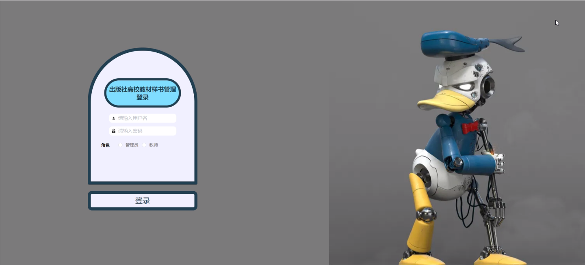
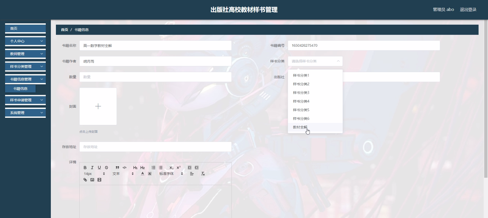
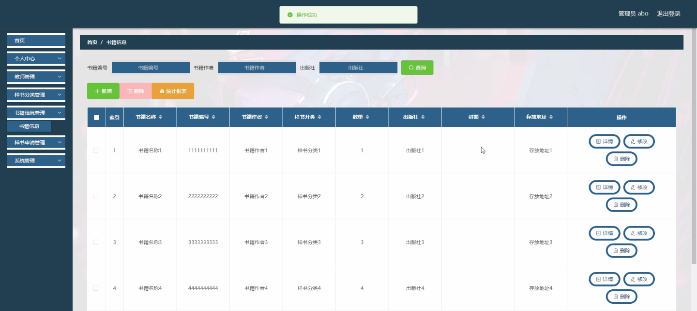
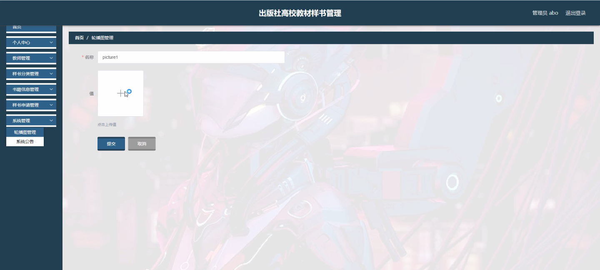
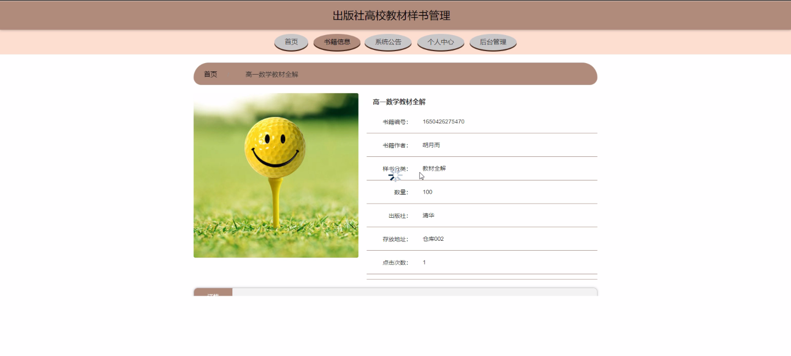
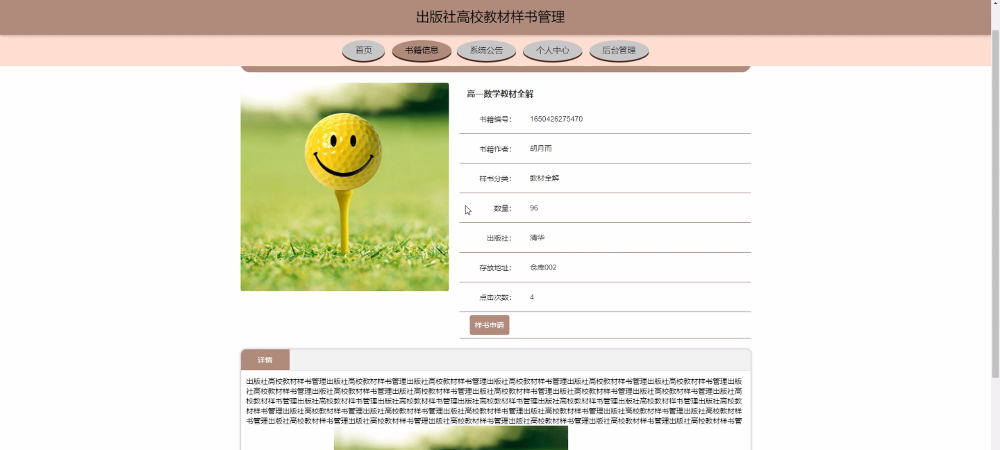

****本项目包含程序+源码+数据库+LW+调试部署环境，文末可获取一份本项目的java源码和数据库参考。****

## ******开题报告******

研究背景：
随着高校教育的不断发展和进步，教材在教学过程中起到了至关重要的作用。而教材样书管理作为一项重要的工作，对于高校出版社来说具有重要意义。然而，在传统的样书管理方式下，存在着一些问题，如样书分类不规范、样书申请流程繁琐等，这些问题给教材样书管理带来了一定的困扰和挑战。

研究意义：
因此，开展对高校教材样书管理的研究具有重要意义。通过深入研究和分析，可以找出现有样书管理方式的不足之处，并提出相应的改进措施，从而提高样书管理的效率和质量，为高校教学提供更好的支持和保障。

研究目的：
本研究旨在探索高校教材样书管理的优化方案，以解决当前存在的问题。具体目标包括：建立规范的样书分类体系，简化样书申请流程，提升书籍信息管理的准确性和及时性，从而实现高校教材样书管理的科学化、规范化和智能化。

研究内容： 本研究将围绕教师、样书分类、样书申请和书籍信息等系统功能展开研究。具体包括以下几个方面的内容：

  1. 教师管理：研究如何建立教师信息库，包括教师基本信息、所授课程和使用教材等，以便更好地满足教师对样书的需求，并提供个性化的服务。

  2. 样书分类：研究如何建立科学合理的样书分类体系，使得样书能够按照一定的规则进行分类和归档，方便教师和管理人员查找和借阅。

  3. 样书申请：研究如何简化样书申请流程，通过引入电子化申请系统，实现在线申请、审批和借阅，提高样书申请的效率和便利性。

  4. 书籍信息管理：研究如何建立完善的书籍信息管理系统，包括书籍的采购、入库、出库和盘点等环节，确保书籍信息的准确性和及时性。

拟解决的主要问题：
本研究旨在解决当前高校教材样书管理中存在的问题，主要包括样书分类不规范、样书申请流程繁琐、书籍信息管理不及时等方面的问题。通过优化管理方式和引入智能化技术，提高样书管理的效率和质量。

研究方案：
本研究将采用文献研究、实地调研、问卷调查等方法，对高校教材样书管理进行深入分析和研究。同时，结合现有的信息技术手段，设计并开发相应的样书管理系统，以实现样书管理的科学化、规范化和智能化。

预期成果：
通过本研究，预期可以得到以下成果：建立规范的样书分类体系，简化样书申请流程，提升书籍信息管理的准确性和及时性，从而实现高校教材样书管理的科学化、规范化和智能化。这些成果将为高校出版社和教师提供更好的样书管理服务，提高教学质量和效果。

进度安排：

2022年9月至10月：需求分析和规划，进行用户需求调研和分析，确定系统功能和目标。

2022年11月至2023年1月：系统设计和开发，完成系统架构设计和技术选型，并开始编写代码。

2023年2月至3月：测试和优化，进行单元测试和集成测试，修复问题并优化系统性能。

2023年4月至5月：文档编写和培训，编写用户手册和系统文档，并进行相关人员的培训。

2023年5月：上线部署和维护，将系统部署到生产环境中，并定期进行维护和升级。

参考文献：

[1]王振华.SpringBoot在教学效果评估系统中的应用[J].电子技术,2023,(05):67-69.

[2]王明泉.基于SpringBoot远程热部署的探索和应用[J].信息与电脑(理论版),2023,(07):1-4.

[3]王亚东,李晓霞,陈强强,剡美娜.基于SpringBoot的需求发布平台设计[J].信息与电脑(理论版),2023,(01):105-107.

[4]陈新府豪.基于SpringBoot和Vue框架的创新方法推理系统的设计与实现[D].导师：黄静.浙江理工大学,2022.

[5]霍福华,韩慧.基于SpringBoot微服务架构下前后端分离的MVVM模型[J].电子技术与软件工程,2022,(01):73-76.

[6]韩策,张娜,王松亭,张凯,何方,袁峰.SpringBoot OPC客户端设计与研究[J].电子世界,2021,(19):25-26.

****以上是本项目程序开发之前开题报告内容，最终成品以下面界面为准，大家可以酌情参考使用。要源码参考请在文末进行获取！！****

## ******本项目的界面展示******

