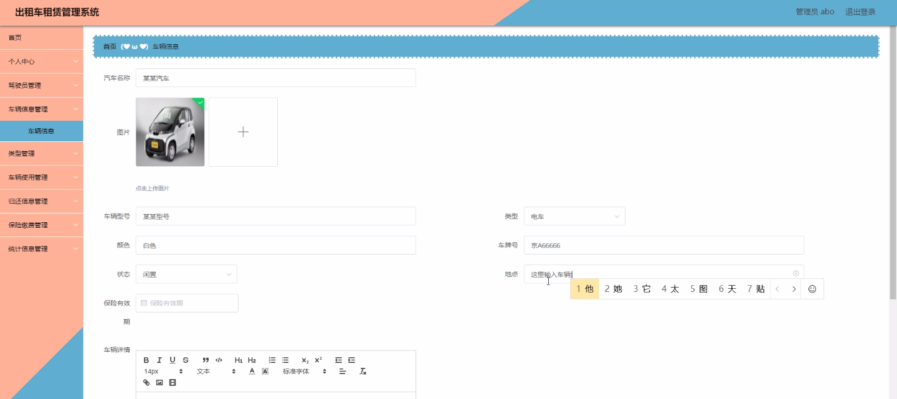
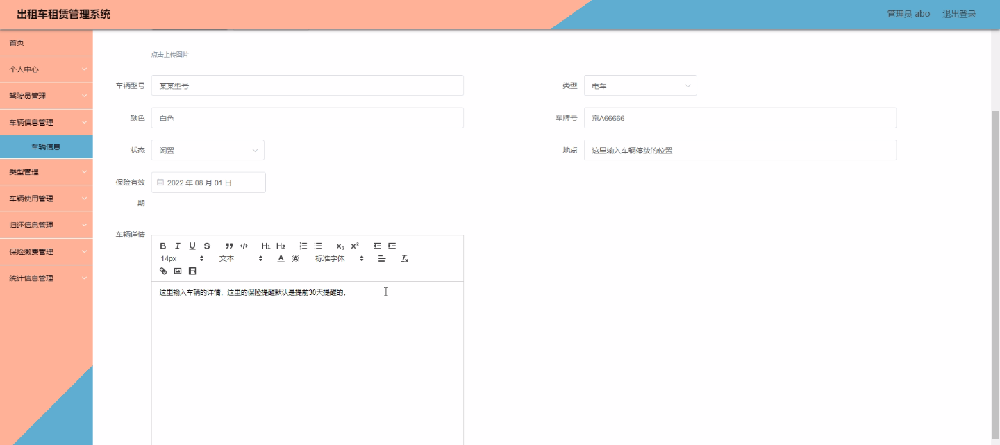
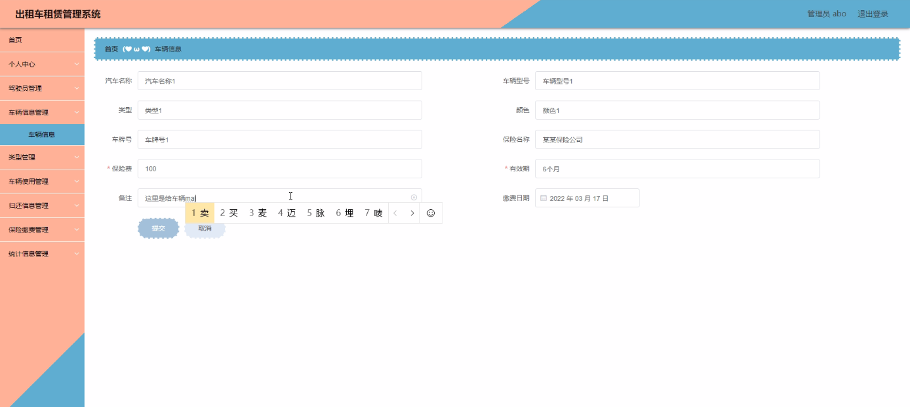
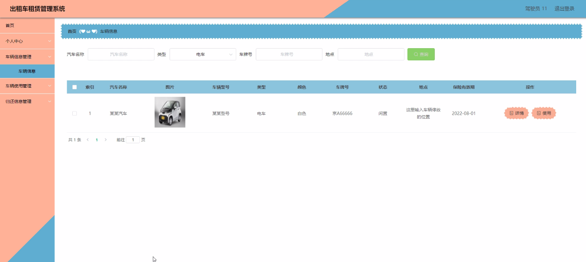
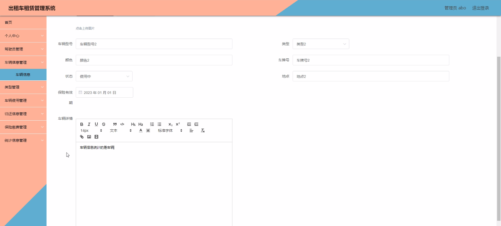

****本项目包含程序+源码+数据库+LW+调试部署环境，文末可获取一份本项目的java源码和数据库参考。****

## ******开题报告******

研究背景：
随着城市交通的不断发展和人们生活水平的提高，出租车行业在现代社会中扮演着重要的角色。然而，传统的出租车管理方式存在一些问题，如信息不透明、效率低下、安全隐患等。因此，开发一套高效的出租车租赁管理系统具有重要的现实意义。

研究意义：
出租车租赁管理系统的开发将为出租车行业带来诸多好处。首先，通过系统化的管理，可以提高出租车行业的运营效率，减少资源浪费。其次，系统能够提供准确的数据分析和统计信息，为决策者提供科学依据，优化资源配置。此外，系统还能提供更加便捷、安全的服务，提升乘客的出行体验。

研究目的：
本研究旨在开发一套完善的出租车租赁管理系统，以解决传统出租车管理方式存在的问题。通过引入信息技术手段，提高出租车行业的管理水平和服务质量，推动行业的可持续发展。

研究内容： 根据系统功能，本研究的主要内容包括以下几个方面：

  1. 驾驶员管理：包括驾驶员信息的录入、审核和维护，以及对驾驶员的培训和考核等。

  2. 车辆信息管理：涉及车辆基本信息的录入、更新和查询，包括车型、车牌号、购买日期等。

  3. 类型管理：对不同类型的出租车进行分类管理，如普通出租车、豪华出租车等。

  4. 车辆使用管理：记录车辆的使用情况，包括出租时间、里程数、费用等，并提供相应的统计分析功能。

  5. 归还信息管理：记录车辆的归还情况，包括归还时间、车况检查等。

  6. 保险缴费管理：管理车辆保险的缴费情况，提醒相关人员及时缴纳保险费用。

  7. 统计信息管理：对各项数据进行统计分析，生成报表和图表，为决策者提供参考依据。

拟解决的主要问题：
通过开发出租车租赁管理系统，我们将解决传统出租车管理方式存在的一系列问题，包括信息不透明、效率低下、安全隐患等。系统将提供全面的管理功能，实现信息的集中管理和共享，提高工作效率和服务质量。

研究方案：
本研究将采用软件开发的方法，结合数据库技术和网络技术，设计并实现出租车租赁管理系统。通过需求分析、系统设计、编码实现和测试验证等步骤，逐步完善系统功能，并进行性能优化和安全加固。

预期成果：
预计本研究将开发出一套高效、稳定的出租车租赁管理系统，能够满足出租车行业的管理需求。系统将提供全面的管理功能，提高出租车行业的运营效率和服务质量，为决策者提供科学依据，推动行业的可持续发展。

进度安排：

2022年9月至10月：需求分析和规划，明确系统功能和目标，制定项目计划。

2022年11月至2023年1月：系统设计和编码，完成详细的系统设计并开始编写代码。

2023年2月至3月：用户界面开发和数据库开发，开发用户友好的界面和设计数据库结构。

2023年4月至5月：功能测试、文档编写和上线部署，对系统进行全面的功能测试并编写用户手册。

2023年5月：维护和升级，定期对系统进行维护和升级，修复bug和添加新功能。

参考文献：

[1]邱小群,邓丽艳,陈海潮.基于B/S的信息管理系统设计和实现[J].信息与电脑(理论版),2022,(20):146-148.

[2]谢霜.基于Java技术的网络管理体系结构的应用[J].网络安全技术与应用,2022,(10):14-15.

[3]宋锦华.高职院校Java程序设计课程改革研究[J].科技视界,2022,(20):133-135.

[4]曹嵩彭,王鹏宇.浅析Java语言在软件开发中的应用[J].信息记录材料,2022,(03):114-116.

[5]朱澈,余俊达.武汉东湖学院.基于Java的软硬件信息管理系统V1.0[Z].项目立项编号.鉴定单位.鉴定日期:

****以上是本项目程序开发之前开题报告内容，最终成品以下面界面为准，大家可以酌情参考使用。要源码参考请在文末进行获取！！****

## ******本项目的界面展示******

