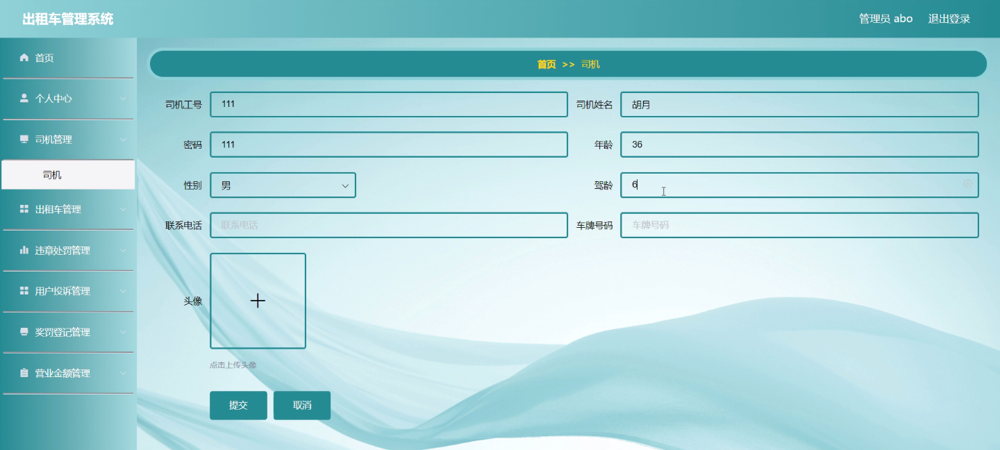
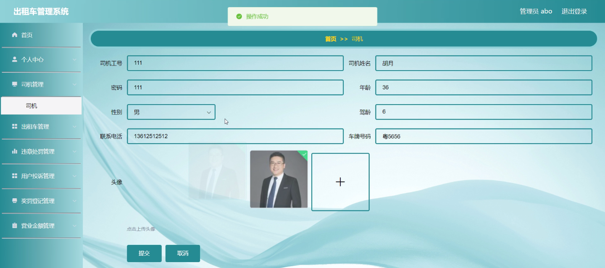
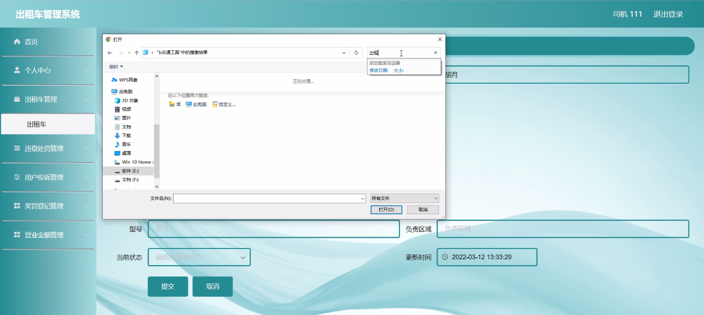
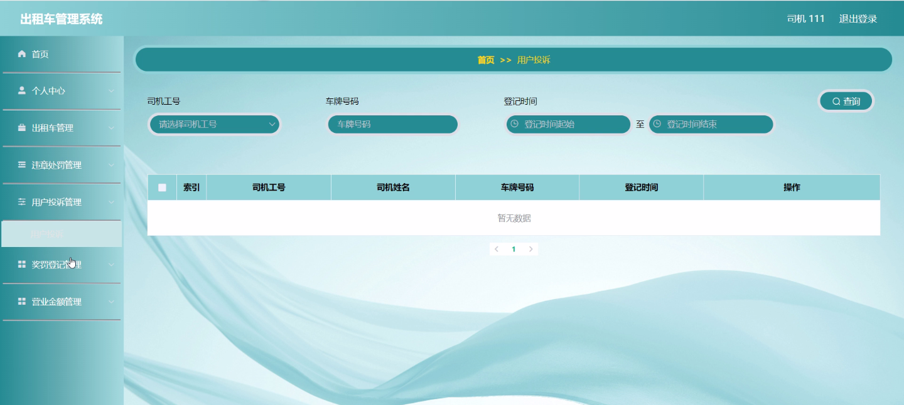
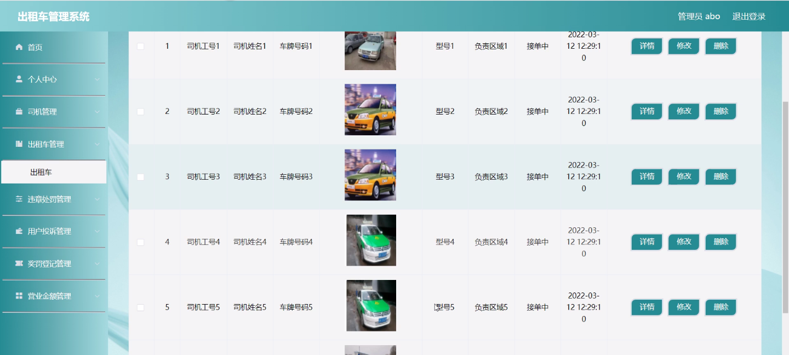
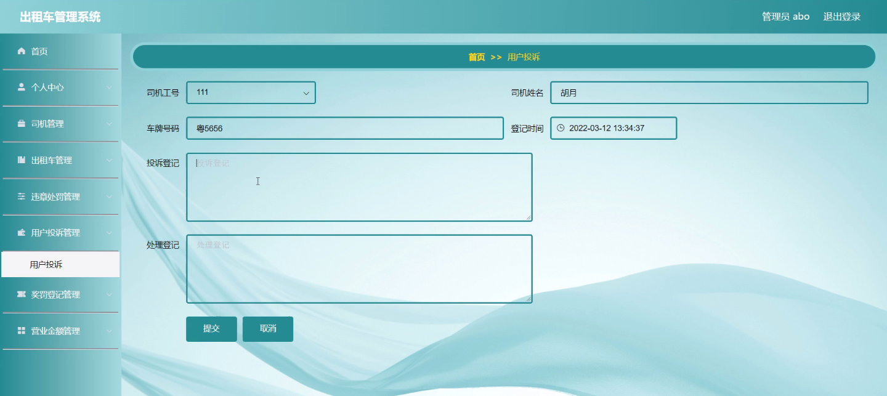
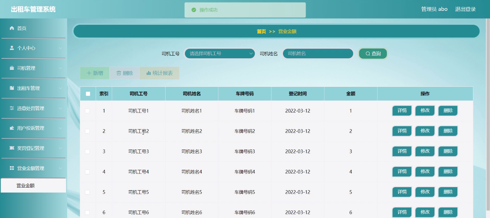

****本项目包含程序+源码+数据库+LW+调试部署环境，文末可获取一份本项目的java源码和数据库参考。****

## ******开题报告******

研究背景：
随着城市化进程的加快和人口的增长，出租车作为一种重要的交通工具在城市中扮演着重要角色。然而，传统的出租车管理方式存在一些问题，如司机违章行为频发、用户投诉难以及奖罚登记不规范等。这些问题严重影响了出租车行业的正常运营和服务质量，因此需要建立一个高效的出租车管理系统来解决这些问题。

研究意义：
建立一个出租车管理系统具有重要的现实意义。首先，通过对司机、出租车、违章处罚、用户投诉、奖罚登记、营业金额等系统功能进行有效管理，可以提高出租车行业的整体运营效率和服务质量。其次，该系统可以帮助监管部门更好地监督和管理出租车行业，减少违规行为和不良事件的发生，保障乘客的安全和权益。最后，该系统还可以为相关研究提供数据支持，为出租车行业的发展和改进提供科学依据。

研究目的：
本研究旨在设计和开发一套完善的出租车管理系统，以解决传统出租车管理方式存在的问题。具体目标包括提高司机的遵守交通规则和服务态度，加强用户投诉的处理和反馈机制，规范奖罚登记流程，实现营业金额的准确记录和统计分析。通过实施该系统，期望能够改善出租车行业的运营状况，提升乘客的出行体验，促进城市交通的发展。

研究内容： 本研究的主要内容是基于出租车管理系统的功能需求，设计和开发相应的模块和功能。具体包括以下几个方面：

  1. 司机管理：建立司机档案，记录司机的基本信息、从业资格证明等，并对司机的违章行为进行监控和处罚。

  2. 出租车管理：对出租车进行注册和认证，记录车辆信息、运营状态等，并进行定期检查和维护。

  3. 违章处罚：建立违章记录数据库，及时记录和处理司机的违章行为，并进行相应的处罚和警示。

  4. 用户投诉：建立用户投诉平台，接收用户的投诉信息，并及时处理和回复，保障用户的权益。

  5. 奖罚登记：建立奖罚登记系统，记录司机的优秀表现和不良行为，并进行相应的奖励和惩罚。

  6. 营业金额：建立营业金额统计系统，准确记录出租车的运营收入和支出，并进行分析和报表生成。

拟解决的主要问题： 通过上述研究内容，本研究旨在解决传统出租车管理方式存在的以下主要问题：

  1. 司机违章行为频发，影响交通秩序和乘客安全。
  2. 用户投诉难以及时处理和回复，降低了用户对出租车服务的满意度。
  3. 奖罚登记不规范，导致优秀司机得不到应有的奖励，不良司机得不到有效的惩罚。
  4. 营业金额记录不准确，影响了财务管理和经营决策的科学性。

研究方案和预期成果： 本研究将采用软件工程的方法，设计和开发出一套完善的出租车管理系统。通过系统的实施和应用，预期可以达到以下成果：

  1. 提高司机的遵守交通规则和服务态度，减少违章行为的发生。
  2. 加强用户投诉的处理和反馈机制，提升用户对出租车服务的满意度。
  3. 规范奖罚登记流程，确保优秀司机得到应有的奖励，不良司机得到有效的惩罚。
  4. 实现营业金额的准确记录和统计分析，为财务管理和经营决策提供科学依据。

进度安排：

2022年9月至10月：需求分析和规划，进行用户需求调研和分析，确定系统功能和目标。

2022年11月至2023年1月：系统设计和开发，完成系统架构设计和技术选型，并开始编写代码。

2023年2月至3月：测试和优化，进行单元测试和集成测试，修复问题并优化系统性能。

2023年4月至5月：文档编写和培训，编写用户手册和系统文档，并进行相关人员的培训。

2023年5月：上线部署和维护，将系统部署到生产环境中，并定期进行维护和升级。

参考文献：

[1]王振华.SpringBoot在教学效果评估系统中的应用[J].电子技术,2023,(05):67-69.

[2]王明泉.基于SpringBoot远程热部署的探索和应用[J].信息与电脑(理论版),2023,(07):1-4.

[3]王亚东,李晓霞,陈强强,剡美娜.基于SpringBoot的需求发布平台设计[J].信息与电脑(理论版),2023,(01):105-107.

[4]陈新府豪.基于SpringBoot和Vue框架的创新方法推理系统的设计与实现[D].导师：黄静.浙江理工大学,2022.

[5]霍福华,韩慧.基于SpringBoot微服务架构下前后端分离的MVVM模型[J].电子技术与软件工程,2022,(01):73-76.

[6]韩策,张娜,王松亭,张凯,何方,袁峰.SpringBoot OPC客户端设计与研究[J].电子世界,2021,(19):25-26.

****以上是本项目程序开发之前开题报告内容，最终成品以下面界面为准，大家可以酌情参考使用。要源码参考请在文末进行获取！！****

## ******本项目的界面展示******

