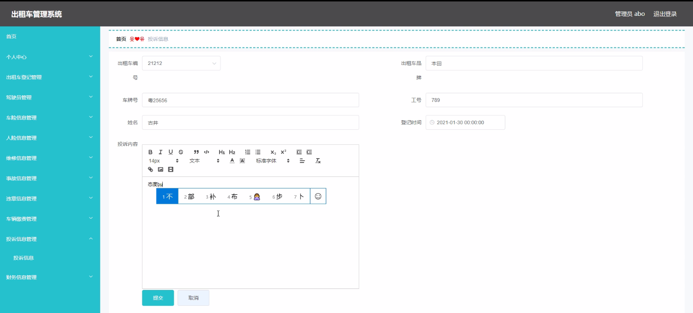

****本项目包含程序+源码+数据库+LW+调试部署环境，文末可获取一份本项目的java源码和数据库参考。****

## ******开题报告******

研究背景：
随着城市化进程的加快和人口的不断增长，出租车作为一种重要的公共交通工具，在城市出行中扮演着重要角色。然而，传统的出租车管理方式存在一些问题，如信息不透明、管理效率低下等。因此，建立一个高效的出租车管理系统变得尤为重要。

研究意义：
出租车管理系统的建立对于提升城市交通运输的效率和质量具有重要意义。通过该系统，可以实现对出租车的全面管理和监控，提高运营效率，减少资源浪费，改善乘客的出行体验，提升城市形象。

研究目的：
本研究旨在设计和开发一套完善的出租车管理系统，以解决传统管理方式存在的问题。通过该系统，可以实现对出租车的登记、驾驶员信息、车险信息、人险信息、维修信息、事故信息、违章信息、车辆缴费、投诉信息、财务信息等多个方面的管理，提高管理效率和服务质量。

研究内容： 本研究的主要内容是基于出租车管理系统的功能需求，设计和开发相应的模块，包括但不限于以下系统功能：

  1. 出租车登记：对出租车进行注册和登记，包括车辆信息、驾驶员信息等。
  2. 驾驶员管理：对驾驶员进行管理，包括驾驶证信息、从业资格证信息等。
  3. 车险信息管理：记录和管理出租车的车险信息，包括保险公司、保单号、保险金额等。
  4. 人险信息管理：记录和管理驾驶员的人身保险信息，包括保险公司、保单号、保险金额等。
  5. 维修信息管理：记录和管理出租车的维修信息，包括维修时间、维修内容、费用等。
  6. 事故信息管理：记录和管理出租车的事故信息，包括事故时间、责任方、赔偿金额等。
  7. 违章信息管理：记录和管理出租车的违章信息，包括违章时间、违章地点、罚款金额等。
  8. 车辆缴费管理：记录和管理出租车的各项费用，包括年检费、路桥费、停车费等。
  9. 投诉信息管理：记录和管理乘客对出租车服务的投诉信息，包括投诉内容、处理结果等。
  10. 财务信息管理：记录和管理出租车的财务信息，包括收入、支出、利润等。

拟解决的主要问题：
通过建立出租车管理系统，可以解决传统管理方式存在的信息不透明、管理效率低下等问题。该系统将实现信息的集中管理和共享，提高管理效率和服务质量，为城市交通运输提供更加便捷和高效的服务。

研究方案和预期成果：
本研究将采用软件开发的方法，设计和开发出一套完善的出租车管理系统。通过需求分析、系统设计、编码实现和测试验证等步骤，最终完成系统的开发和部署。预期成果包括一个功能完备、操作简便、安全可靠的出租车管理系统，能够满足城市交通管理部门和出租车企业的需求，提升管理效率和服务质量，改善乘客的出行体验，促进城市交通运输的可持续发展。

进度安排：

2022年9月至10月：开题报告编写和提交，完成开题报告的撰写并提交给指导教师进行审核。

2022年11月至2023年1月：系统设计和开发，根据开题报告的要求，进行系统设计和编码工作。

2023年2月至3月：论文撰写和初稿完成，开始撰写论文，并在这个阶段完成论文的初稿。

2023年4月至5月：论文修改和最终定稿，根据指导教师的意见对论文进行修改，并完成最终的定稿。

2023年5月：论文答辩和提交，参加论文答辩并根据答辩结果进行修改，最后将论文提交给学院或学校。

参考文献：

[1]喻佳,吴丹新.基于SpringBoot的Web快速开发框架[J].电脑编程技巧与维护,2021,(09):31-33.

[2]李鹏.基于SpringBoot快速开发平台的实现[J].电子技术与软件工程,2021,(12):36-37.

[3]叶开平,蔡维晟,陈家敏,邓斯妮.基于SpringBoot的综测可视化管理系统的研究与设计[J].电脑知识与技术,2021,(12):100-104.

[4]江健锋,徐振平.Springboot最小系统的设计与实现[J].电脑知识与技术,2021,(04):62-63.

[5]赵炯,司圣杰,周奇才,熊肖磊.通用信息获取系统设计与实现[J].起重运输机械,2020,(16):89-97.

[6]吴英宾.一种内外网数据交互系统的设计与实现[J].软件工程,2020,(08):25-27.

****以上是本项目程序开发之前开题报告内容，最终成品以下面界面为准，大家可以酌情参考使用。要源码参考请在文末进行获取！！****

## ******本项目的界面展示******

