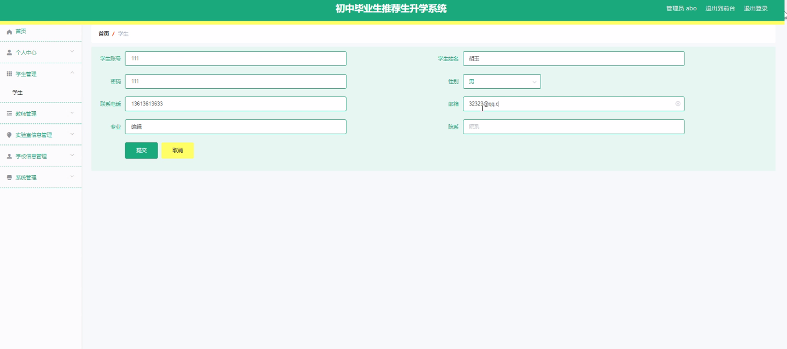
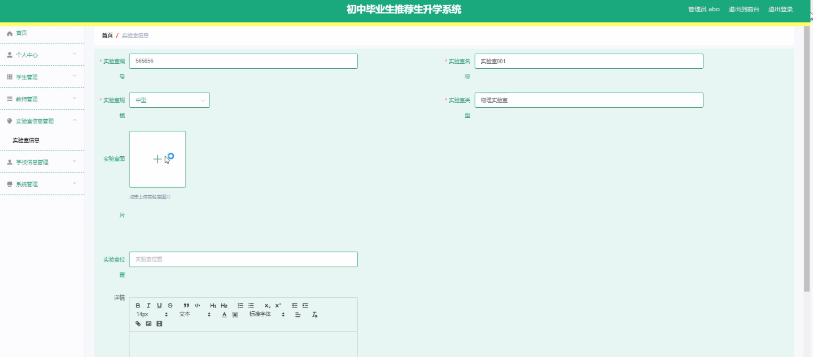
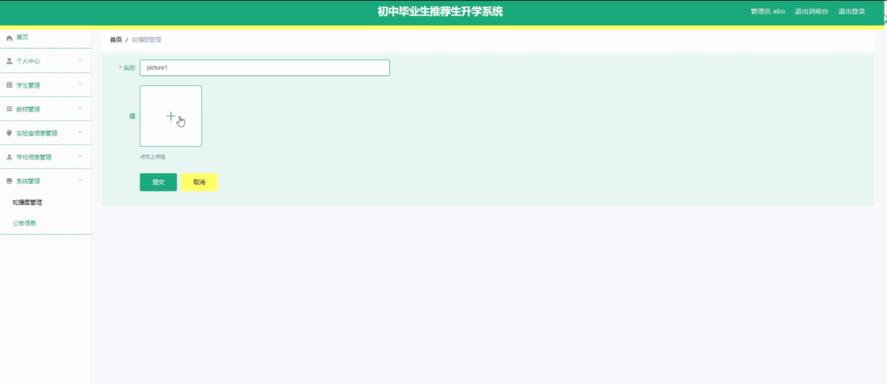
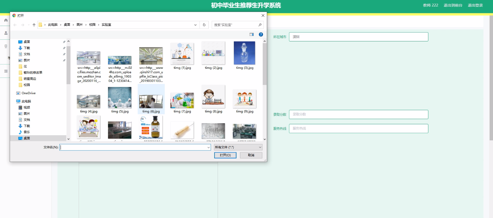
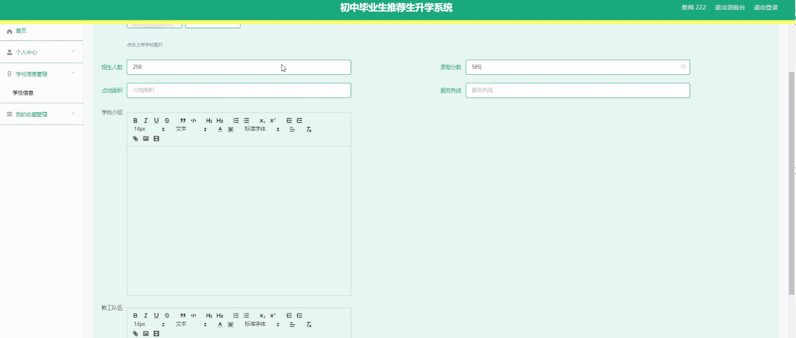
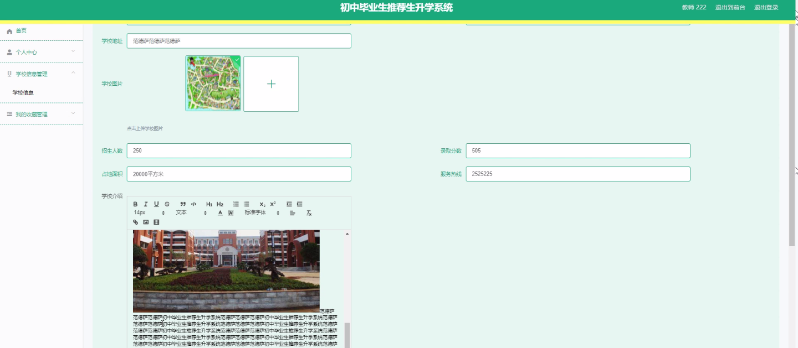

****本项目包含程序+源码+数据库+LW+调试部署环境，文末可获取一份本项目的java源码和数据库参考。****

## ******开题报告******

研究背景：
随着社会的发展和教育的普及，初中毕业生升学问题日益引起人们的关注。传统的升学方式主要依赖于学生和家长的个人经验和信息渠道，存在信息不对称、选择困难等问题。因此，开发一套科学有效的生升学系统具有重要的现实意义。

研究意义：
推荐生升学系统的开发将为初中毕业生提供全面、准确的升学信息和指导，帮助他们更好地规划自己的未来发展方向。同时，该系统还能够为学校、教育部门等提供数据支持，促进教育资源的合理配置和优化。

研究目的：
本研究旨在开发一套基于学生、学校信息和学生成绩等功能的推荐生升学系统，通过分析学生的个人特点、学校的教育质量以及学生成绩等因素，为初中毕业生提供个性化的升学建议和方案，帮助他们做出明智的决策。

研究内容： 本研究的主要内容包括以下三个系统功能：

  1. 学生信息功能：收集和管理初中毕业生的个人信息，包括性别、家庭背景、兴趣爱好等。通过对学生个人特点的分析，为其提供个性化的升学建议。

  2. 学校信息功能：收集和整理各个学校的教育资源、师资力量、办学特色等信息。通过对学校的综合评估，为学生推荐适合的学校。

  3. 学生成绩功能：收集和分析学生的学习成绩，包括各科目的得分情况、排名等。通过对学生成绩的评估，为学生提供相应的升学方向和建议。

拟解决的主要问题： 本研究旨在解决以下问题：

  1. 信息不对称问题：通过系统化的数据收集和整理，消除学生和家长在升学信息获取上的不平等现象，提供公平、准确的信息。

  2. 选择困难问题：通过对学生个人特点和学校教育质量的分析，为学生提供个性化的升学建议，减轻选择压力。

  3. 教育资源配置问题：通过对学校的综合评估，促进教育资源的合理配置和优化，提高教育质量。

研究方案和预期成果：
本研究将采用数据收集、分析和算法设计等方法，开发一套推荐生升学系统。通过对大量的学生、学校信息和学生成绩进行分析，建立相应的推荐模型和算法，为初中毕业生提供个性化的升学建议。预期成果包括系统的开发与实施，并通过实际应用验证其有效性和可行性。

进度安排：

2022年9月至10月：开题报告编写和提交，完成开题报告的撰写并提交给指导教师进行审核。

2022年11月至2023年1月：系统设计和开发，根据开题报告的要求，进行系统设计和编码工作。

2023年2月至3月：论文撰写和初稿完成，开始撰写论文，并在这个阶段完成论文的初稿。

2023年4月至5月：论文修改和最终定稿，根据指导教师的意见对论文进行修改，并完成最终的定稿。

2023年5月：论文答辩和提交，参加论文答辩并根据答辩结果进行修改，最后将论文提交给学院或学校。

参考文献：

[1]喻佳,吴丹新.基于SpringBoot的Web快速开发框架[J].电脑编程技巧与维护,2021,(09):31-33.

[2]李鹏.基于SpringBoot快速开发平台的实现[J].电子技术与软件工程,2021,(12):36-37.

[3]叶开平,蔡维晟,陈家敏,邓斯妮.基于SpringBoot的综测可视化管理系统的研究与设计[J].电脑知识与技术,2021,(12):100-104.

[4]江健锋,徐振平.Springboot最小系统的设计与实现[J].电脑知识与技术,2021,(04):62-63.

[5]赵炯,司圣杰,周奇才,熊肖磊.通用信息获取系统设计与实现[J].起重运输机械,2020,(16):89-97.

[6]吴英宾.一种内外网数据交互系统的设计与实现[J].软件工程,2020,(08):25-27.

****以上是本项目程序开发之前开题报告内容，最终成品以下面界面为准，大家可以酌情参考使用。要源码参考请在文末进行获取！！****

## ******本项目的界面展示******

