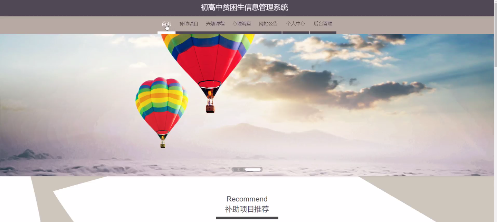
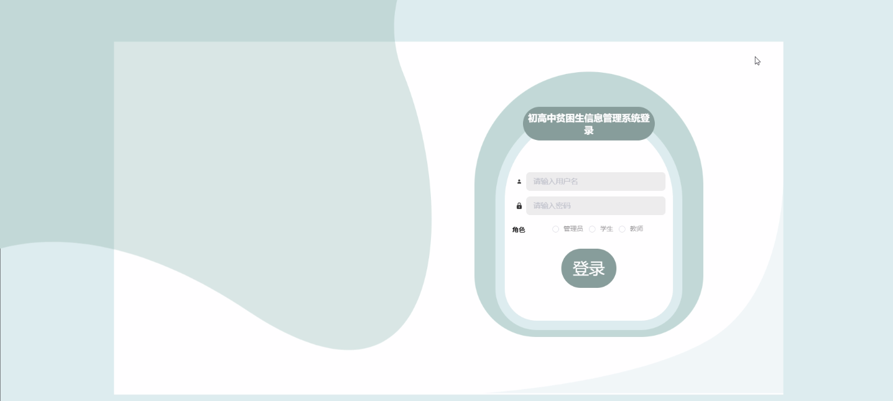
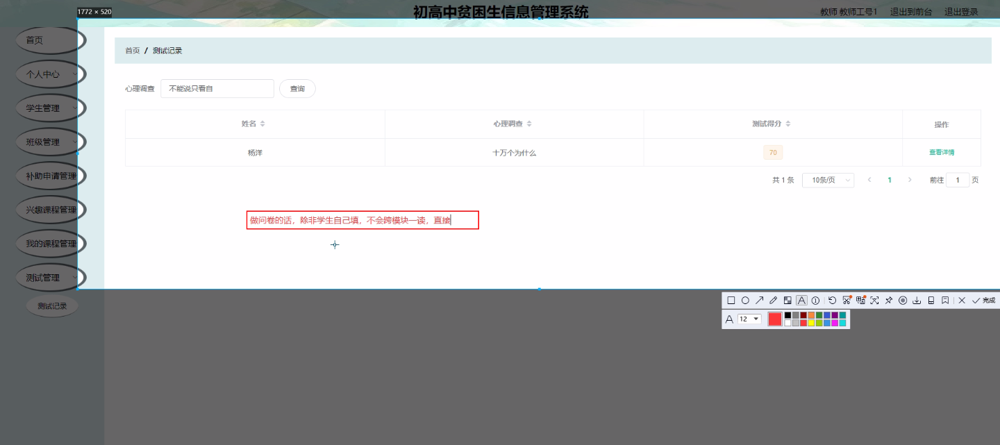
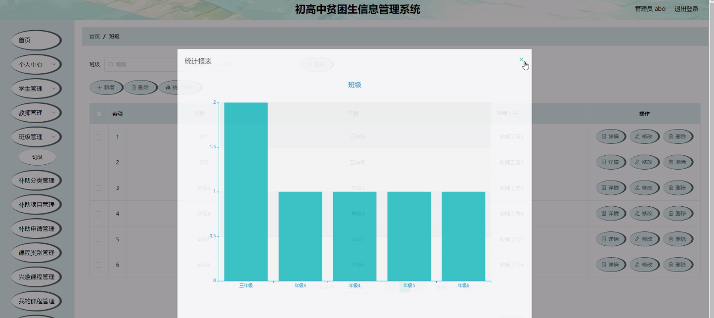
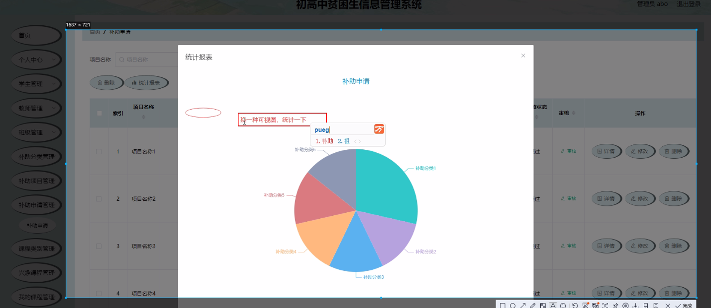
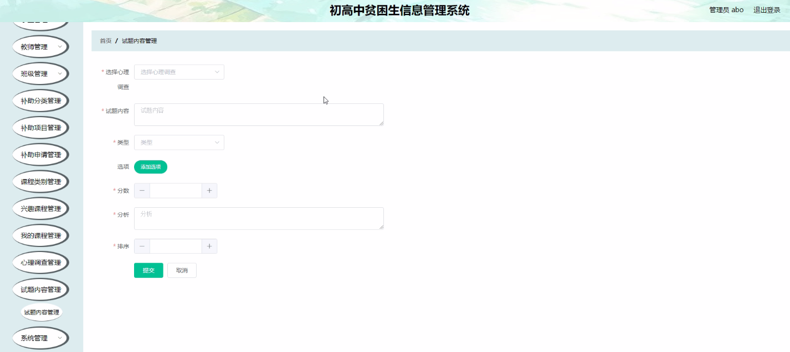
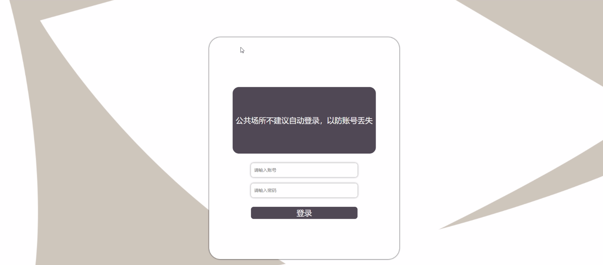

****本项目包含程序+源码+数据库+LW+调试部署环境，文末可获取一份本项目的java源码和数据库参考。****

## ******开题报告******

研究背景：
随着社会的发展和进步，教育公平问题一直备受关注。贫困生是指家庭经济条件较差、无法满足基本学习需求的学生群体。他们面临着诸多困境，如学习资源匮乏、生活费用不足等。为了帮助这些贫困生更好地接受教育，初高中贫困生信息管理系统应运而生。

研究意义：
初高中贫困生信息管理系统的建立对于促进教育公平具有重要意义。通过该系统，可以更加全面、准确地了解贫困生的基本情况和需求，为他们提供有针对性的帮助和支持。同时，该系统还能够提高教育资源的配置效率，优化贫困生的学习环境，推动教育公平的实现。

研究目的：
初高中贫困生信息管理系统的研究旨在构建一个科学、高效的管理平台，以便更好地管理和服务贫困生群体。通过该系统，可以实现对贫困生信息的收集、整理、分析和利用，为相关部门和机构提供决策依据，为贫困生提供个性化的教育支持和帮助。

研究内容：
初高中贫困生信息管理系统的研究内容主要包括以下系统功能：学生、班级、补助分类、补助项目、补助申请、课程类别、兴趣课程、我的课程、教师等。通过这些功能，可以实现对贫困生的基本信息管理、补助申请管理、课程安排和教师管理等方面的工作。

拟解决的主要问题：
该系统旨在解决初高中贫困生管理中存在的一系列问题，如信息收集不全面、数据分析不准确、资源配置不合理等。通过建立科学的信息管理系统，可以更好地了解贫困生的需求，优化资源配置，提高教育公平的实现效果。

研究方案和预期成果：
在研究方案上，我们将采用先进的信息技术手段，结合教育管理的实际需求，设计并开发初高中贫困生信息管理系统。预期成果包括系统的正常运行和应用，能够实现对贫困生信息的全面管理和利用，提高教育资源的配置效率，促进教育公平的实现。

进度安排：

2022年9月至10月：需求分析和规划，进行用户需求调研和分析，确定系统功能和目标。

2022年11月至2023年1月：系统设计和开发，完成系统架构设计和技术选型，并开始编写代码。

2023年2月至3月：测试和优化，进行单元测试和集成测试，修复问题并优化系统性能。

2023年4月至5月：文档编写和培训，编写用户手册和系统文档，并进行相关人员的培训。

2023年5月：上线部署和维护，将系统部署到生产环境中，并定期进行维护和升级。

参考文献：

[1]王振华.SpringBoot在教学效果评估系统中的应用[J].电子技术,2023,(05):67-69.

[2]王明泉.基于SpringBoot远程热部署的探索和应用[J].信息与电脑(理论版),2023,(07):1-4.

[3]王亚东,李晓霞,陈强强,剡美娜.基于SpringBoot的需求发布平台设计[J].信息与电脑(理论版),2023,(01):105-107.

[4]陈新府豪.基于SpringBoot和Vue框架的创新方法推理系统的设计与实现[D].导师：黄静.浙江理工大学,2022.

[5]霍福华,韩慧.基于SpringBoot微服务架构下前后端分离的MVVM模型[J].电子技术与软件工程,2022,(01):73-76.

[6]韩策,张娜,王松亭,张凯,何方,袁峰.SpringBoot OPC客户端设计与研究[J].电子世界,2021,(19):25-26.

****以上是本项目程序开发之前开题报告内容，最终成品以下面界面为准，大家可以酌情参考使用。要源码参考请在文末进行获取！！****

## ******本项目的界面展示******

