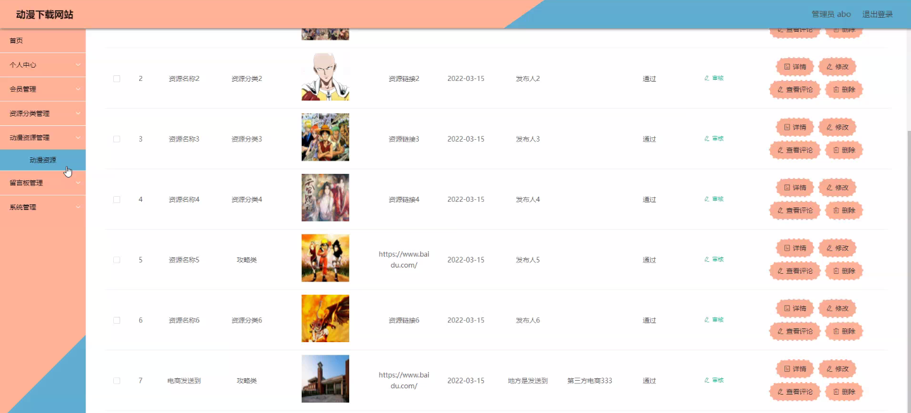

****本项目包含程序+源码+数据库+LW+调试部署环境，文末可获取一份本项目的java源码和数据库参考。****

## ******开题报告******

研究背景：
随着互联网的迅速发展，动漫作为一种受众广泛的娱乐形式，受到了越来越多人的喜爱。然而，由于动漫资源的获取相对困难，用户往往需要通过各种渠道进行搜索和下载，存在着版权不明、资源质量参差不齐等问题。因此，建立一个专门提供动漫下载的网站具有重要意义。

研究意义：
通过建立一个专业的动漫下载网站，可以为广大动漫爱好者提供便捷、高质量的动漫资源，满足他们的需求。同时，该网站还可以规范动漫资源的传播渠道，保护版权，促进动漫产业的健康发展。此外，通过研究动漫下载网站的系统功能，可以提升用户体验，增加用户粘性，为网站运营提供更多商业机会。

研究目的：
本研究旨在探索动漫下载网站的建设与优化，以提供更好的服务体验和资源质量，满足用户的需求。通过分析现有的动漫下载网站，总结其优点和不足之处，并结合用户反馈和需求，设计出一个更加完善的动漫下载网站系统，提高用户满意度和使用效果。

研究内容： 本研究将围绕动漫下载网站的系统功能展开，主要包括以下几个方面：

  1. 会员系统：研究如何建立一个完善的会员系统，实现用户注册、登录、积分管理、VIP特权等功能，以提升用户忠诚度和粘性。

  2. 资源分类：研究如何对动漫资源进行合理分类和标签，方便用户查找和浏览，提高资源的可用性和可发现性。

  3. 动漫资源：研究如何收集、整理和更新动漫资源，保证资源的质量和时效性，同时解决版权问题，确保资源的合法性。

拟解决的主要问题：
在建设动漫下载网站的过程中，存在着资源不全、版权问题、用户体验不佳等一系列问题。本研究旨在通过优化网站的系统功能和资源管理，解决以上问题，提供更好的服务体验和资源质量。

研究方案：
本研究将采用文献调研、案例分析和用户调研等方法，结合市场需求和技术实际，设计出一个符合用户需求的动漫下载网站系统。同时，还将进行资源采集和整理工作，确保网站上的动漫资源丰富、优质。

预期成果：
通过本研究，预期可以建立一个专业的动漫下载网站，提供便捷、高质量的动漫资源，满足用户的需求。同时，通过优化网站的系统功能和资源管理，解决版权问题，提升用户体验，增加用户粘性，为网站运营带来更多商业机会。

进度安排：

2022年9月至10月：开题报告编写和提交，完成开题报告的撰写并提交给指导教师进行审核。

2022年11月至2023年1月：系统设计和开发，根据开题报告的要求，进行系统设计和编码工作。

2023年2月至3月：论文撰写和初稿完成，开始撰写论文，并在这个阶段完成论文的初稿。

2023年4月至5月：论文修改和最终定稿，根据指导教师的意见对论文进行修改，并完成最终的定稿。

2023年5月：论文答辩和提交，参加论文答辩并根据答辩结果进行修改，最后将论文提交给学院或学校。

参考文献：

[1]喻佳,吴丹新.基于SpringBoot的Web快速开发框架[J].电脑编程技巧与维护,2021,(09):31-33.

[2]李鹏.基于SpringBoot快速开发平台的实现[J].电子技术与软件工程,2021,(12):36-37.

[3]叶开平,蔡维晟,陈家敏,邓斯妮.基于SpringBoot的综测可视化管理系统的研究与设计[J].电脑知识与技术,2021,(12):100-104.

[4]江健锋,徐振平.Springboot最小系统的设计与实现[J].电脑知识与技术,2021,(04):62-63.

[5]赵炯,司圣杰,周奇才,熊肖磊.通用信息获取系统设计与实现[J].起重运输机械,2020,(16):89-97.

[6]吴英宾.一种内外网数据交互系统的设计与实现[J].软件工程,2020,(08):25-27.

****以上是本项目程序开发之前开题报告内容，最终成品以下面界面为准，大家可以酌情参考使用。要源码参考请在文末进行获取！！****

## ******本项目的界面展示******

