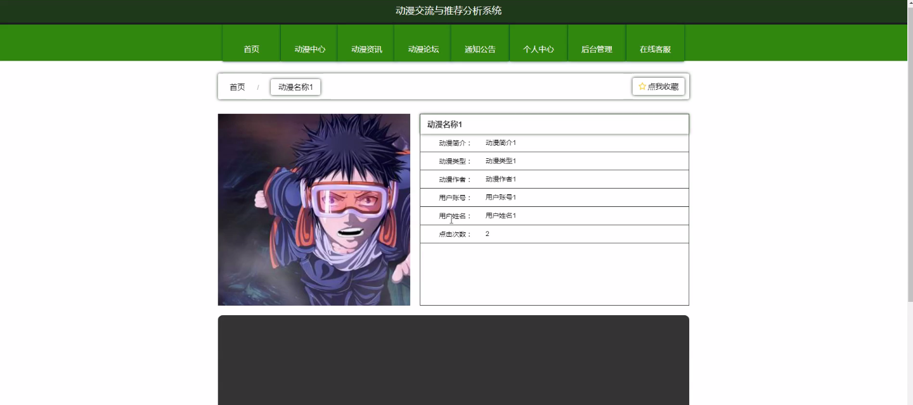
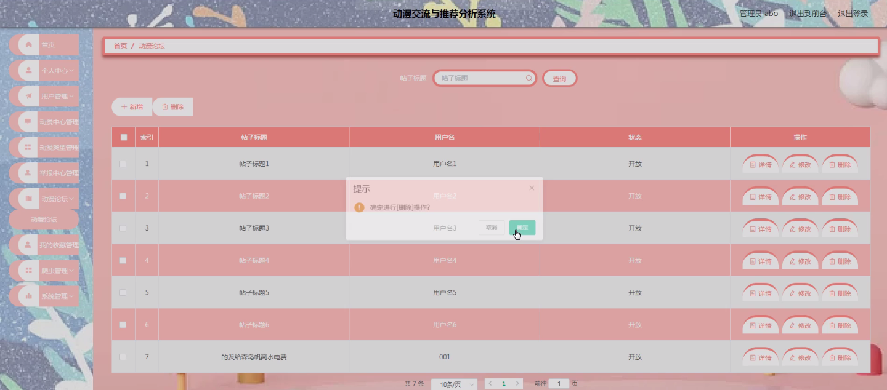
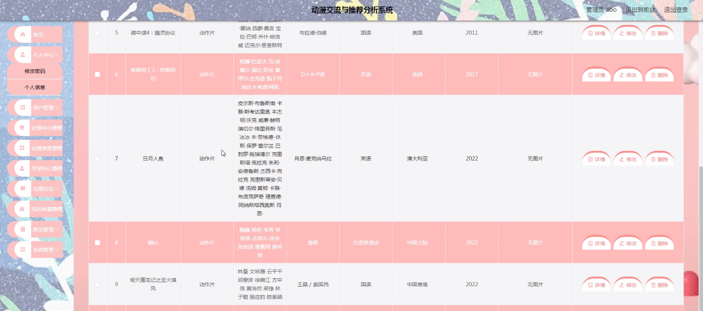

****本项目包含程序+源码+数据库+LW+调试部署环境，文末可获取一份本项目的java源码和数据库参考。****

## ******开题报告******

研究背景：
随着互联网的快速发展和普及，动漫作为一种受欢迎的娱乐形式在全球范围内越来越受到关注。然而，由于动漫作品数量庞大、类型繁多，用户往往面临着选择困难和信息过载的问题。同时，动漫作品中可能存在低俗、暴力等不良内容，这也给用户带来了一定的安全隐患。因此，开发一个动漫交流与推荐分析系统具有重要的现实意义。

研究意义：
该系统的研发旨在通过对动漫作品进行分析和推荐，提供给用户更加个性化、精准的动漫推荐服务。同时，通过建立举报中心，能够及时发现和处理不良内容，保护用户的合法权益。此外，该系统还可以促进用户之间的交流和互动，增强用户对动漫作品的理解和欣赏，提升用户的整体观影体验。

研究目的：
本研究的目的是设计和开发一个动漫交流与推荐分析系统，以满足用户对动漫作品的需求，并提供安全可靠的使用环境。通过系统的运行和应用，旨在提高用户对动漫作品的选择准确性和满意度，促进动漫产业的发展，推动优秀动漫作品的传播和推广。

研究内容： 本研究的主要内容包括以下几个方面：

  1. 用户系统：设计并实现用户注册、登录、个人信息管理等功能，为用户提供个性化的服务和推荐体验。

  2. 动漫中心：建立动漫作品数据库，收录各类动漫作品的基本信息，包括名称、类型、导演、制作公司等，以便用户进行查询和浏览。

  3. 动漫类型：对动漫作品进行分类和标签化，提供多维度的检索和筛选功能，帮助用户快速找到符合自己兴趣的作品。

  4. 举报中心：建立一个举报平台，用户可以匿名举报不良内容，系统将及时处理并采取相应措施，保障用户的安全和权益。

拟解决的主要问题：
该系统旨在解决动漫用户面临的信息过载、选择困难和安全隐患等问题。通过分析用户的喜好和行为，利用推荐算法为用户提供个性化的动漫推荐服务；通过建立举报中心，及时发现和处理不良内容，保护用户的合法权益。

研究方案和预期成果：
本研究将采用数据挖掘、机器学习等技术方法，结合用户行为分析和推荐算法，设计并实现一个智能化的动漫交流与推荐分析系统。预期成果包括：高效准确的动漫推荐算法、安全可靠的用户环境、便捷易用的用户界面等。通过系统的应用和推广，预计能够提升用户对动漫作品的选择准确性和满意度，促进动漫产业的发展和繁荣。

进度安排：

2022年9月至10月：需求分析和规划，明确系统功能和目标，制定项目计划。

2022年11月至2023年1月：系统设计和编码，完成详细的系统设计并开始编写代码。

2023年2月至3月：用户界面开发和数据库开发，开发用户友好的界面和设计数据库结构。

2023年4月至5月：功能测试、文档编写和上线部署，对系统进行全面的功能测试并编写用户手册。

2023年5月：维护和升级，定期对系统进行维护和升级，修复bug和添加新功能。

参考文献：

[1]邱小群,邓丽艳,陈海潮.基于B/S的信息管理系统设计和实现[J].信息与电脑(理论版),2022,(20):146-148.

[2]谢霜.基于Java技术的网络管理体系结构的应用[J].网络安全技术与应用,2022,(10):14-15.

[3]宋锦华.高职院校Java程序设计课程改革研究[J].科技视界,2022,(20):133-135.

[4]曹嵩彭,王鹏宇.浅析Java语言在软件开发中的应用[J].信息记录材料,2022,(03):114-116.

[5]朱澈,余俊达.武汉东湖学院.基于Java的软硬件信息管理系统V1.0[Z].项目立项编号.鉴定单位.鉴定日期:

****以上是本项目程序开发之前开题报告内容，最终成品以下面界面为准，大家可以酌情参考使用。要源码参考请在文末进行获取！！****

## ******本项目的界面展示******

