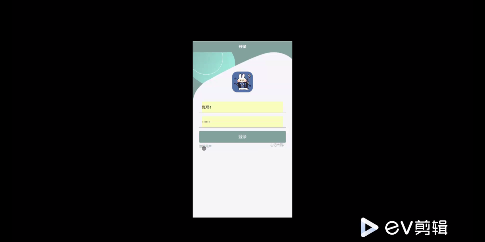
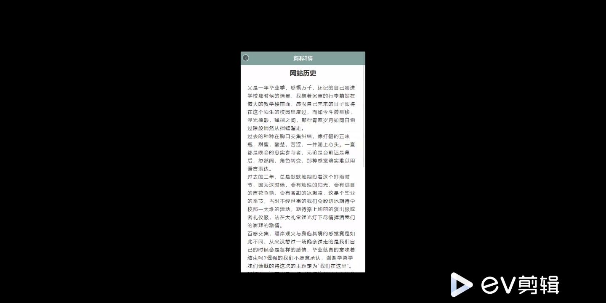
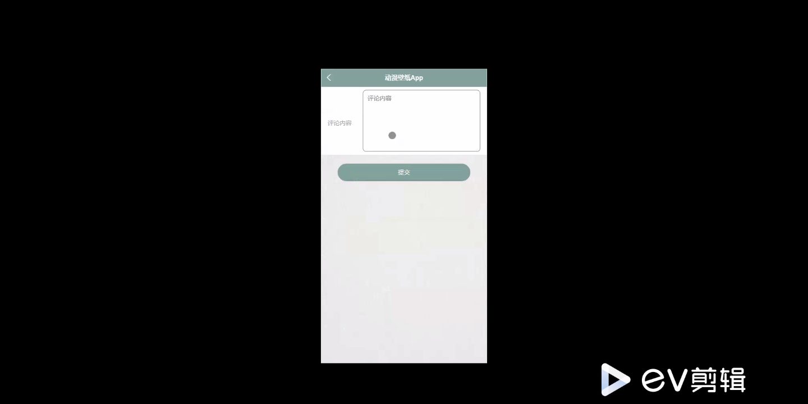
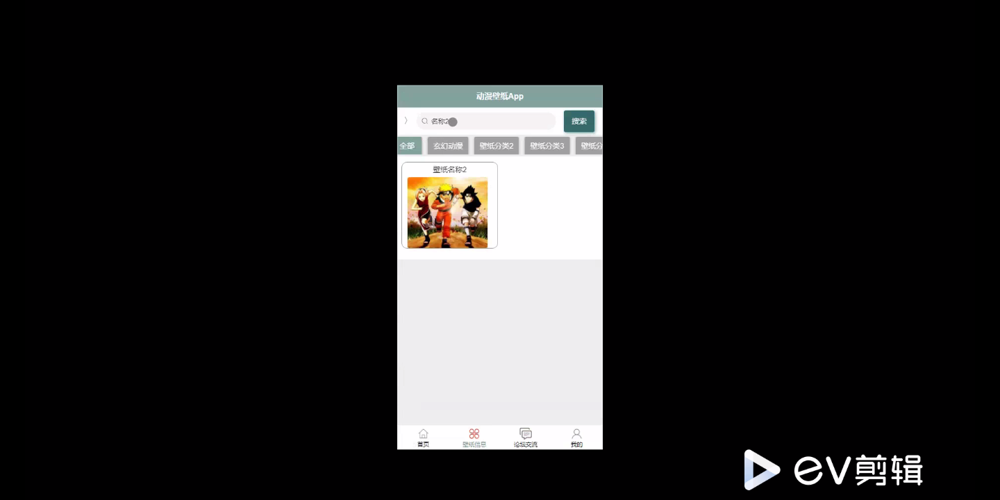
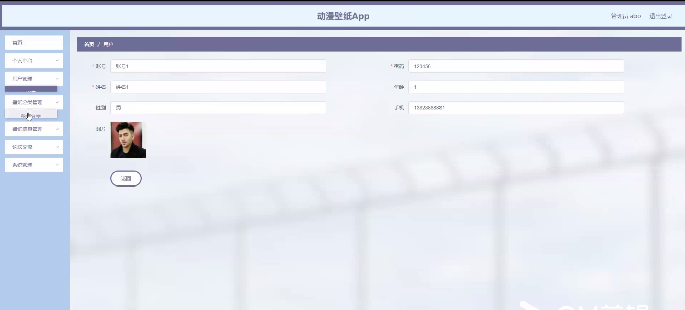
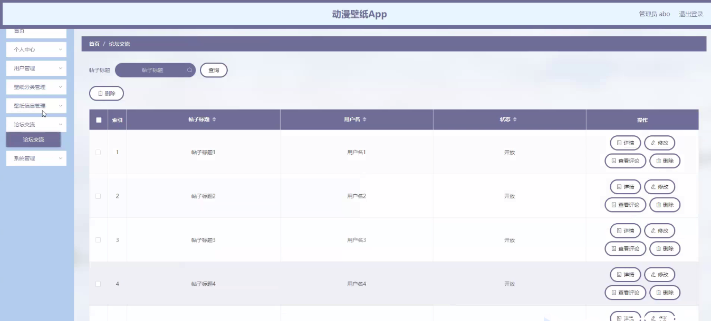

****本项目包含程序+源码+数据库+LW+调试部署环境，文末可获取一份本项目的java源码和数据库参考。****

## ******开题报告******

研究背景：
随着科技的不断发展和智能手机的普及，动漫壁纸作为一种个性化的装饰方式受到了越来越多人的喜爱。动漫壁纸以其独特的艺术风格和生动的形象，吸引了广大动漫爱好者的关注。然而，在当前的市场上，动漫壁纸的质量和数量存在一定的问题，用户往往难以找到自己喜欢的高质量动漫壁纸。因此，对于动漫壁纸的研究具有重要的现实意义。

研究意义：
本研究旨在通过系统功能的设计与优化，提供一个便捷、高效的动漫壁纸获取平台，满足用户对于个性化壁纸的需求。通过对用户、壁纸分类和壁纸信息等系统功能的深入研究，可以为用户提供更加精准、多样化的动漫壁纸选择，提升用户体验，促进动漫文化的传播与推广。

研究目的：
本研究的主要目的是通过对动漫壁纸获取平台的研究与开发，解决用户在获取动漫壁纸过程中遇到的问题，提高用户对于动漫壁纸的满意度。具体而言，研究目的包括：优化用户界面设计，提升用户体验；改进壁纸分类算法，增加壁纸的多样性和个性化选择；完善壁纸信息展示，提供更加详尽准确的壁纸信息。

研究内容： 本研究的主要内容包括以下三个方面：

  1. 用户功能：通过用户注册、登录和个人信息管理等功能，建立用户个人档案，实现用户个性化推荐和壁纸收藏等功能，提升用户体验。

  2. 壁纸分类功能：通过对动漫壁纸进行分类标注和算法优化，实现壁纸的自动分类和推荐功能，提供更加精准、多样化的壁纸选择。

  3. 壁纸信息功能：完善壁纸的信息展示，包括作者、作品介绍、版权信息等，提供给用户更加详尽准确的壁纸信息，增加用户对壁纸的了解和认知。

拟解决的主要问题：
本研究旨在解决以下问题：用户在获取动漫壁纸时难以找到符合个人喜好的高质量壁纸；壁纸分类不准确或单一，无法满足用户多样化的需求；壁纸信息不完善，用户对于壁纸的了解有限。

研究方案和预期成果：
本研究将采用数据分析、算法优化和用户调研等方法，设计与开发一个动漫壁纸获取平台。通过系统功能的优化和改进，预期实现以下成果：提供精准、多样化的动漫壁纸选择；增加用户对壁纸的了解和认知；提升用户体验和满意度；促进动漫文化的传播与推广。

进度安排：

2022年9月至10月：开题报告编写和提交，完成开题报告的撰写并提交给指导教师进行审核。

2022年11月至2023年1月：系统设计和开发，根据开题报告的要求，进行系统设计和编码工作。

2023年2月至3月：论文撰写和初稿完成，开始撰写论文，并在这个阶段完成论文的初稿。

2023年4月至5月：论文修改和最终定稿，根据指导教师的意见对论文进行修改，并完成最终的定稿。

2023年5月：论文答辩和提交，参加论文答辩并根据答辩结果进行修改，最后将论文提交给学院或学校。

参考文献：

[1]喻佳,吴丹新.基于SpringBoot的Web快速开发框架[J].电脑编程技巧与维护,2021,(09):31-33.

[2]李鹏.基于SpringBoot快速开发平台的实现[J].电子技术与软件工程,2021,(12):36-37.

[3]叶开平,蔡维晟,陈家敏,邓斯妮.基于SpringBoot的综测可视化管理系统的研究与设计[J].电脑知识与技术,2021,(12):100-104.

[4]江健锋,徐振平.Springboot最小系统的设计与实现[J].电脑知识与技术,2021,(04):62-63.

[5]赵炯,司圣杰,周奇才,熊肖磊.通用信息获取系统设计与实现[J].起重运输机械,2020,(16):89-97.

[6]吴英宾.一种内外网数据交互系统的设计与实现[J].软件工程,2020,(08):25-27.

****以上是本项目程序开发之前开题报告内容，最终成品以下面界面为准，大家可以酌情参考使用。要源码参考请在文末进行获取！！****

## ******本项目的界面展示******

