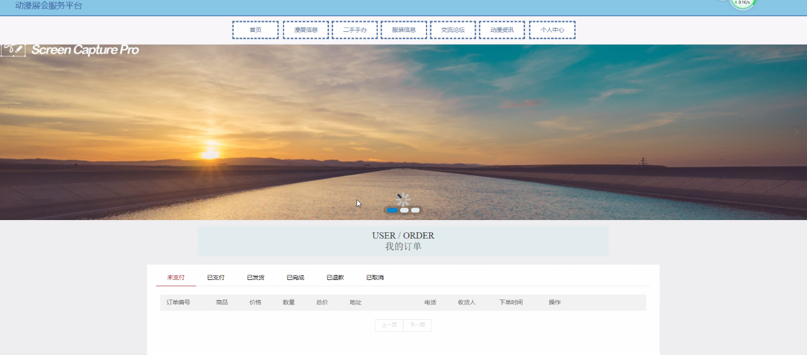

****本项目包含程序+源码+数据库+LW+调试部署环境，文末可获取一份本项目的java源码和数据库参考。****

## ******开题报告******

研究背景：
随着动漫产业的快速发展，动漫展会已经成为了动漫爱好者们交流、展示和购买作品的重要平台。然而，目前市场上缺乏一个统一的服务平台，使得动漫展会的组织和参与变得困难且不便利。因此，开发一个动漫展会服务平台具有重要的现实意义。

研究意义：
动漫展会服务平台的建立将为动漫爱好者、卖家以及相关从业人员提供一个集中管理和交流的平台。这将极大地促进动漫文化的传播和推广，提升动漫展会的组织效率和用户体验。同时，该平台还能够为动漫产业链的各个环节提供更多商机和发展空间。

研究目的：
本研究旨在设计和开发一个全面的动漫展会服务平台，通过整合用户、卖家、漫展信息、漫展分类、二手手办、手办分类、服装信息、服装分类等系统功能，实现动漫展会的全方位管理和优化。通过该平台，用户可以方便地查找感兴趣的展会信息，购买喜爱的商品，交流分享动漫文化。卖家可以通过平台推广和销售自己的产品，增加曝光度和销售额。

研究内容： 本研究将主要围绕动漫展会服务平台的设计和开发展开。具体研究内容包括但不限于以下系统功能：

  1. 用户管理：实现用户注册、登录、个人信息管理等功能，提供个性化的用户体验。
  2. 卖家管理：为卖家提供店铺管理、商品发布、订单管理等功能，方便卖家进行业务操作。
  3. 漫展信息管理：建立漫展信息数据库，包括展会时间、地点、参展商等信息，方便用户查询和了解。
  4. 漫展分类：对漫展进行分类管理，使用户能够快速找到感兴趣的展会。
  5. 二手手办管理：为用户提供二手手办交易平台，方便用户购买和出售二手手办。
  6. 手办分类：对手办进行分类管理，方便用户按照自己的喜好进行筛选和购买。
  7. 服装信息管理：建立服装信息数据库，包括服装款式、尺码、价格等信息，方便用户浏览和购买。
  8. 服装分类：对服装进行分类管理，使用户能够快速找到自己喜欢的款式。

拟解决的主要问题： 通过开发动漫展会服务平台，我们将解决以下问题：

  1. 动漫爱好者难以获取到全面和准确的漫展信息。
  2. 卖家缺乏一个集中管理和销售的平台，导致推广和销售困难。
  3. 用户购买二手手办和服装的渠道有限，交易不便利。
  4. 缺乏一个方便用户筛选和浏览商品的分类系统。

研究方案和预期成果：
本研究将采用需求分析、系统设计和软件开发等方法，设计和开发一个动漫展会服务平台原型。预期成果包括一个功能完善、界面友好的动漫展会服务平台，能够满足用户、卖家和相关从业人员的需求。该平台将提供全面的动漫展会管理和交流功能，促进动漫文化的传播和发展。

进度安排：

2022年9月至10月：需求分析和规划，明确系统功能和目标，制定项目计划。

2022年11月至2023年1月：系统设计和编码，完成详细的系统设计并开始编写代码。

2023年2月至3月：用户界面开发和数据库开发，开发用户友好的界面和设计数据库结构。

2023年4月至5月：功能测试、文档编写和上线部署，对系统进行全面的功能测试并编写用户手册。

2023年5月：维护和升级，定期对系统进行维护和升级，修复bug和添加新功能。

参考文献：

[1]邱小群,邓丽艳,陈海潮.基于B/S的信息管理系统设计和实现[J].信息与电脑(理论版),2022,(20):146-148.

[2]谢霜.基于Java技术的网络管理体系结构的应用[J].网络安全技术与应用,2022,(10):14-15.

[3]宋锦华.高职院校Java程序设计课程改革研究[J].科技视界,2022,(20):133-135.

[4]曹嵩彭,王鹏宇.浅析Java语言在软件开发中的应用[J].信息记录材料,2022,(03):114-116.

[5]朱澈,余俊达.武汉东湖学院.基于Java的软硬件信息管理系统V1.0[Z].项目立项编号.鉴定单位.鉴定日期:

****以上是本项目程序开发之前开题报告内容，最终成品以下面界面为准，大家可以酌情参考使用。要源码参考请在文末进行获取！！****

## ******本项目的界面展示******

