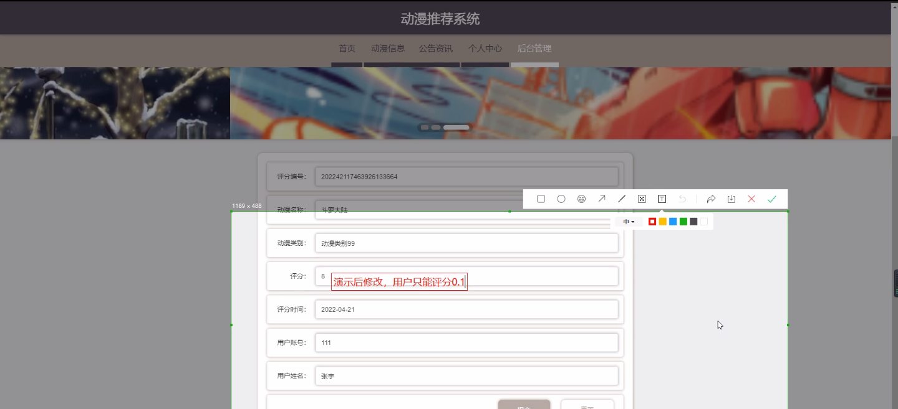

****本项目包含程序+源码+数据库+LW+调试部署环境，文末可获取一份本项目的java源码和数据库参考。****

## ******开题报告******

研究背景：
随着互联网的普及和技术的发展，动漫作为一种受欢迎的娱乐形式，吸引了越来越多的观众。然而，由于动漫作品的数量庞大且类型繁多，观众往往面临选择困难。因此，开发一个能够根据用户需求和偏好提供个性化推荐的动漫推荐系统变得尤为重要。

研究意义：
动漫推荐系统的出现可以帮助用户快速准确地找到符合自己口味的动漫作品，提高用户的观影体验。同时，对于动漫制作方和平台运营方来说，通过推荐系统可以更好地了解用户的喜好和需求，从而提供更精准的内容推荐，增加用户黏性和平台流量。

研究目的：
本研究旨在设计和开发一个基于用户需求和偏好的动漫推荐系统，通过分析用户的历史行为和兴趣特点，结合动漫的类别、信息和评分等系统功能，为用户提供个性化的动漫推荐服务。通过这样的推荐系统，我们希望能够解决用户在选择动漫作品时面临的困惑和选择难题，提高用户的满意度和观影体验。

研究内容： 本研究的主要内容包括以下几个方面：

  1. 用户建模：通过分析用户的历史行为数据，构建用户画像，包括用户的兴趣偏好、观影习惯等。同时，考虑到用户可能存在多样性的需求，需要设计合适的算法来处理用户的个性化推荐请求。

  2. 动漫类别分类：对动漫作品进行分类，建立动漫类别标签体系。通过对动漫作品的内容、风格、题材等进行分析和归纳，将动漫作品划分为不同的类别，为后续的推荐算法提供基础。

  3. 动漫信息获取：收集和整理动漫作品的相关信息，包括剧情介绍、导演、声优等。这些信息将用于推荐系统的展示和用户选择参考。

  4. 评分系统设计：建立一个可靠的动漫评分系统，通过用户的评分和反馈，不断优化推荐算法，提高推荐结果的准确性和个性化程度。

拟解决的主要问题： 本研究旨在解决以下主要问题：

  1. 用户个性化推荐：如何根据用户的历史行为和兴趣特点，提供个性化的动漫推荐服务，满足用户多样化的需求。

  2. 推荐算法优化：如何设计高效准确的推荐算法，提高推荐结果的质量和准确性。

  3. 数据获取和处理：如何收集和整理大量的动漫作品信息，建立完善的动漫数据库，为推荐系统提供可靠的数据支持。

研究方案和预期成果：
本研究将采用数据挖掘、机器学习和推荐算法等方法，结合用户行为分析和动漫内容特征，设计和开发一个动漫推荐系统。通过实验和评估，验证推荐系统的有效性和可行性，并与传统的推荐方法进行比较。预期的成果包括一个功能完善、准确度高的动漫推荐系统，能够为用户提供个性化、精准的动漫推荐服务，提高用户的观影体验和平台的用户黏性。

进度安排：

2022年9月至10月：需求分析和规划，进行用户需求调研和分析，确定系统功能和目标。

2022年11月至2023年1月：系统设计和开发，完成系统架构设计和技术选型，并开始编写代码。

2023年2月至3月：测试和优化，进行单元测试和集成测试，修复问题并优化系统性能。

2023年4月至5月：文档编写和培训，编写用户手册和系统文档，并进行相关人员的培训。

2023年5月：上线部署和维护，将系统部署到生产环境中，并定期进行维护和升级。

参考文献：

[1]王振华.SpringBoot在教学效果评估系统中的应用[J].电子技术,2023,(05):67-69.

[2]王明泉.基于SpringBoot远程热部署的探索和应用[J].信息与电脑(理论版),2023,(07):1-4.

[3]王亚东,李晓霞,陈强强,剡美娜.基于SpringBoot的需求发布平台设计[J].信息与电脑(理论版),2023,(01):105-107.

[4]陈新府豪.基于SpringBoot和Vue框架的创新方法推理系统的设计与实现[D].导师：黄静.浙江理工大学,2022.

[5]霍福华,韩慧.基于SpringBoot微服务架构下前后端分离的MVVM模型[J].电子技术与软件工程,2022,(01):73-76.

[6]韩策,张娜,王松亭,张凯,何方,袁峰.SpringBoot OPC客户端设计与研究[J].电子世界,2021,(19):25-26.

****以上是本项目程序开发之前开题报告内容，最终成品以下面界面为准，大家可以酌情参考使用。要源码参考请在文末进行获取！！****

## ******本项目的界面展示******

