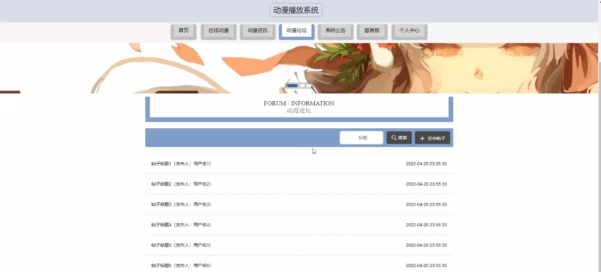
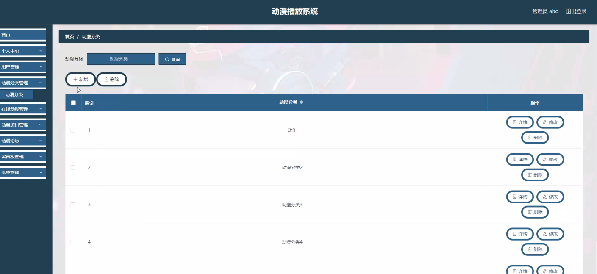
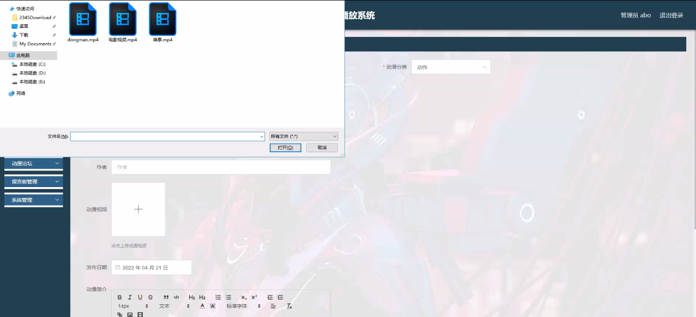

****本项目包含程序+源码+数据库+LW+调试部署环境，文末可获取一份本项目的java源码和数据库参考。****

## ******开题报告******

研究背景：
随着互联网的快速发展和智能手机的普及，动漫已经成为了人们生活中不可或缺的一部分。越来越多的人开始通过在线平台观看动漫，这也导致了动漫资源的爆发式增长。然而，由于动漫资源的庞大和多样性，用户往往会面临找到自己喜欢的动漫作品的困扰。因此，开发一个高效、智能的动漫播放系统对于满足用户需求，提供优质的动漫体验具有重要意义。

研究意义：
本研究旨在设计和开发一种动漫播放系统，以解决用户在寻找、分类和观看动漫作品时遇到的问题。通过引入用户、动漫分类、在线动漫、动漫资讯和标签信息等功能，该系统将为用户提供个性化推荐、方便的搜索和详细的动漫信息，从而提升用户的观看体验，并促进动漫产业的发展。

研究目的：
本研究的目的是构建一个全面、智能的动漫播放系统，以满足用户对动漫作品的多样化需求。通过对用户行为和偏好的分析，系统能够准确地推荐适合用户口味的动漫作品，并提供丰富的分类和标签信息，使用户能够快速找到自己感兴趣的作品。此外，系统还将提供及时的动漫资讯和在线观看功能，方便用户获取最新的动漫内容。

研究内容： 本研究的主要内容包括以下系统功能：

  1. 用户管理：设计并实现用户注册、登录、个人信息管理等功能，以便于系统对用户进行个性化推荐和记录用户的观看历史。

  2. 动漫分类：建立动漫分类体系，将动漫作品按照不同的类型、风格、年代等进行分类，方便用户根据自己的喜好进行选择。

  3. 在线动漫：搭建在线动漫播放平台，提供高清流畅的动漫观看服务，支持多种播放方式和设备。

  4. 动漫资讯：整合各类动漫资讯资源，包括新番介绍、声优访谈、活动报道等，为用户提供最新的动漫相关信息。

  5. 标签信息：为每部动漫作品添加标签信息，如题材、制作公司、原著作者等，方便用户通过标签搜索和筛选作品。

拟解决的主要问题：

  1. 用户需求匹配问题：如何根据用户的兴趣和偏好，精准地推荐适合其口味的动漫作品？

  2. 动漫分类问题：如何建立科学合理的动漫分类体系，使用户能够方便快速地找到自己感兴趣的作品？

  3. 在线观看问题：如何提供高质量、流畅的在线动漫观看服务，满足用户对观看体验的要求？

  4. 动漫资讯获取问题：如何及时、全面地整合和更新动漫资讯，为用户提供最新的动漫相关信息？

  5. 标签信息管理问题：如何准确地为每部动漫作品添加标签信息，并实现标签搜索和筛选功能的高效运行？

研究方案和预期成果： 本研究将采用数据挖掘、机器学习和推荐算法等技术手段，结合用户行为分析和动漫内容特征，设计并开发一个智能的动漫播放系统。预期成果包括：

  1. 用户个性化推荐算法：基于用户的兴趣和偏好，构建推荐模型，实现精准的动漫作品推荐。

  2. 动漫分类体系：建立科学合理的动漫分类体系，提供多维度的分类标准，方便用户快速找到感兴趣的作品。

  3. 高质量的在线观看服务：优化视频播放技术，提供流畅、高清的动漫观看体验。

  4. 动漫资讯平台：整合各类动漫资讯资源，为用户提供及时、全面的动漫相关信息。

  5. 标签信息管理系统：设计标签信息管理系统，实现准确的标签添加和高效的标签搜索功能。

进度安排：

2022年9月至10月：需求分析和规划，明确系统功能和目标，制定项目计划。

2022年11月至2023年1月：系统设计和编码，完成详细的系统设计并开始编写代码。

2023年2月至3月：用户界面开发和数据库开发，开发用户友好的界面和设计数据库结构。

2023年4月至5月：功能测试、文档编写和上线部署，对系统进行全面的功能测试并编写用户手册。

2023年5月：维护和升级，定期对系统进行维护和升级，修复bug和添加新功能。

参考文献：

[1]邱小群,邓丽艳,陈海潮.基于B/S的信息管理系统设计和实现[J].信息与电脑(理论版),2022,(20):146-148.

[2]谢霜.基于Java技术的网络管理体系结构的应用[J].网络安全技术与应用,2022,(10):14-15.

[3]宋锦华.高职院校Java程序设计课程改革研究[J].科技视界,2022,(20):133-135.

[4]曹嵩彭,王鹏宇.浅析Java语言在软件开发中的应用[J].信息记录材料,2022,(03):114-116.

[5]朱澈,余俊达.武汉东湖学院.基于Java的软硬件信息管理系统V1.0[Z].项目立项编号.鉴定单位.鉴定日期:

****以上是本项目程序开发之前开题报告内容，最终成品以下面界面为准，大家可以酌情参考使用。要源码参考请在文末进行获取！！****

## ******本项目的界面展示******

