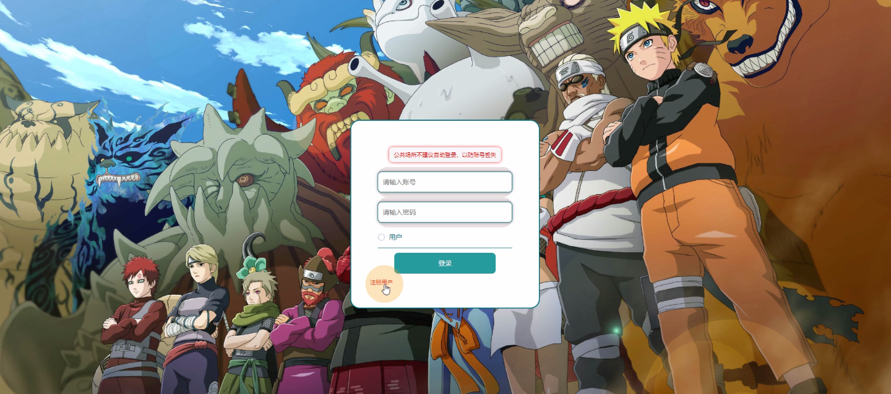
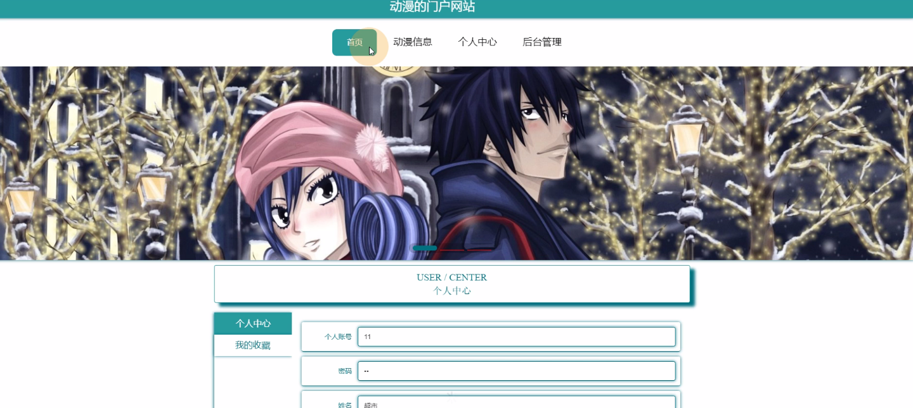
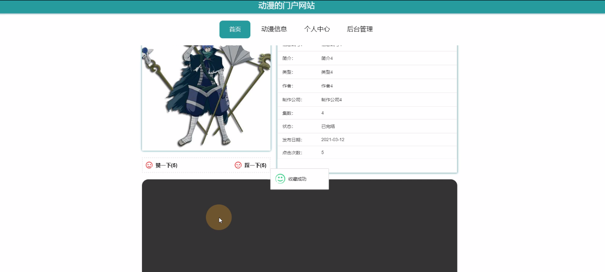
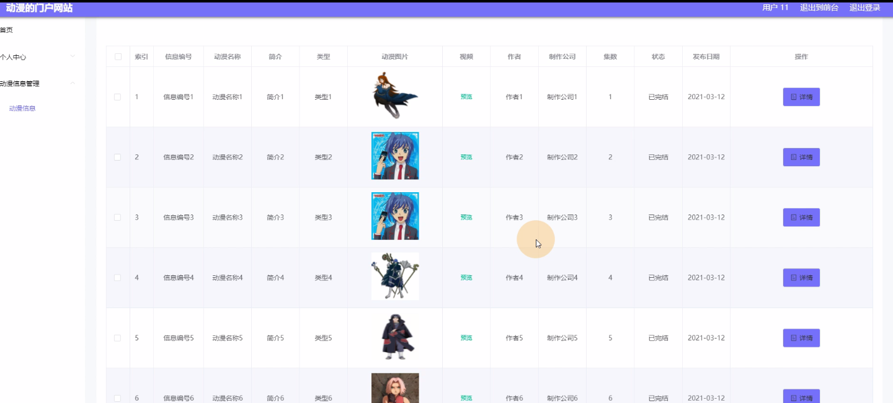
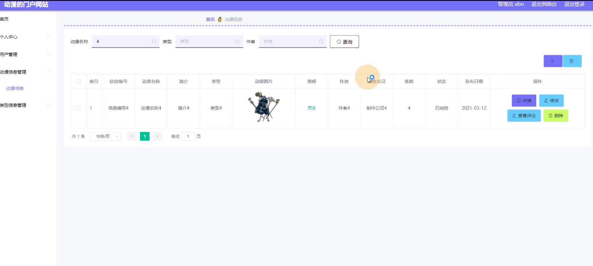
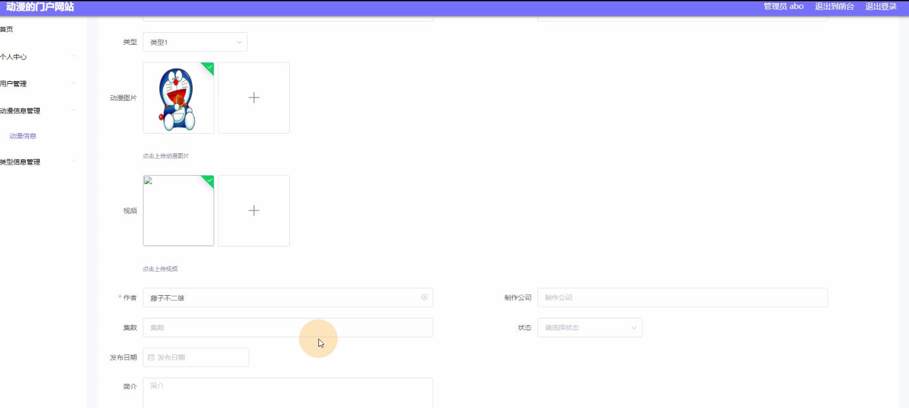
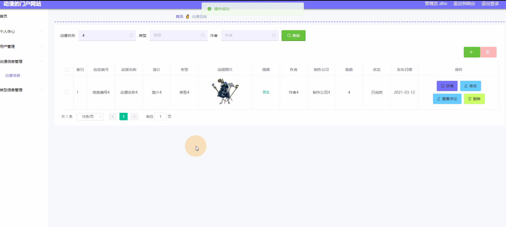

****本项目包含程序+源码+数据库+LW+调试部署环境，文末可获取一份本项目的java源码和数据库参考。****

## ******开题报告******

研究背景：
随着互联网的快速发展和普及，动漫作为一种重要的文化形式，吸引了越来越多的关注和参与。同时，动漫产业也成为了一个庞大而复杂的系统，涉及到用户、动漫信息、类型信息等多个功能模块。然而，在目前的动漫门户网站中，存在着一些问题，如信息不全面、分类不准确、用户体验不佳等，这些问题制约了动漫门户网站的进一步发展和提升用户满意度。

研究意义：
针对动漫门户网站存在的问题，进行深入研究具有重要的意义。首先，通过优化动漫门户网站的功能模块，可以提供更全面、准确的动漫信息，满足用户的需求。其次，改善用户体验，提高用户的满意度，有助于增加用户粘性和活跃度，促进动漫产业的发展。此外，研究动漫门户网站还可以推动相关技术的创新和应用，提升整个行业的竞争力。

研究目的：
本研究旨在通过对动漫门户网站的功能模块进行深入研究，优化系统的设计和运行，提升用户体验和满意度。具体目标包括：1.改进动漫信息模块，提供更全面、准确的动漫信息；2.优化类型信息模块，提供更精准的分类和推荐服务；3.改善用户模块，提高用户的参与度和互动性。

研究内容： 本研究的主要内容包括三个方面：用户模块、动漫信息模块和类型信息模块。

  1. 用户模块：通过分析用户的需求和行为，设计合理的用户界面和交互方式，提高用户的参与度和互动性。同时，建立用户画像，实现个性化推荐和定制化服务。

  2. 动漫信息模块：对动漫信息进行全面搜集和整理，建立完善的动漫数据库。通过采用先进的数据挖掘和机器学习技术，提高动漫信息的准确性和时效性。

  3. 类型信息模块：对动漫进行科学分类和标签化，建立起完善的类型信息体系。通过分析用户的兴趣和偏好，实现个性化的类型推荐和定制化服务。

拟解决的主要问题：
本研究旨在解决动漫门户网站存在的信息不全面、分类不准确、用户体验不佳等问题。通过优化系统的设计和运行，提供更全面、准确的动漫信息，改善用户体验，提高用户的满意度。

研究方案和预期成果：
本研究将采用实证研究方法，结合数据分析和用户调研，对动漫门户网站的功能模块进行深入研究和优化。预期成果包括：1.建立完善的动漫数据库，提供更全面、准确的动漫信息；2.优化类型信息模块，提供更精准的分类和推荐服务；3.改进用户模块，提高用户的参与度和互动性。通过这些改进和优化，预计能够提升动漫门户网站的用户体验和满意度，促进动漫产业的发展。

进度安排：

2022年9月至10月：需求分析和规划，明确系统功能和目标，制定项目计划。

2022年11月至2023年1月：系统设计和编码，完成详细的系统设计并开始编写代码。

2023年2月至3月：用户界面开发和数据库开发，开发用户友好的界面和设计数据库结构。

2023年4月至5月：功能测试、文档编写和上线部署，对系统进行全面的功能测试并编写用户手册。

2023年5月：维护和升级，定期对系统进行维护和升级，修复bug和添加新功能。

参考文献：

[1]邱小群,邓丽艳,陈海潮.基于B/S的信息管理系统设计和实现[J].信息与电脑(理论版),2022,(20):146-148.

[2]谢霜.基于Java技术的网络管理体系结构的应用[J].网络安全技术与应用,2022,(10):14-15.

[3]宋锦华.高职院校Java程序设计课程改革研究[J].科技视界,2022,(20):133-135.

[4]曹嵩彭,王鹏宇.浅析Java语言在软件开发中的应用[J].信息记录材料,2022,(03):114-116.

[5]朱澈,余俊达.武汉东湖学院.基于Java的软硬件信息管理系统V1.0[Z].项目立项编号.鉴定单位.鉴定日期:

****以上是本项目程序开发之前开题报告内容，最终成品以下面界面为准，大家可以酌情参考使用。要源码参考请在文末进行获取！！****

## ******本项目的界面展示******

