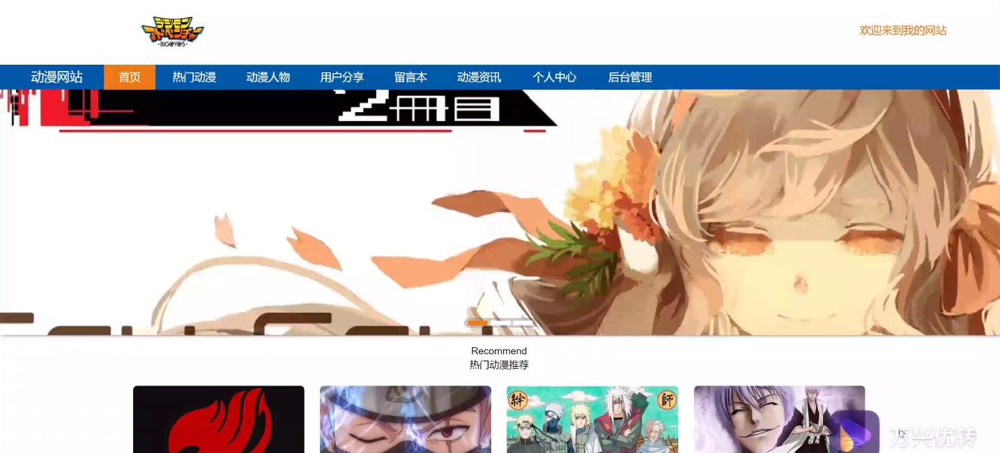
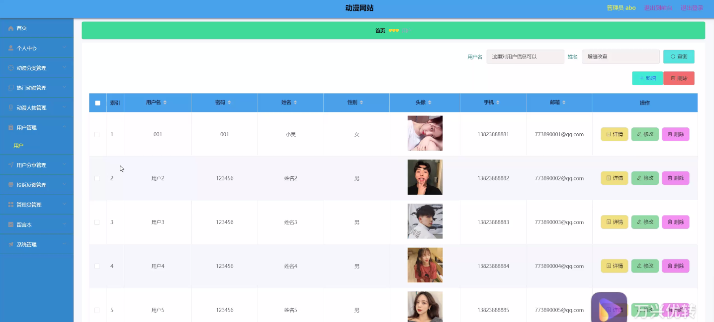

****本项目包含程序+源码+数据库+LW+调试部署环境，文末可获取一份本项目的java源码和数据库参考。****

## ******开题报告******

研究背景：
随着互联网的快速发展，动漫作为一种受众广泛、影响力巨大的文化形式，逐渐成为人们生活中不可或缺的一部分。越来越多的人通过网络平台观看和分享动漫作品，这也促使了动漫网站的兴起。然而，目前存在的动漫网站在功能和用户体验方面仍有一些问题，因此有必要进行相关研究，以提升动漫网站的质量和用户满意度。

研究意义：
本研究旨在探索和改进动漫网站的系统功能，从而提供更好的服务和体验给用户。通过对动漫分类、热门动漫、动漫人物、用户、用户分享、投诉反馈等系统功能的研究，可以优化网站的内容推荐、用户交互、社区建设等方面，提高用户的参与度和忠诚度。同时，研究还可以为动漫产业的发展提供参考，促进动漫文化的传播和推广。

研究目的：
本研究的目的是通过对动漫网站系统功能的深入研究，解决当前动漫网站存在的问题，提升用户体验和满意度。具体目标包括优化动漫分类的准确性和完整性，提高热门动漫的推荐效果，加强对动漫人物的介绍和分析，改进用户注册和登录流程，增加用户分享和互动的功能，建立有效的投诉反馈机制等。

研究内容： 本研究将重点关注动漫网站的系统功能，包括但不限于以下方面：

  1. 动漫分类：通过对动漫作品进行分类和标签化，提供更精准的检索和推荐服务。
  2. 热门动漫：通过数据分析和用户行为研究，挖掘和推荐当前热门的动漫作品。
  3. 动漫人物：深入了解和介绍动漫作品中的人物角色，包括背景故事、特点等信息。
  4. 用户：研究用户的需求和行为，设计更符合用户习惯和喜好的界面和功能。
  5. 用户分享：提供用户分享动漫作品和评论的平台，促进用户之间的交流和互动。
  6. 投诉反馈：建立有效的投诉反馈机制，及时处理用户的问题和意见。

拟解决的主要问题： 本研究旨在解决动漫网站存在的以下主要问题：

  1. 动漫分类不准确或不完整，导致用户难以找到自己感兴趣的作品。
  2. 热门动漫推荐效果不佳，无法满足用户对新鲜和热门作品的需求。
  3. 动漫人物介绍不全面或不详细，影响用户对作品的理解和喜爱程度。
  4. 用户注册和登录流程繁琐，影响用户的使用体验和积极性。
  5. 缺乏用户分享和互动的功能，限制了用户之间的交流和社区建设。
  6. 投诉反馈机制不畅通或处理不及时，降低了用户对网站的信任和满意度。

研究方案和预期成果： 本研究将采用实证研究方法，通过数据分析、用户调研和系统设计等手段，对动漫网站的系统功能进行优化和改进。预期成果包括但不限于：

  1. 设计和实现更准确和完善的动漫分类系统，提高用户检索和推荐的准确性。
  2. 开发智能算法和推荐系统，提供更精准的热门动漫推荐服务。
  3. 提供详细和全面的动漫人物介绍，增加用户对作品的了解和喜爱程度。
  4. 优化用户注册和登录流程，简化操作步骤，提高用户的使用便利性。
  5. 增加用户分享和互动的功能，促进用户之间的交流和社区建设。
  6. 建立高效的投诉反馈机制，及时处理用户的问题和意见，提升用户满意度。

进度安排：

2022年9月至10月：开题报告编写和提交，完成开题报告的撰写并提交给指导教师进行审核。

2022年11月至2023年1月：系统设计和开发，根据开题报告的要求，进行系统设计和编码工作。

2023年2月至3月：论文撰写和初稿完成，开始撰写论文，并在这个阶段完成论文的初稿。

2023年4月至5月：论文修改和最终定稿，根据指导教师的意见对论文进行修改，并完成最终的定稿。

2023年5月：论文答辩和提交，参加论文答辩并根据答辩结果进行修改，最后将论文提交给学院或学校。

参考文献：

[1]喻佳,吴丹新.基于SpringBoot的Web快速开发框架[J].电脑编程技巧与维护,2021,(09):31-33.

[2]李鹏.基于SpringBoot快速开发平台的实现[J].电子技术与软件工程,2021,(12):36-37.

[3]叶开平,蔡维晟,陈家敏,邓斯妮.基于SpringBoot的综测可视化管理系统的研究与设计[J].电脑知识与技术,2021,(12):100-104.

[4]江健锋,徐振平.Springboot最小系统的设计与实现[J].电脑知识与技术,2021,(04):62-63.

[5]赵炯,司圣杰,周奇才,熊肖磊.通用信息获取系统设计与实现[J].起重运输机械,2020,(16):89-97.

[6]吴英宾.一种内外网数据交互系统的设计与实现[J].软件工程,2020,(08):25-27.

****以上是本项目程序开发之前开题报告内容，最终成品以下面界面为准，大家可以酌情参考使用。要源码参考请在文末进行获取！！****

## ******本项目的界面展示******

