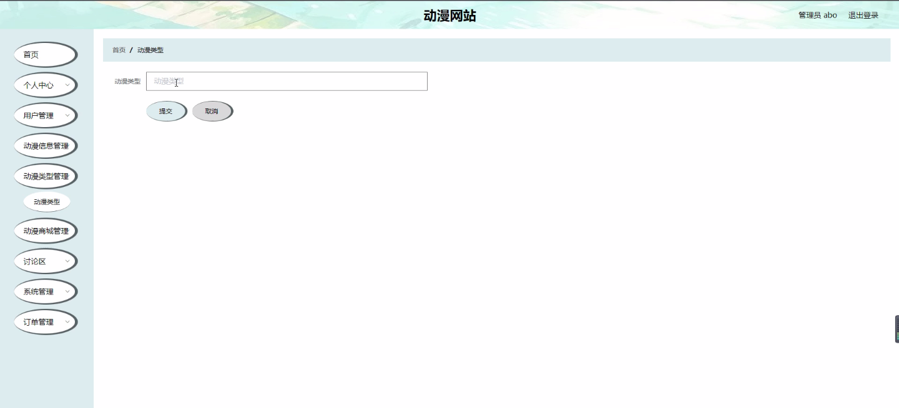

****本项目包含程序+源码+数据库+LW+调试部署环境，文末可获取一份本项目的java源码和数据库参考。****

## ******开题报告******

研究背景：
随着互联网的快速发展，动漫产业也逐渐成为一种受欢迎的文化形式。越来越多的人开始关注和喜爱动漫作品，这导致了动漫市场的不断扩大和发展。然而，在这个数字化时代，传统的动漫观看方式已经无法满足用户的需求。因此，建立一个专门的动漫网站，提供全方位的服务和功能，对于促进动漫产业的发展具有重要意义。

研究意义：
动漫网站作为一个集动漫信息、动漫类型、动漫商城等系统功能于一体的平台，可以为用户提供便捷的动漫观看、购买和交流的渠道。通过动漫网站，用户可以轻松地浏览各类动漫作品，了解最新的动漫资讯，并且可以与其他动漫爱好者进行交流和分享。同时，动漫网站还可以为动漫创作者提供一个展示和推广自己作品的平台，促进动漫产业的繁荣发展。

研究目的：
本研究旨在构建一个完善的动漫网站，通过整合用户、动漫信息、动漫类型和动漫商城等系统功能，为用户提供全方位的动漫服务。具体目标包括但不限于：提供高质量的动漫作品资源，满足用户的观看需求；建立一个动漫社区，促进用户之间的交流和互动；开设动漫商城，为用户提供购买动漫相关产品的渠道；推广优秀的动漫作品，促进动漫产业的发展。

研究内容： 本研究将主要围绕以下系统功能展开：

  1. 用户系统：设计和实现用户注册、登录、个人信息管理等功能，确保用户能够方便地使用动漫网站的各项服务。

  2. 动漫信息系统：收集和整理各类动漫作品的信息，包括作品介绍、制作团队、声优阵容等，并提供搜索和分类功能，使用户能够快速找到自己感兴趣的动漫作品。

  3. 动漫类型系统：建立动漫作品的分类体系，包括不同风格、题材、年代等分类，帮助用户更好地了解和选择适合自己的动漫作品。

  4. 动漫商城系统：搭建一个在线购物平台，提供动漫周边产品的销售，包括漫画、周边商品、音乐CD等，为用户提供便捷的购物体验。

拟解决的主要问题： 本研究将重点解决以下问题：

  1. 如何高效地收集和整理动漫作品的信息，确保动漫网站能够提供准确、全面的动漫资讯。

  2. 如何设计用户系统，使用户能够方便地注册、登录和管理个人信息，并提供个性化的推荐服务。

  3. 如何建立一个完善的动漫分类体系，帮助用户更好地了解和选择适合自己的动漫作品。

  4. 如何搭建一个安全可靠的动漫商城系统，保护用户的购物安全和个人信息安全。

  5. 如何促进用户之间的交流和互动，打造一个活跃的动漫社区。

研究方案和预期成果：
本研究将采用市场调研、需求分析、系统设计和开发等方法，构建一个功能完善、用户友好的动漫网站。预期成果包括但不限于：一个具有良好用户体验的动漫网站原型，包含用户系统、动漫信息系统、动漫类型系统和动漫商城系统；一个完善的动漫作品数据库，包含各类动漫作品的详细信息；一个活跃的动漫社区，用户可以在其中交流、分享和评价动漫作品。通过这些成果，预计能够满足用户对于动漫观看、购买和交流的需求，促进动漫产业的发展。

进度安排：

2022年9月至10月：需求分析和规划，明确系统功能和目标，制定项目计划。

2022年11月至2023年1月：系统设计和编码，完成详细的系统设计并开始编写代码。

2023年2月至3月：用户界面开发和数据库开发，开发用户友好的界面和设计数据库结构。

2023年4月至5月：功能测试、文档编写和上线部署，对系统进行全面的功能测试并编写用户手册。

2023年5月：维护和升级，定期对系统进行维护和升级，修复bug和添加新功能。

参考文献：

[1]邱小群,邓丽艳,陈海潮.基于B/S的信息管理系统设计和实现[J].信息与电脑(理论版),2022,(20):146-148.

[2]谢霜.基于Java技术的网络管理体系结构的应用[J].网络安全技术与应用,2022,(10):14-15.

[3]宋锦华.高职院校Java程序设计课程改革研究[J].科技视界,2022,(20):133-135.

[4]曹嵩彭,王鹏宇.浅析Java语言在软件开发中的应用[J].信息记录材料,2022,(03):114-116.

[5]朱澈,余俊达.武汉东湖学院.基于Java的软硬件信息管理系统V1.0[Z].项目立项编号.鉴定单位.鉴定日期:

****以上是本项目程序开发之前开题报告内容，最终成品以下面界面为准，大家可以酌情参考使用。要源码参考请在文末进行获取！！****

## ******本项目的界面展示******

