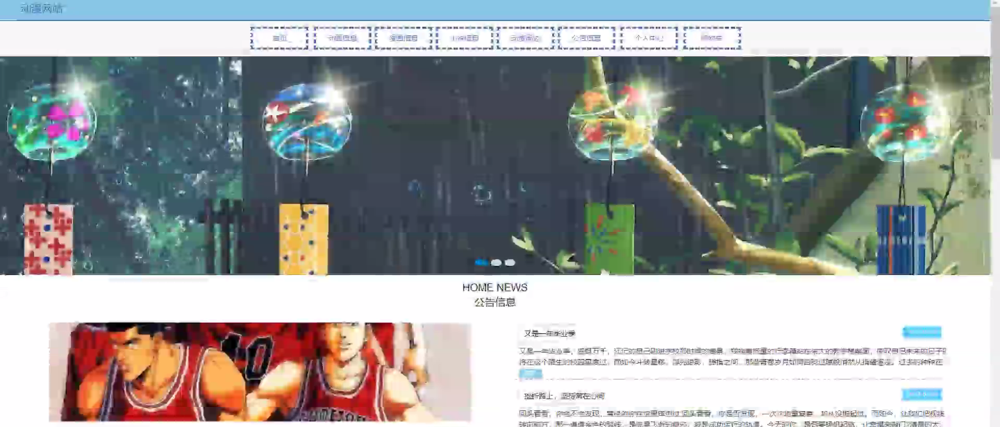
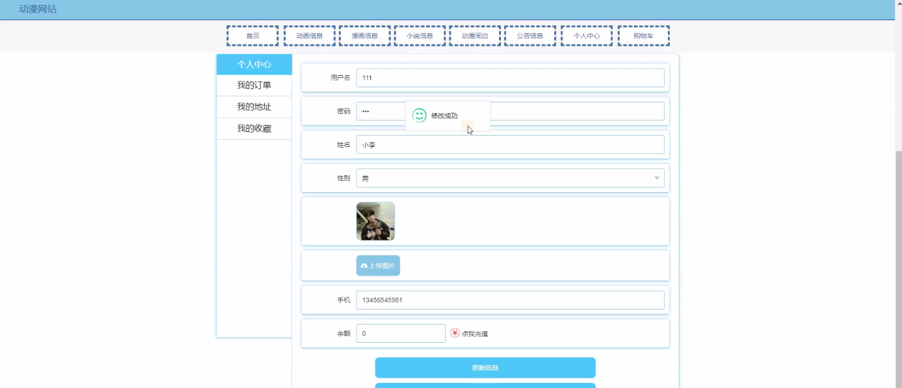
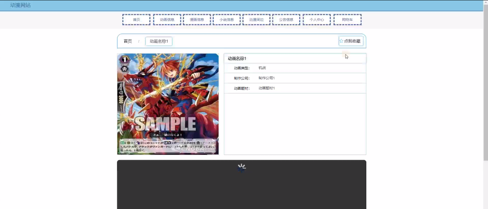
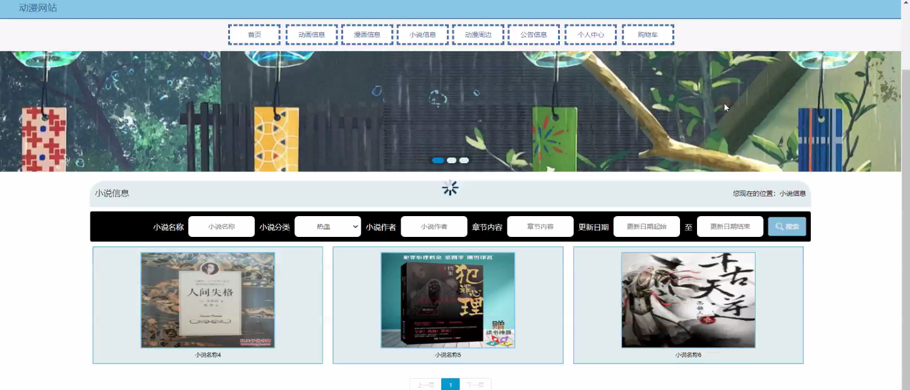
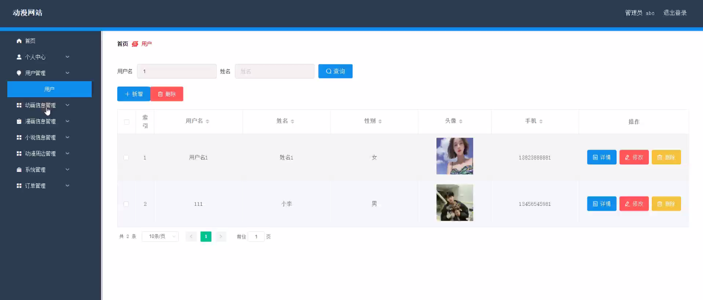
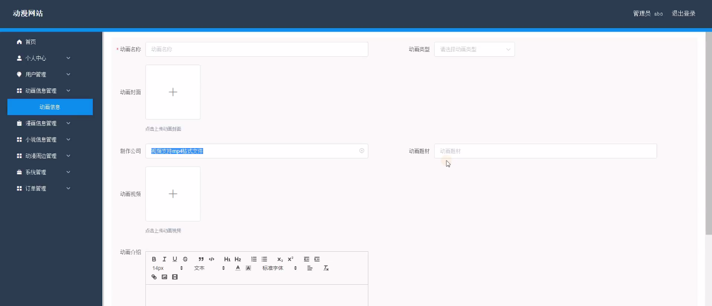
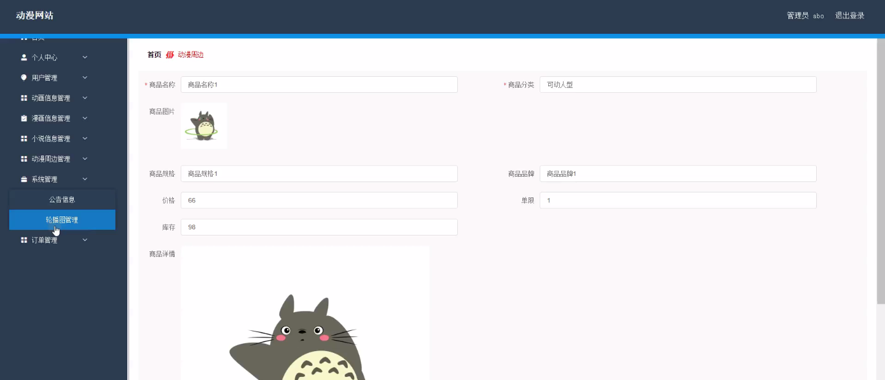
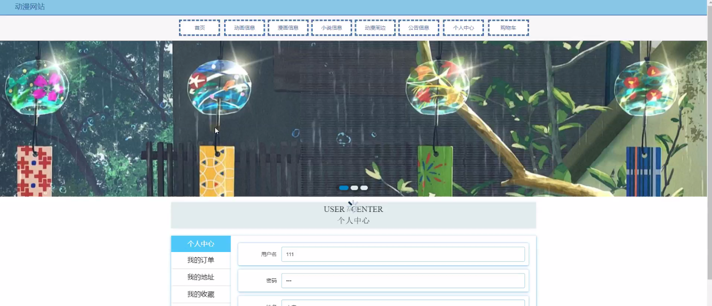

****本项目包含程序+源码+数据库+LW+调试部署环境，文末可获取一份本项目的java源码和数据库参考。****

## ******开题报告******

研究背景：
随着互联网的迅速发展，动漫产业逐渐成为人们生活中不可或缺的一部分。越来越多的人开始关注和喜爱动漫作品，而传统的动漫媒体已经无法满足用户的需求。因此，建立一个全面、便捷的动漫网站成为了当下亟待解决的问题。

研究意义：
通过建立一个综合性的动漫网站，可以为用户提供丰富多样的动漫资源，包括动画、漫画、小说以及相关的周边产品等。这将极大地方便了用户的获取和浏览，同时也为动漫产业的发展提供了更广阔的平台。此外，通过对用户行为和喜好的分析，还可以为动漫制作方提供更准确的市场反馈和数据支持。

研究目的：
本研究旨在构建一个功能完善、用户友好的动漫网站，以满足用户对动漫资源的需求，并促进动漫产业的健康发展。通过提供全面的动漫信息和便捷的浏览方式，帮助用户快速找到自己感兴趣的作品，并提供个性化推荐，以提升用户体验和满意度。

研究内容： 本研究的主要内容包括以下系统功能：

  1. 用户系统：建立用户注册、登录、个人信息管理等功能，实现用户的个性化服务和互动交流。

  2. 动画信息系统：收集整理各类动画作品的相关信息，包括片名、导演、声优、剧情介绍等，并提供在线观看或下载的方式。

  3. 漫画信息系统：整合各类漫画作品的信息，包括作者、出版社、章节更新等，并提供在线阅读或下载的功能。

  4. 小说信息系统：汇集各类与动漫相关的小说作品，包括作者、出版社、章节更新等，并提供在线阅读或下载的服务。

  5. 动漫周边系统：提供动漫相关的周边产品信息，包括角色模型、服饰、周边商品等，并提供购买渠道和价格查询。

拟解决的主要问题： 通过建立上述系统功能，本研究旨在解决以下问题：

  1. 用户获取动漫资源的不便利性：传统的动漫媒体存在着资源分散、获取困难等问题，本研究将提供一个集中式的平台，方便用户快速找到所需的动漫资源。

  2. 用户个性化需求的满足度不高：传统媒体无法提供个性化推荐和服务，本研究将通过用户行为分析和推荐算法，为用户提供更准确、个性化的推荐内容。

  3. 动漫产业发展面临的市场反馈不足：通过对用户行为和喜好的分析，本研究将为动漫制作方提供更准确的市场反馈和数据支持，有助于提升作品质量和市场竞争力。

研究方案和预期成果：
本研究将采用前后端分离的开发模式，利用现有的技术和工具构建一个稳定、高效的动漫网站。预期成果包括一个功能完善、用户友好的动漫网站，并通过用户调研和评估来验证其可用性和用户满意度。同时，预计通过该网站的建立，能够促进动漫产业的发展，提升用户对动漫作品的体验和参与度。

进度安排：

2022年9月至10月：需求分析和规划，进行用户需求调研和分析，确定系统功能和目标。

2022年11月至2023年1月：系统设计和开发，完成系统架构设计和技术选型，并开始编写代码。

2023年2月至3月：测试和优化，进行单元测试和集成测试，修复问题并优化系统性能。

2023年4月至5月：文档编写和培训，编写用户手册和系统文档，并进行相关人员的培训。

2023年5月：上线部署和维护，将系统部署到生产环境中，并定期进行维护和升级。

参考文献：

[1]王振华.SpringBoot在教学效果评估系统中的应用[J].电子技术,2023,(05):67-69.

[2]王明泉.基于SpringBoot远程热部署的探索和应用[J].信息与电脑(理论版),2023,(07):1-4.

[3]王亚东,李晓霞,陈强强,剡美娜.基于SpringBoot的需求发布平台设计[J].信息与电脑(理论版),2023,(01):105-107.

[4]陈新府豪.基于SpringBoot和Vue框架的创新方法推理系统的设计与实现[D].导师：黄静.浙江理工大学,2022.

[5]霍福华,韩慧.基于SpringBoot微服务架构下前后端分离的MVVM模型[J].电子技术与软件工程,2022,(01):73-76.

[6]韩策,张娜,王松亭,张凯,何方,袁峰.SpringBoot OPC客户端设计与研究[J].电子世界,2021,(19):25-26.

****以上是本项目程序开发之前开题报告内容，最终成品以下面界面为准，大家可以酌情参考使用。要源码参考请在文末进行获取！！****

## ******本项目的界面展示******

