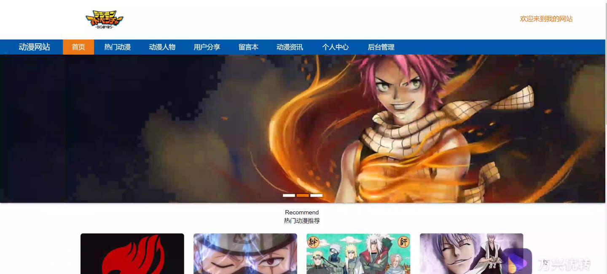
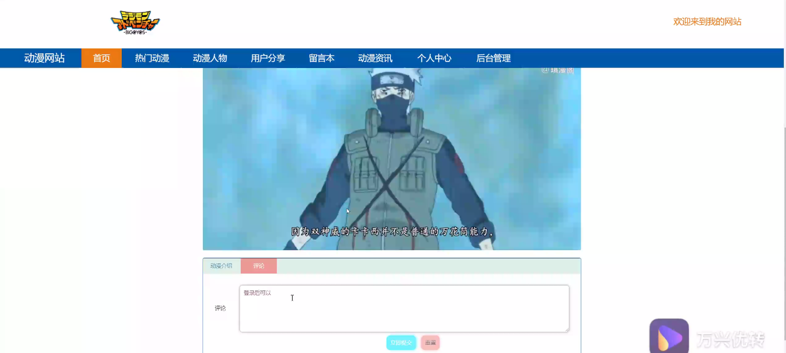
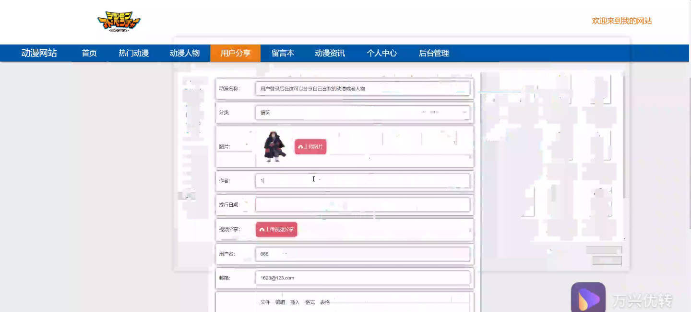
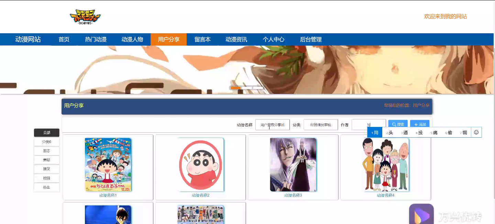
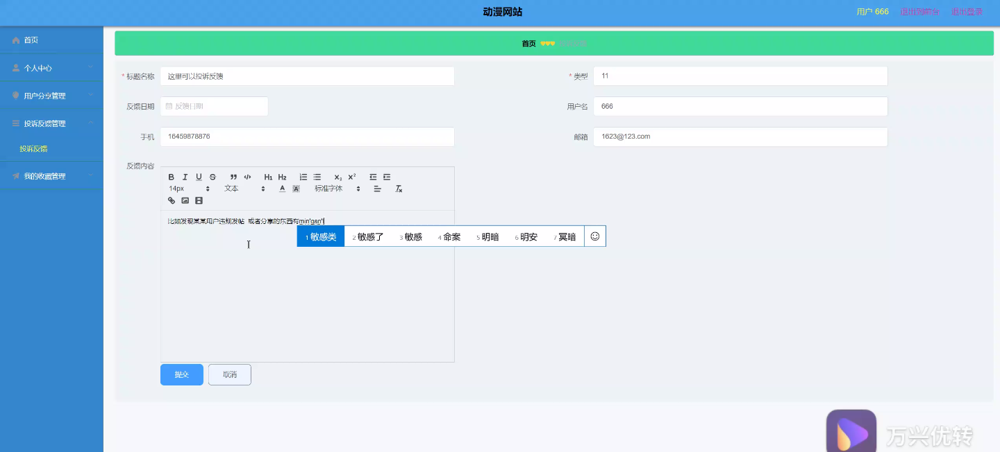
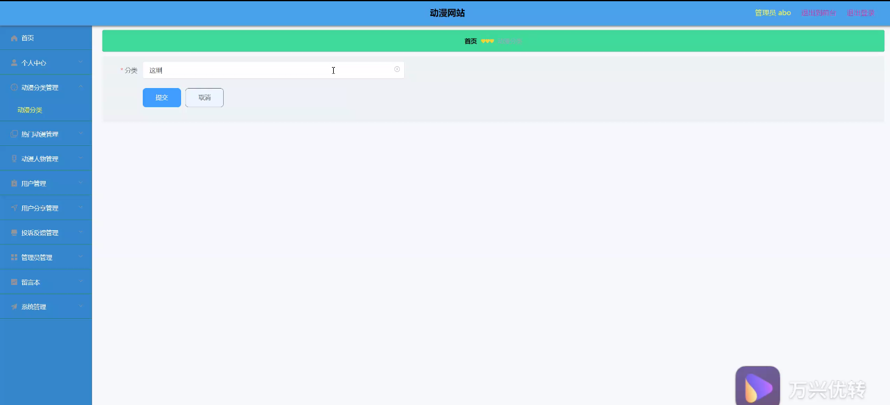
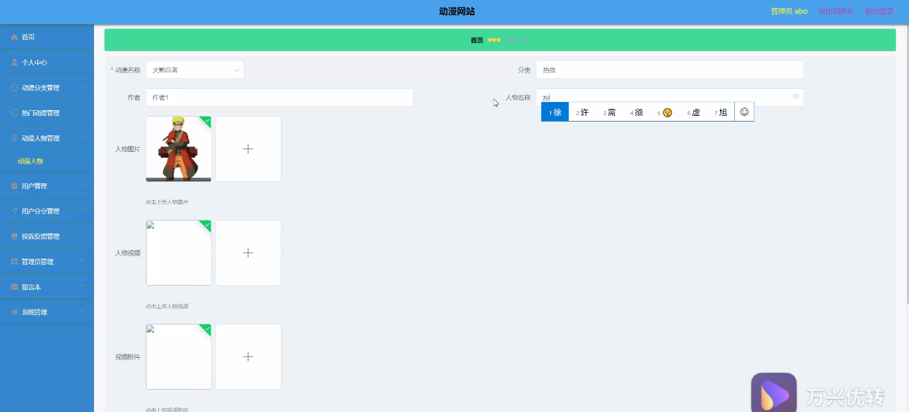
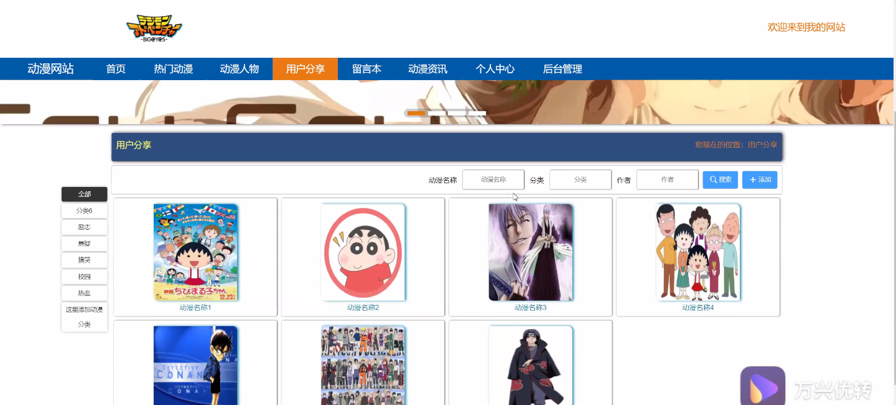

****本项目包含程序+源码+数据库+LW+调试部署环境，文末可获取一份本项目的java源码和数据库参考。****

## ******开题报告******

研究背景：
随着互联网的快速发展，动漫作为一种受欢迎的娱乐形式，在全球范围内拥有大量的粉丝和观众。越来越多的人开始关注和喜爱动漫，并且对于动漫作品的选择和评价也变得越来越重要。然而，目前存在着大量的动漫作品和信息，用户很难在海量的内容中找到符合自己口味的作品。因此，建立一个专门针对动漫的评论网站，能够提供全面、准确、个性化的动漫推荐和评价服务，具有重要的现实意义。

研究意义：
动漫评论网站的建立可以满足广大动漫爱好者的需求，帮助他们更好地了解和选择适合自己的动漫作品。同时，通过用户的评价和反馈，可以促进动漫产业的发展和优化，提高动漫作品的质量和创新程度。此外，动漫评论网站还可以成为动漫爱好者之间交流和分享的平台，促进社区的形成和互动。

研究目的：
本研究旨在构建一个全面、准确、个性化的动漫评论网站，通过对动漫作品进行分类、评价和推荐，帮助用户更好地了解和选择适合自己的动漫作品。具体目标包括：1）提供多样化的动漫类型分类，满足不同用户的需求；2）收集和整理热门动漫作品的信息，为用户提供最新的动漫资讯；3）推荐新品动漫作品，引导用户发现新的优秀作品；4）建立用户系统，让用户可以参与到评论和评价中，促进互动和交流。

研究内容： 本研究的主要内容包括动漫类型分类、热门动漫信息收集、新品动漫推荐和用户系统的建立。

  1. 动漫类型分类：根据动漫作品的风格、题材、年代等特点，将动漫作品进行分类，以便用户能够快速找到符合自己口味的作品。

  2. 热门动漫信息收集：通过收集和整理各种渠道上的动漫资讯和数据，及时更新热门动漫作品的相关信息，让用户了解最新的动态。

  3. 新品动漫推荐：根据用户的兴趣和偏好，结合动漫作品的评价和口碑，为用户推荐符合其喜好的新品动漫作品。

  4. 用户系统建立：建立一个用户系统，让用户可以注册、登录并参与到评论和评价中，提供个性化的推荐服务，并促进用户之间的交流和互动。

拟解决的主要问题：

  1. 如何准确分类动漫作品，满足不同用户的需求？
  2. 如何及时收集和更新热门动漫作品的信息，保持网站的实时性？
  3. 如何根据用户的兴趣和偏好，进行精准的动漫推荐？
  4. 如何建立一个安全、稳定的用户系统，保护用户的隐私和权益？

研究方案和预期成果：
本研究将采用数据挖掘和机器学习等技术，结合用户行为分析和专家评价，构建一个智能化的动漫评论网站。通过对大量的动漫数据进行处理和分析，建立动漫作品的分类模型和推荐算法，实现个性化的推荐服务。同时，建立一个完善的用户系统，保护用户的隐私和权益。预期成果包括一个功能完善、用户友好的动漫评论网站，能够为广大动漫爱好者提供准确、个性化的动漫推荐和评价服务，促进动漫产业的发展和优化。

进度安排：

2022年9月至10月：需求分析和规划，明确系统功能和目标，制定项目计划。

2022年11月至2023年1月：系统设计和编码，完成详细的系统设计并开始编写代码。

2023年2月至3月：用户界面开发和数据库开发，开发用户友好的界面和设计数据库结构。

2023年4月至5月：功能测试、文档编写和上线部署，对系统进行全面的功能测试并编写用户手册。

2023年5月：维护和升级，定期对系统进行维护和升级，修复bug和添加新功能。

参考文献：

[1]邱小群,邓丽艳,陈海潮.基于B/S的信息管理系统设计和实现[J].信息与电脑(理论版),2022,(20):146-148.

[2]谢霜.基于Java技术的网络管理体系结构的应用[J].网络安全技术与应用,2022,(10):14-15.

[3]宋锦华.高职院校Java程序设计课程改革研究[J].科技视界,2022,(20):133-135.

[4]曹嵩彭,王鹏宇.浅析Java语言在软件开发中的应用[J].信息记录材料,2022,(03):114-116.

[5]朱澈,余俊达.武汉东湖学院.基于Java的软硬件信息管理系统V1.0[Z].项目立项编号.鉴定单位.鉴定日期:

****以上是本项目程序开发之前开题报告内容，最终成品以下面界面为准，大家可以酌情参考使用。要源码参考请在文末进行获取！！****

## ******本项目的界面展示******

