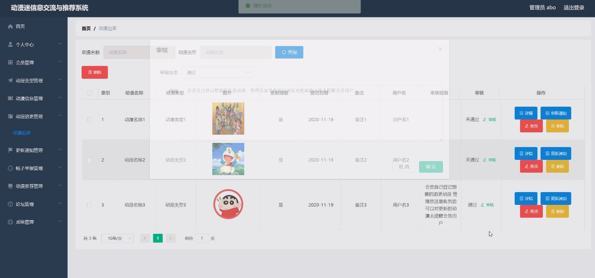
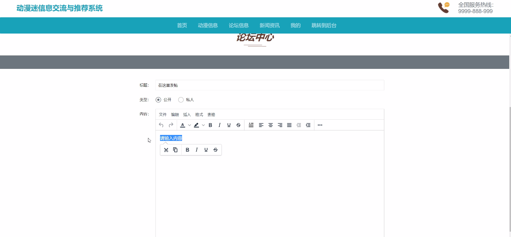

****本项目包含程序+源码+数据库+LW+调试部署环境，文末可获取一份本项目的java源码和数据库参考。****

## ******开题报告******

研究背景：
随着互联网的快速发展，动漫迷群体逐渐壮大，对于动漫信息的需求也日益增加。然而，在海量的动漫作品中寻找自己喜欢的作品变得越来越困难，同时，动漫迷之间的信息交流也面临着诸多问题。因此，设计一个动漫迷信息交流与推荐系统具有重要的现实意义。

研究意义：
该系统的建立将为广大动漫迷提供一个便捷的平台，使他们能够更好地获取动漫信息、进行交流，并获得个性化的推荐服务。这不仅能够满足动漫迷对于动漫的需求，还可以促进动漫产业的发展，提高用户体验，推动动漫文化的传播和交流。

研究目的：
本研究旨在开发一个功能完善、用户友好的动漫迷信息交流与推荐系统，通过整合会员管理、动漫类型分类、动漫信息展示、动漫追更、更新通知、帖子举报、动漫推荐和动漫维护等系统功能，提供一站式的服务，满足动漫迷的需求，提升用户体验。

研究内容： 本研究将主要包括以下内容：

  1. 会员管理：设计会员注册、登录、个人信息管理等功能，为用户提供个性化的服务和交流平台。
  2. 动漫类型分类：建立动漫作品的分类体系，便于用户根据自己的兴趣选择喜欢的类型。
  3. 动漫信息展示：收集并整理丰富的动漫信息，包括作品介绍、剧情梗概、声优表等，方便用户了解和选择。
  4. 动漫追更与更新通知：提供动漫更新的及时通知，并支持用户追踪自己关注的作品的最新进展。
  5. 帖子举报：建立举报机制，保证系统内的信息安全和秩序。
  6. 动漫推荐：基于用户的兴趣和行为数据，利用推荐算法为用户推荐符合其口味的动漫作品。
  7. 动漫维护：定期更新动漫信息，修复系统bug，确保系统的正常运行。

拟解决的主要问题：
本研究旨在解决动漫迷在获取动漫信息和进行交流时面临的问题，如信息碎片化、信息过载、推荐不准确等。通过构建一个综合性的动漫迷信息交流与推荐系统，为用户提供个性化、精准的服务，解决用户在动漫领域中的信息获取和交流困难。

研究方案和预期成果：
本研究将采用前后端分离的开发模式，利用现有的技术和工具进行系统设计与开发。预期成果包括一个功能完善、用户友好的动漫迷信息交流与推荐系统，并能够满足用户的需求，提升用户体验。同时，通过对用户行为数据的分析和挖掘，优化推荐算法，提高推荐准确度和个性化程度。最终实现动漫迷群体的信息共享和交流，促进动漫产业的发展。

进度安排：

2022年9月至10月：需求分析和规划，明确系统功能和目标，制定项目计划。

2022年11月至2023年1月：系统设计和编码，完成详细的系统设计并开始编写代码。

2023年2月至3月：用户界面开发和数据库开发，开发用户友好的界面和设计数据库结构。

2023年4月至5月：功能测试、文档编写和上线部署，对系统进行全面的功能测试并编写用户手册。

2023年5月：维护和升级，定期对系统进行维护和升级，修复bug和添加新功能。

参考文献：

[1]邱小群,邓丽艳,陈海潮.基于B/S的信息管理系统设计和实现[J].信息与电脑(理论版),2022,(20):146-148.

[2]谢霜.基于Java技术的网络管理体系结构的应用[J].网络安全技术与应用,2022,(10):14-15.

[3]宋锦华.高职院校Java程序设计课程改革研究[J].科技视界,2022,(20):133-135.

[4]曹嵩彭,王鹏宇.浅析Java语言在软件开发中的应用[J].信息记录材料,2022,(03):114-116.

[5]朱澈,余俊达.武汉东湖学院.基于Java的软硬件信息管理系统V1.0[Z].项目立项编号.鉴定单位.鉴定日期:

****以上是本项目程序开发之前开题报告内容，最终成品以下面界面为准，大家可以酌情参考使用。要源码参考请在文末进行获取！！****

## ******本项目的界面展示******

