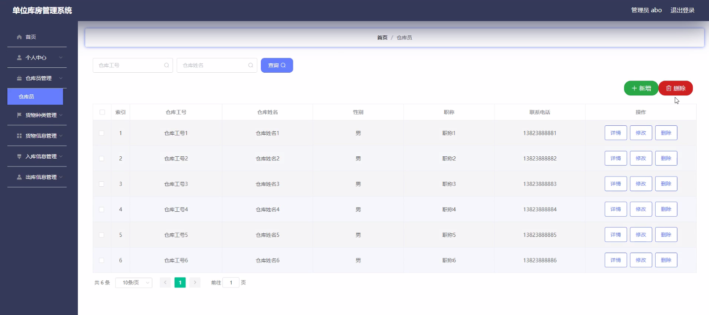
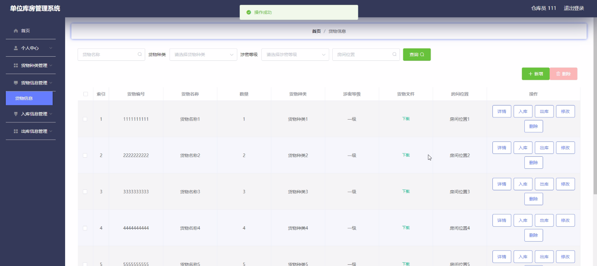

****本项目包含程序+源码+数据库+LW+调试部署环境，文末可获取一份本项目的java源码和数据库参考。****

## ******开题报告******

研究背景：
随着社会经济的发展和科技的进步，各行各业都在不断追求高效、精确和自动化的管理方式。在这样的背景下，单位库房管理系统应运而生。传统的库房管理往往依赖人工操作，容易出现信息不准确、流程不规范等问题，导致库存管理效率低下、成本高昂。因此，开发一个高效的单位库房管理系统具有重要的现实意义。

研究意义：
单位库房管理系统的建立和应用可以提高库房管理的效率和准确性，降低库存成本，优化供应链管理，提升企业的竞争力和经济效益。通过引入先进的信息技术和管理方法，单位库房管理系统能够实现对货物种类、货物信息、入库信息、出库信息等系统功能的全面监控和管理，为企业提供科学决策支持，提高库房管理水平。

研究目的：
本研究旨在开发一个高效、智能的单位库房管理系统，以解决传统库房管理中存在的问题，并提升库房管理的效率和准确性。通过系统的设计与实施，我们将实现以下目标：提高库存管理的自动化程度，减少人工操作的繁琐性；优化库房布局和货物存放方式，提高空间利用率；实现对货物种类、货物信息、入库信息、出库信息等系统功能的全面监控和管理；提供科学决策支持，为企业提供精确的库存数据分析和预测。

研究内容： 本研究的主要内容包括以下系统功能的设计与实现：

  1. 仓库员管理：包括仓库员信息的录入、权限管理、考勤记录等。
  2. 货物种类管理：包括货物种类的分类、编码、属性、规格等信息的维护和管理。
  3. 货物信息管理：包括货物的进货、销售、库存等信息的记录和查询。
  4. 入库信息管理：包括采购订单的生成、入库单的录入、入库数量的统计等。
  5. 出库信息管理：包括销售订单的生成、出库单的录入、出库数量的统计等。

拟解决的主要问题： 在单位库房管理系统的开发过程中，我们将重点解决以下问题：

  1. 如何实现对货物种类、货物信息、入库信息、出库信息等系统功能的高效管理和查询？
  2. 如何通过系统自动化和智能化的方式提高库房管理的效率和准确性？
  3. 如何优化库房布局和货物存放方式，提高空间利用率？
  4. 如何提供科学决策支持，为企业提供精确的库存数据分析和预测？

研究方案和预期成果：
本研究将采用软件工程的方法，结合数据库技术、网络技术和人机交互技术，设计并实现一个高效、智能的单位库房管理系统。通过系统的开发与应用，预期可以实现以下成果：

  1. 提高库房管理的自动化程度，减少人工操作的繁琐性。
  2. 优化库房布局和货物存放方式，提高空间利用率。
  3. 实现对货物种类、货物信息、入库信息、出库信息等系统功能的全面监控和管理。
  4. 提供科学决策支持，为企业提供精确的库存数据分析和预测。

进度安排：

2022年9月至10月：开题报告编写和提交，完成开题报告的撰写并提交给指导教师进行审核。

2022年11月至2023年1月：系统设计和开发，根据开题报告的要求，进行系统设计和编码工作。

2023年2月至3月：论文撰写和初稿完成，开始撰写论文，并在这个阶段完成论文的初稿。

2023年4月至5月：论文修改和最终定稿，根据指导教师的意见对论文进行修改，并完成最终的定稿。

2023年5月：论文答辩和提交，参加论文答辩并根据答辩结果进行修改，最后将论文提交给学院或学校。

参考文献：

[1]喻佳,吴丹新.基于SpringBoot的Web快速开发框架[J].电脑编程技巧与维护,2021,(09):31-33.

[2]李鹏.基于SpringBoot快速开发平台的实现[J].电子技术与软件工程,2021,(12):36-37.

[3]叶开平,蔡维晟,陈家敏,邓斯妮.基于SpringBoot的综测可视化管理系统的研究与设计[J].电脑知识与技术,2021,(12):100-104.

[4]江健锋,徐振平.Springboot最小系统的设计与实现[J].电脑知识与技术,2021,(04):62-63.

[5]赵炯,司圣杰,周奇才,熊肖磊.通用信息获取系统设计与实现[J].起重运输机械,2020,(16):89-97.

[6]吴英宾.一种内外网数据交互系统的设计与实现[J].软件工程,2020,(08):25-27.

****以上是本项目程序开发之前开题报告内容，最终成品以下面界面为准，大家可以酌情参考使用。要源码参考请在文末进行获取！！****

## ******本项目的界面展示******

