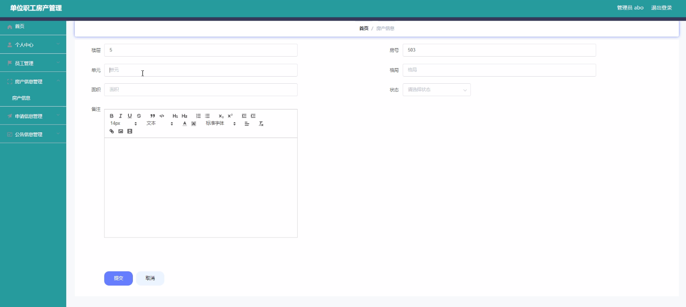
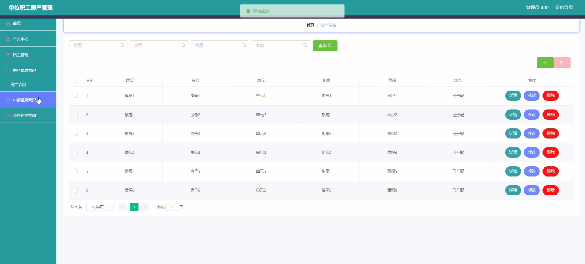
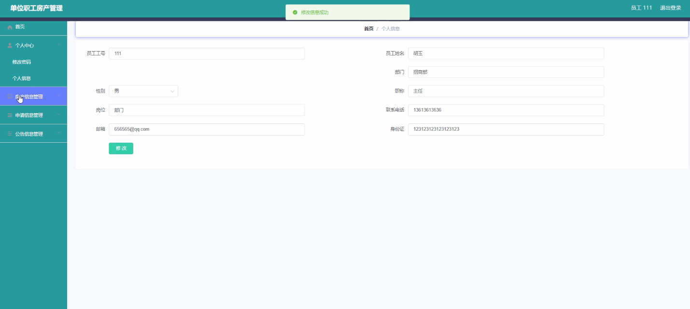
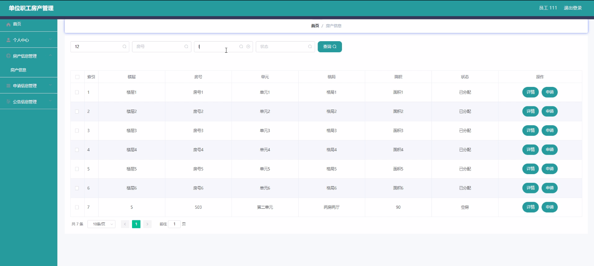
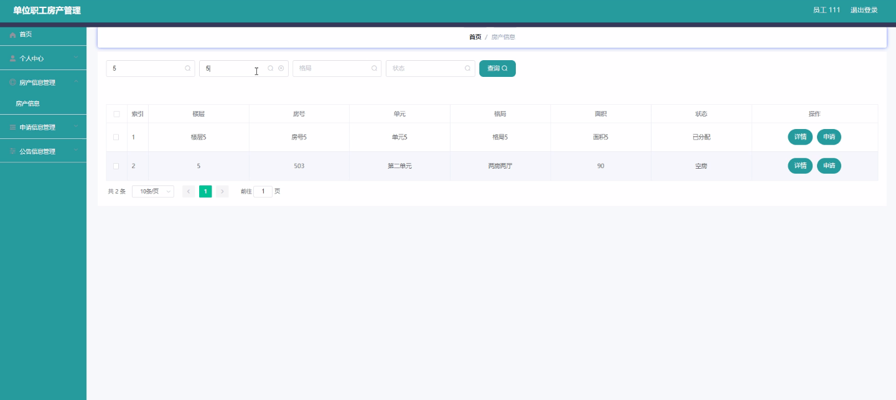

****本项目包含程序+源码+数据库+LW+调试部署环境，文末可获取一份本项目的java源码和数据库参考。****

## ******开题报告******

研究背景：
随着社会经济的发展和城市化进程的加快，单位职工房产管理成为了一个重要的课题。传统的房产管理方式存在着信息不对称、流程繁琐、效率低下等问题，给单位和职工带来了一系列的困扰。因此，开展单位职工房产管理的研究具有重要的现实意义。

研究意义：
单位职工房产管理的优化与改进，可以提高单位职工的居住环境质量，增强职工的归属感和幸福感，进而提高单位的凝聚力和竞争力。同时，优化房产管理流程，降低管理成本，提高工作效率，对于单位的可持续发展也具有积极的促进作用。

研究目的：
本研究旨在通过对单位职工房产管理进行深入研究，探索一种高效、便捷的管理模式，以满足单位职工的各类需求，提升管理效能，并为相关单位提供科学合理的管理决策依据。通过研究，期望能够解决当前房产管理中存在的问题，推动单位职工房产管理工作的改进与创新。

研究内容： 本研究将围绕单位职工房产管理系统展开，主要包括以下几个方面的内容：

  1. 员工信息管理：建立完善的员工信息数据库，包括个人基本信息、工作情况、家庭情况等，以便更好地了解职工的需求和特点。

  2. 房产信息管理：建立房产信息库，包括房屋位置、面积、户型、装修情况等详细信息，为单位职工提供全面的房产信息查询和选择服务。

  3. 申请信息管理：建立申请信息管理系统，实现职工对房产的申请、变更、退房等操作的在线提交和处理，简化流程，提高效率。

  4. 公告信息管理：建立公告信息发布平台，及时发布单位相关政策、通知、活动等信息，方便职工获取最新信息。

拟解决的主要问题：
本研究旨在解决单位职工房产管理中存在的信息不对称、流程繁琐、效率低下等问题。通过建立科学合理的管理模式和信息化系统，提高单位职工的满意度和参与度，优化管理流程，提升管理效能。

研究方案和预期成果：
本研究将采用实地调研、文献研究、数据分析等方法，结合信息技术手段，设计并开发一个单位职工房产管理系统。通过对该系统的应用和实践，预期能够实现单位职工房产管理的信息化、智能化，提高管理效率和服务质量。同时，本研究还将总结经验，提出相关政策建议，为单位职工房产管理工作的改进与创新提供参考依据。

进度安排：

2022年9月至10月：需求分析和规划，明确系统功能和目标，制定项目计划。

2022年11月至2023年1月：系统设计和编码，完成详细的系统设计并开始编写代码。

2023年2月至3月：用户界面开发和数据库开发，开发用户友好的界面和设计数据库结构。

2023年4月至5月：功能测试、文档编写和上线部署，对系统进行全面的功能测试并编写用户手册。

2023年5月：维护和升级，定期对系统进行维护和升级，修复bug和添加新功能。

参考文献：

[1]邱小群,邓丽艳,陈海潮.基于B/S的信息管理系统设计和实现[J].信息与电脑(理论版),2022,(20):146-148.

[2]谢霜.基于Java技术的网络管理体系结构的应用[J].网络安全技术与应用,2022,(10):14-15.

[3]宋锦华.高职院校Java程序设计课程改革研究[J].科技视界,2022,(20):133-135.

[4]曹嵩彭,王鹏宇.浅析Java语言在软件开发中的应用[J].信息记录材料,2022,(03):114-116.

[5]朱澈,余俊达.武汉东湖学院.基于Java的软硬件信息管理系统V1.0[Z].项目立项编号.鉴定单位.鉴定日期:

****以上是本项目程序开发之前开题报告内容，最终成品以下面界面为准，大家可以酌情参考使用。要源码参考请在文末进行获取！！****

## ******本项目的界面展示******

