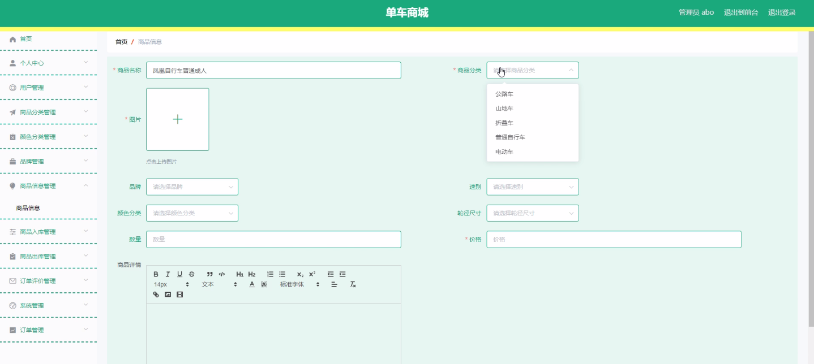
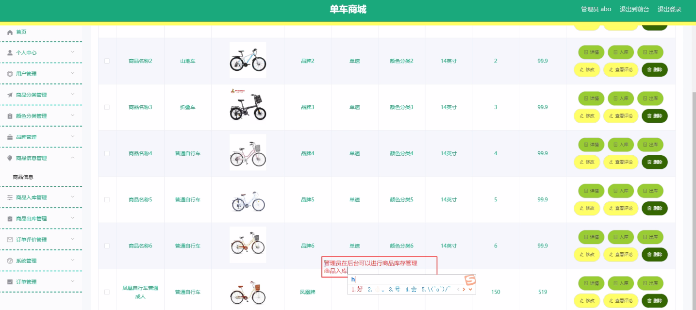
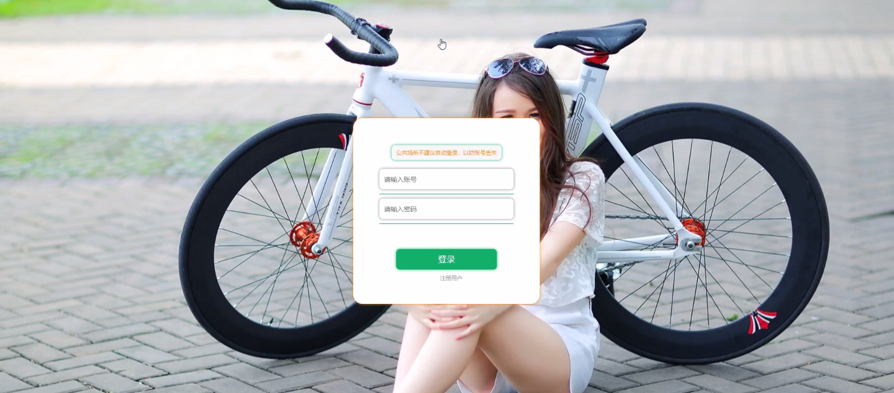
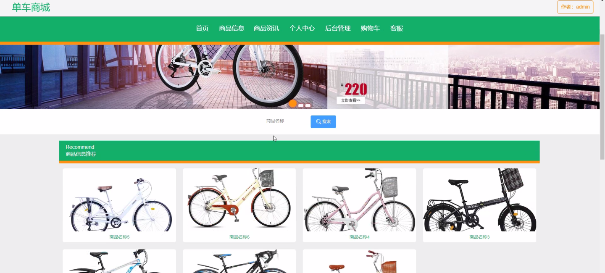
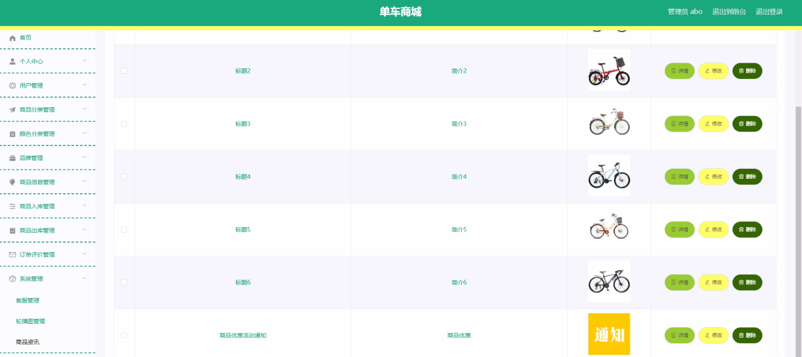
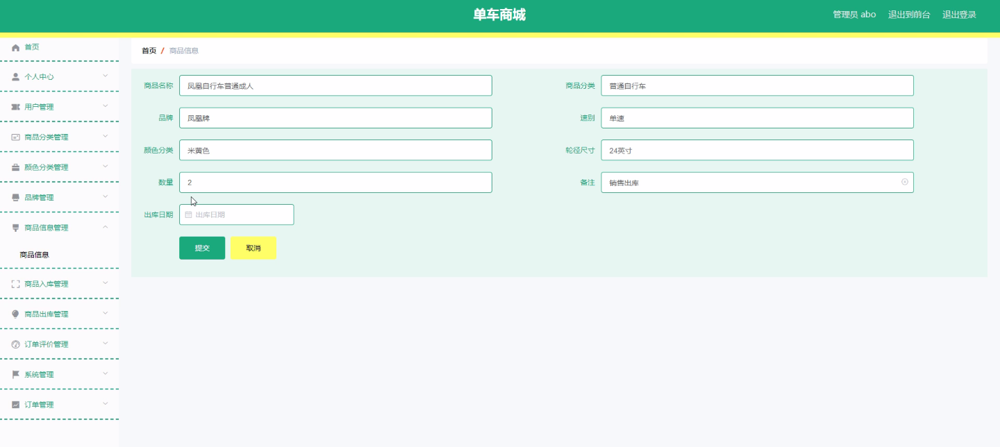

****本项目包含程序+源码+数据库+LW+调试部署环境，文末可获取一份本项目的java源码和数据库参考。****

## ******开题报告******

研究背景：
随着社会经济的发展和人们生活水平的提高，单车作为一种环保、健康的出行方式，受到越来越多人的青睐。单车商城作为一个集用户、商品分类、商品信息、颜色分类、订单评价、品牌等系统功能于一体的平台，为用户提供了便捷的购物体验。然而，在当前市场上存在着许多问题和挑战，如用户体验不佳、商品信息不准确、订单评价不及时等，这些问题严重影响了单车商城的运营效果和用户满意度。

研究意义：
通过对单车商城进行深入研究和分析，可以帮助商城管理者更好地了解用户需求，优化商品分类和信息展示，提升用户体验和购物满意度。同时，通过改进订单评价系统，可以促进用户参与互动，增加用户粘性和忠诚度。此外，研究还可以为单车商城的发展提供参考和指导，推动行业的进步和创新。

研究目的：
本研究旨在探索单车商城的运营问题，并提出相应的解决方案，以提升商城的竞争力和用户满意度。具体目标包括：1）分析用户需求和行为特点，优化用户界面和交互设计；2）改进商品分类和信息展示方式，提高商品搜索和筛选的准确性和便捷性；3）建立完善的订单评价系统，及时收集用户反馈并进行处理；4）加强品牌宣传和推广，提升品牌知名度和美誉度。

研究内容： 本研究将围绕单车商城的用户、商品分类、商品信息、颜色分类、订单评价、品牌等系统功能展开研究。具体内容包括但不限于以下几个方面：
1）用户需求与行为分析：通过调查问卷、访谈等方法，了解用户对单车商城的需求和使用习惯，分析用户行为特点和购物偏好。
2）商品分类与信息展示优化：根据用户需求和市场趋势，优化商品分类体系，改进商品信息展示方式，提高用户对商品的搜索和筛选效果。
3）订单评价系统改进：建立健全的订单评价机制，鼓励用户积极参与评价，及时收集用户反馈并进行处理，提升用户满意度和忠诚度。
4）品牌宣传与推广：通过多种渠道和方式，加强单车商城的品牌宣传和推广，提升品牌知名度和美誉度。

拟解决的主要问题： 1）用户体验不佳：通过优化用户界面和交互设计，提升用户使用的便捷性和舒适度。
2）商品信息不准确：通过改进商品分类和信息展示方式，提高商品搜索和筛选的准确性和有效性。
3）订单评价不及时：建立完善的订单评价系统，及时收集用户反馈并进行处理，增加用户参与度和满意度。
4）品牌知名度不高：加强品牌宣传和推广，提升品牌在市场中的知名度和美誉度。

研究方案和预期成果：
本研究将采用综合性的研究方法，包括文献调研、实地调查、数据分析等。通过对单车商城的运营问题进行深入研究，提出相应的解决方案，并进行实际操作和验证。预期成果包括但不限于：优化的用户界面和交互设计、改进的商品分类和信息展示方式、健全的订单评价系统、提升的品牌知名度和美誉度等。

进度安排：

2022年9月至10月：需求分析和规划，进行用户需求调研和分析，确定系统功能和目标。

2022年11月至2023年1月：系统设计和开发，完成系统架构设计和技术选型，并开始编写代码。

2023年2月至3月：测试和优化，进行单元测试和集成测试，修复问题并优化系统性能。

2023年4月至5月：文档编写和培训，编写用户手册和系统文档，并进行相关人员的培训。

2023年5月：上线部署和维护，将系统部署到生产环境中，并定期进行维护和升级。

参考文献：

[1]王振华.SpringBoot在教学效果评估系统中的应用[J].电子技术,2023,(05):67-69.

[2]王明泉.基于SpringBoot远程热部署的探索和应用[J].信息与电脑(理论版),2023,(07):1-4.

[3]王亚东,李晓霞,陈强强,剡美娜.基于SpringBoot的需求发布平台设计[J].信息与电脑(理论版),2023,(01):105-107.

[4]陈新府豪.基于SpringBoot和Vue框架的创新方法推理系统的设计与实现[D].导师：黄静.浙江理工大学,2022.

[5]霍福华,韩慧.基于SpringBoot微服务架构下前后端分离的MVVM模型[J].电子技术与软件工程,2022,(01):73-76.

[6]韩策,张娜,王松亭,张凯,何方,袁峰.SpringBoot OPC客户端设计与研究[J].电子世界,2021,(19):25-26.

****以上是本项目程序开发之前开题报告内容，最终成品以下面界面为准，大家可以酌情参考使用。要源码参考请在文末进行获取！！****

## ******本项目的界面展示******

