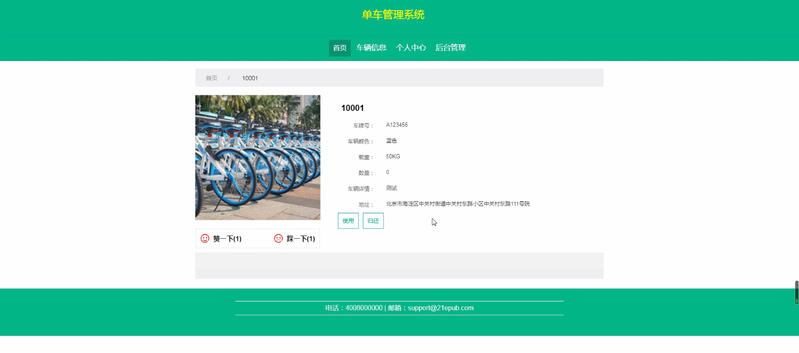

****本项目包含程序+源码+数据库+LW+调试部署环境，文末可获取一份本项目的java源码和数据库参考。****

## ******开题报告******

研究背景：
随着城市化进程的加快和人们生活水平的提高，单车作为一种环保、便捷的交通工具在城市中得到了广泛应用。然而，随之而来的问题也日益凸显：单车乱停乱放、车辆管理混乱、使用信息不透明等。这些问题给城市管理和单车运营带来了诸多困扰。因此，开发一个高效的单车管理系统成为了当务之急。

研究意义：
单车管理系统的建立对于城市管理部门、单车运营公司以及广大用户都具有重要意义。首先，它可以帮助城市管理部门实现对单车停放和使用的规范管理，提升城市形象和交通秩序。其次，对于单车运营公司来说，通过系统化管理可以提高运营效率，降低成本，并且能够更好地了解用户需求，优化服务。最后，对于用户而言，一个完善的单车管理系统可以提供更方便、安全的骑行体验，让用户更加愿意选择单车出行。

研究目的：
本研究旨在设计和开发一套功能完善的单车管理系统，通过该系统实现对用户、城市管理、员工、车辆信息、使用信息、归还信息以及运营情况等多个方面的全面管理和监控。通过系统化的数据收集、分析和处理，提供决策支持和优化方案，解决当前单车管理中存在的主要问题，实现单车管理的规范化、智能化和高效化。

研究内容： 本研究的主要内容包括以下几个方面：

  1. 用户管理：设计用户注册、登录、信息维护等功能，实现对用户身份认证和权限管理，确保用户信息的安全性和可靠性。

  2. 城市管理：建立城市地图和停车点数据库，实现对单车停放位置和数量的监控和管理，避免乱停乱放现象的发生。

  3. 员工管理：开发员工管理模块，包括员工信息录入、权限设置、工作任务分配等功能，确保员工的合理调度和工作效率。

  4. 车辆信息管理：建立车辆信息数据库，记录每辆单车的基本信息和状态，包括车辆编号、型号、位置等，实现对车辆的统一管理和追踪。

  5. 使用信息管理：记录用户的骑行轨迹、时间、距离等信息，为用户提供骑行历史查询和统计分析功能，同时也为城市管理部门和单车运营公司提供数据支持。

  6. 归还信息管理：设计归还流程和规则，记录用户的归还时间、地点等信息，确保单车归还的及时性和准确性。

  7. 运营情况分析：通过对以上数据的收集和分析，提供运营情况的实时监控和分析报告，为城市管理部门和单车运营公司提供决策依据和优化方案。

拟解决的主要问题：
本研究旨在解决当前单车管理中存在的乱停乱放、车辆管理混乱、使用信息不透明等问题。通过建立一套全面、智能的单车管理系统，实现对单车的规范管理和高效运营，提升城市形象，改善用户体验，提高单车的利用率和服务质量。

研究方案和预期成果：
本研究将采用软件开发的方法，结合数据库技术和网络通信技术，设计和开发一套单车管理系统。预期成果包括一个功能完善、界面友好、操作简便的单车管理系统，并通过实际应用验证其可行性和有效性。该系统将为城市管理部门、单车运营公司和广大用户提供一个高效、便捷的单车管理平台，实现城市交通的智能化和可持续发展。

进度安排：

2022年9月至10月：需求分析和规划，明确系统功能和目标，制定项目计划。

2022年11月至2023年1月：系统设计和编码，完成详细的系统设计并开始编写代码。

2023年2月至3月：用户界面开发和数据库开发，开发用户友好的界面和设计数据库结构。

2023年4月至5月：功能测试、文档编写和上线部署，对系统进行全面的功能测试并编写用户手册。

2023年5月：维护和升级，定期对系统进行维护和升级，修复bug和添加新功能。

参考文献：

[1]邱小群,邓丽艳,陈海潮.基于B/S的信息管理系统设计和实现[J].信息与电脑(理论版),2022,(20):146-148.

[2]谢霜.基于Java技术的网络管理体系结构的应用[J].网络安全技术与应用,2022,(10):14-15.

[3]宋锦华.高职院校Java程序设计课程改革研究[J].科技视界,2022,(20):133-135.

[4]曹嵩彭,王鹏宇.浅析Java语言在软件开发中的应用[J].信息记录材料,2022,(03):114-116.

[5]朱澈,余俊达.武汉东湖学院.基于Java的软硬件信息管理系统V1.0[Z].项目立项编号.鉴定单位.鉴定日期:

****以上是本项目程序开发之前开题报告内容，最终成品以下面界面为准，大家可以酌情参考使用。要源码参考请在文末进行获取！！****

## ******本项目的界面展示******

