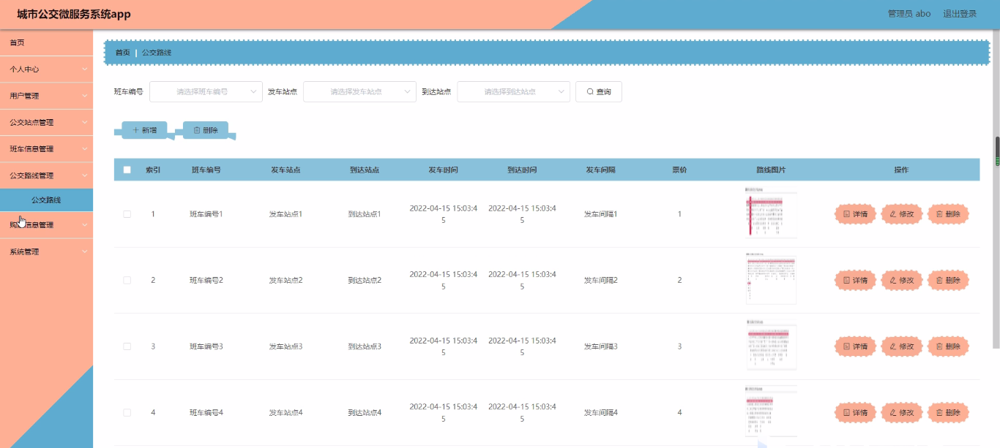

****本项目包含程序+源码+数据库+LW+调试部署环境，文末可获取一份本项目的java源码和数据库参考。****

## ******开题报告******

研究背景：
随着城市化进程的加快，城市公交系统在人们的日常出行中扮演着重要的角色。然而，传统的城市公交系统存在一些问题，如信息不对称、班车不准时、购票不便等，给乘客的出行体验带来了一定的困扰。为了提升城市公交系统的服务质量和效率，引入微服务架构成为了一种可行的解决方案。

研究意义：
城市公交微服务系统的研究具有重要的现实意义。首先，通过引入微服务架构，可以将传统的单一应用拆分为多个小型服务，提高系统的灵活性和可维护性。其次，通过对用户、公交站点、班车信息、公交路线、购票信息等系统功能进行深入研究，可以优化公交系统的各个环节，提升用户的出行体验。最后，研究城市公交微服务系统还可以为城市交通管理部门提供科学决策依据，推动城市交通智能化发展。

研究目的：
本研究旨在设计和开发一个基于微服务架构的城市公交系统，以提升公交系统的服务质量和效率。具体目的包括：优化用户出行体验、提高公交班车准时性、改善购票流程、增强公交路线规划能力等。

研究内容： 本研究将围绕城市公交系统的以下功能展开研究：

  1. 用户功能：设计并实现用户注册、登录、个人信息管理、历史行程查询等功能，提供个性化的出行服务。

  2. 公交站点功能：建立公交站点数据库，包括站点位置、站点设施等信息，为用户提供准确的站点信息。

  3. 班车信息功能：实时获取班车的位置、到达时间等信息，并通过推送等方式向用户提供准确的班车信息。

  4. 公交路线功能：基于用户需求和实时交通情况，进行公交路线规划，提供最佳的出行方案。

  5. 购票信息功能：设计并实现在线购票功能，提供便捷的购票渠道和支付方式。

拟解决的主要问题：
在传统的城市公交系统中，乘客常常面临信息不对称、班车不准时、购票不便等问题。本研究旨在通过引入微服务架构和优化各个功能模块，解决这些问题，提升公交系统的服务质量和效率。

研究方案：
本研究将采用微服务架构设计城市公交系统，通过拆分功能模块、实现服务间的松耦合，提高系统的灵活性和可维护性。同时，将对用户、公交站点、班车信息、公交路线、购票信息等功能进行深入研究，优化各个环节，提升用户的出行体验。

预期成果：
通过本研究，预期可以设计和开发一个基于微服务架构的城市公交系统，实现用户个性化出行服务、提高班车准时性、改善购票流程、增强公交路线规划能力等目标。同时，该系统还可以为城市交通管理部门提供科学决策依据，推动城市交通智能化发展。

进度安排：

2022年9月至10月：需求分析和规划，明确系统功能和目标，制定项目计划。

2022年11月至2023年1月：系统设计和编码，完成详细的系统设计并开始编写代码。

2023年2月至3月：用户界面开发和数据库开发，开发用户友好的界面和设计数据库结构。

2023年4月至5月：功能测试、文档编写和上线部署，对系统进行全面的功能测试并编写用户手册。

2023年5月：维护和升级，定期对系统进行维护和升级，修复bug和添加新功能。

参考文献：

[1]邱小群,邓丽艳,陈海潮.基于B/S的信息管理系统设计和实现[J].信息与电脑(理论版),2022,(20):146-148.

[2]谢霜.基于Java技术的网络管理体系结构的应用[J].网络安全技术与应用,2022,(10):14-15.

[3]宋锦华.高职院校Java程序设计课程改革研究[J].科技视界,2022,(20):133-135.

[4]曹嵩彭,王鹏宇.浅析Java语言在软件开发中的应用[J].信息记录材料,2022,(03):114-116.

[5]朱澈,余俊达.武汉东湖学院.基于Java的软硬件信息管理系统V1.0[Z].项目立项编号.鉴定单位.鉴定日期:

****以上是本项目程序开发之前开题报告内容，最终成品以下面界面为准，大家可以酌情参考使用。要源码参考请在文末进行获取！！****

## ******本项目的界面展示******

