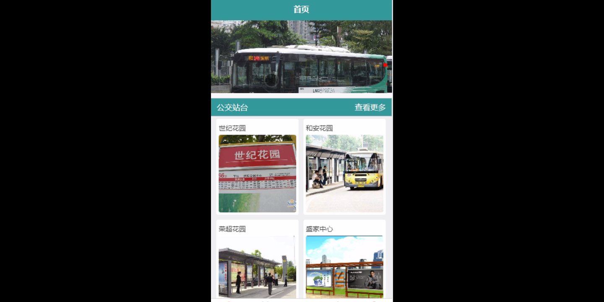
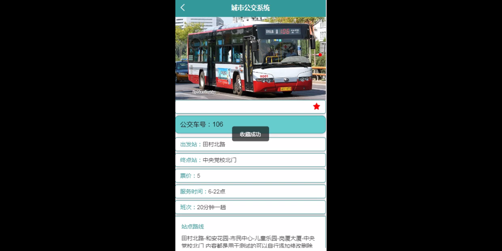
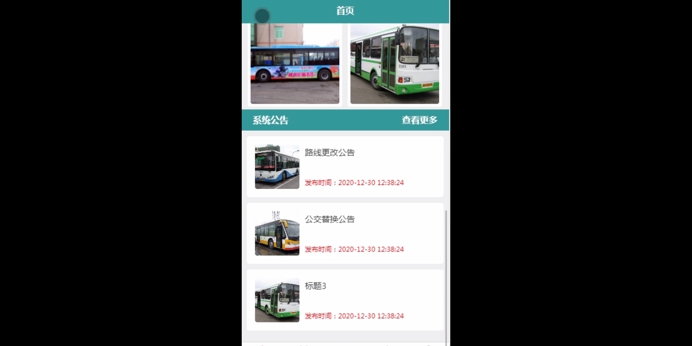
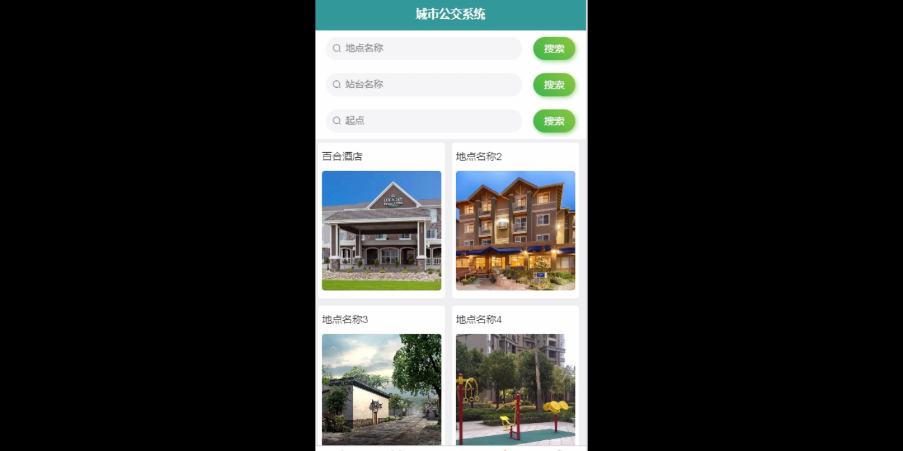
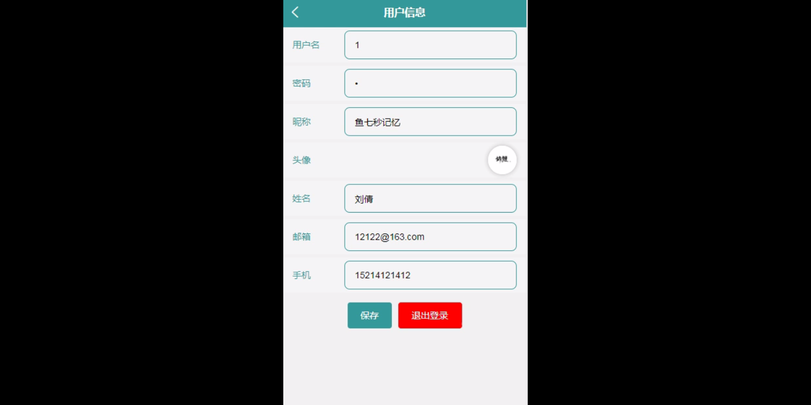

****本项目包含程序+源码+数据库+LW+调试部署环境，文末可获取一份本项目的java源码和数据库参考。****

## ******开题报告******

研究背景：
随着城市化进程的加快和人口的不断增长，城市公交系统作为一种重要的公共交通方式，在现代城市中扮演着至关重要的角色。然而，由于城市规模的扩大和人口流动性的增加，城市公交系统面临着诸多挑战和问题。例如，用户在使用公交系统时可能会遇到线路不清晰、车辆拥挤、等待时间过长等问题，这些问题不仅影响了乘客的出行体验，也给城市交通运输带来了一定的压力。因此，对城市公交系统进行深入研究和优化具有重要的现实意义。

研究意义：
通过对城市公交系统的研究，可以提高公交系统的效率和服务质量，改善乘客的出行体验，减少城市交通拥堵，降低环境污染，促进城市可持续发展。同时，研究城市公交系统还可以为政府部门提供科学决策依据，优化公共交通资源配置，提高城市交通运输的整体效益。

研究目的：
本研究旨在通过对城市公交系统的功能进行深入研究，探索如何优化公交系统的运营和管理，提高乘客的出行体验。具体目标包括但不限于：改善线路规划和调度算法，减少乘客的等待时间；提供实时公交车信息查询功能，方便乘客了解车辆到达时间和拥挤程度；优化公交站台的布局和设计，提高乘客的候车舒适度；提供线路查询功能，帮助乘客快速找到最佳乘车路线。

研究内容： 本研究将围绕城市公交系统的用户、公交站台、公交车信息和线路查询等功能展开研究。具体内容包括但不限于以下几个方面：

  1. 用户需求分析：通过调查问卷、访谈等方式，了解乘客对公交系统的需求和期望，分析用户行为特征和出行偏好。

  2. 公交站台设计与优化：研究公交站台的布局、设施配置和服务流程，提出合理的站台设计方案，以提高乘客的候车体验和安全性。

  3. 公交车信息管理：建立公交车信息管理系统，实现公交车位置的实时监测和数据采集，为乘客提供准确的车辆到达时间和拥挤程度信息。

  4. 线路规划与调度算法：优化公交线路规划和调度算法，减少乘客的等待时间和换乘次数，提高公交系统的运营效率。

拟解决的主要问题：
本研究旨在解决城市公交系统中存在的一些问题，包括但不限于：线路不清晰、车辆拥挤、等待时间过长等。通过优化公交系统的运营和管理，提高乘客的出行体验，减少城市交通拥堵，实现城市公交系统的可持续发展。

研究方案和预期成果：
本研究将采用综合研究方法，包括文献调研、数据分析、模型建立等，以实现对城市公交系统的深入研究。预期成果包括但不限于：优化的公交线路规划和调度算法、实时公交车信息查询系统、改进的公交站台设计方案等。这些成果将为城市公交系统的运营和管理提供科学依据，促进城市交通运输的发展和改善乘客的出行体验。

进度安排：

2022年9月至10月：需求分析和规划，进行用户需求调研和分析，确定系统功能和目标。

2022年11月至2023年1月：系统设计和开发，完成系统架构设计和技术选型，并开始编写代码。

2023年2月至3月：测试和优化，进行单元测试和集成测试，修复问题并优化系统性能。

2023年4月至5月：文档编写和培训，编写用户手册和系统文档，并进行相关人员的培训。

2023年5月：上线部署和维护，将系统部署到生产环境中，并定期进行维护和升级。

参考文献：

[1]王振华.SpringBoot在教学效果评估系统中的应用[J].电子技术,2023,(05):67-69.

[2]王明泉.基于SpringBoot远程热部署的探索和应用[J].信息与电脑(理论版),2023,(07):1-4.

[3]王亚东,李晓霞,陈强强,剡美娜.基于SpringBoot的需求发布平台设计[J].信息与电脑(理论版),2023,(01):105-107.

[4]陈新府豪.基于SpringBoot和Vue框架的创新方法推理系统的设计与实现[D].导师：黄静.浙江理工大学,2022.

[5]霍福华,韩慧.基于SpringBoot微服务架构下前后端分离的MVVM模型[J].电子技术与软件工程,2022,(01):73-76.

[6]韩策,张娜,王松亭,张凯,何方,袁峰.SpringBoot OPC客户端设计与研究[J].电子世界,2021,(19):25-26.

****以上是本项目程序开发之前开题报告内容，最终成品以下面界面为准，大家可以酌情参考使用。要源码参考请在文末进行获取！！****

## ******本项目的界面展示******

