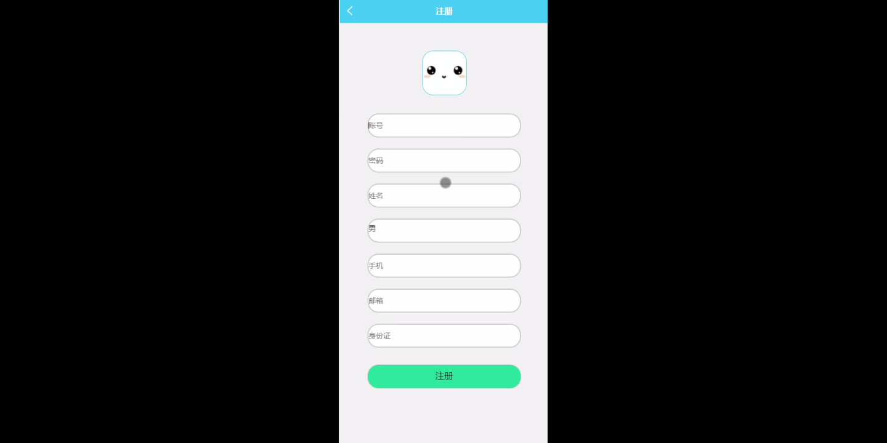
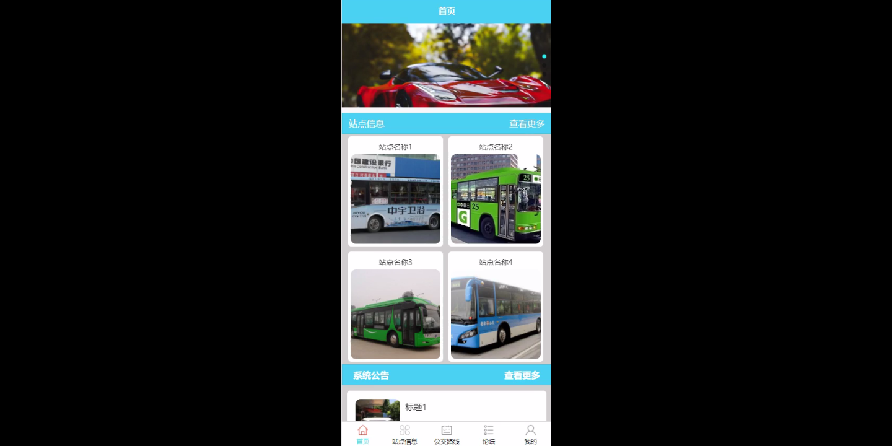
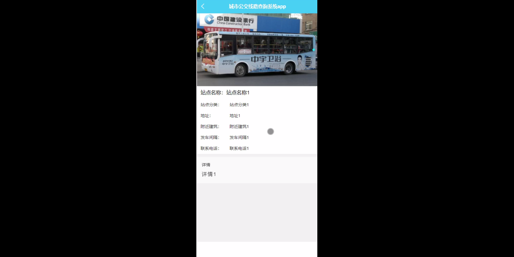
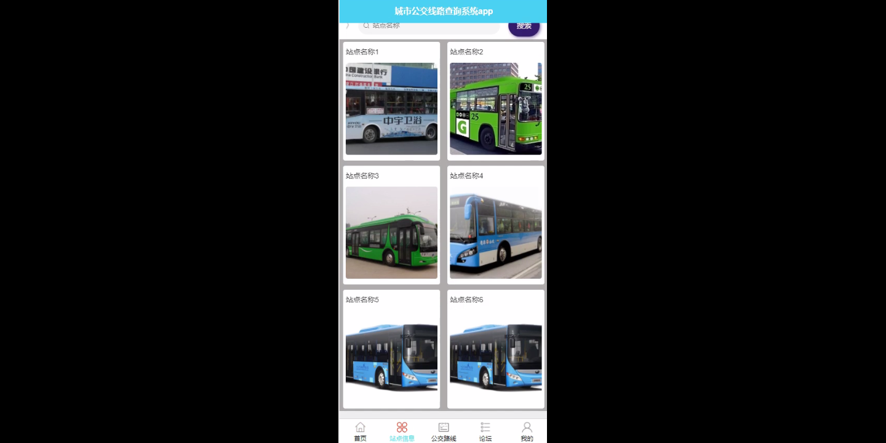
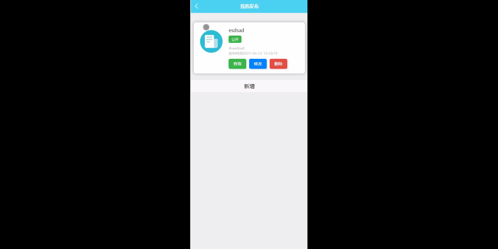
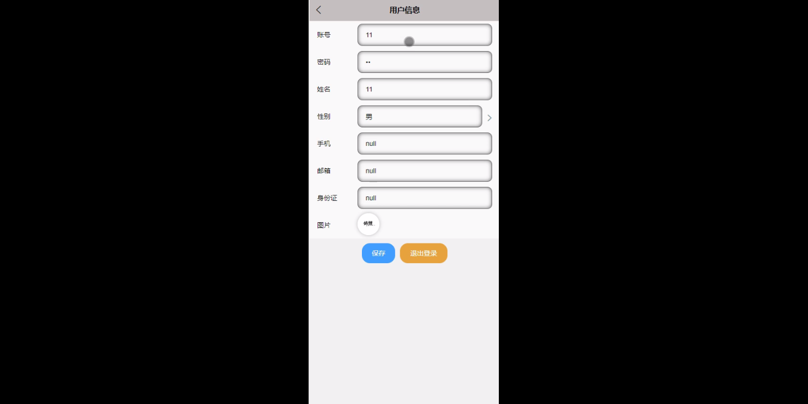
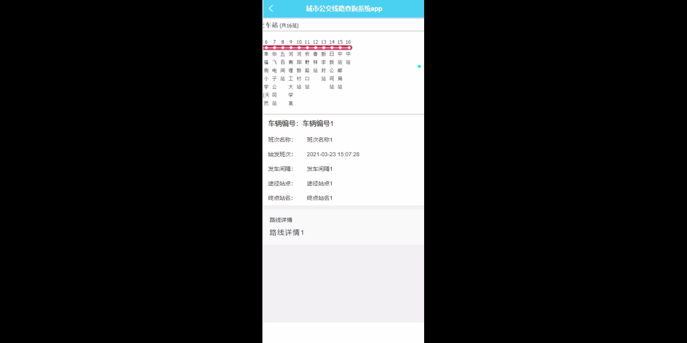

****本项目包含程序+源码+数据库+LW+调试部署环境，文末可获取一份本项目的java源码和数据库参考。****

## ******开题报告******

研究背景：
随着城市化进程的加快，城市人口不断增长，城市交通问题日益突出。公共交通作为城市交通体系的重要组成部分，对于缓解交通拥堵、提高出行效率、改善环境质量具有重要意义。然而，由于城市规模庞大、交通网络复杂，公交线路的规划和管理面临诸多挑战。因此，建立一套高效可靠的城市公交线路查询系统，对于提升公共交通服务质量、满足市民出行需求具有重要意义。

研究意义：
城市公交线路查询系统的建立可以为市民提供准确、实时的公交线路信息，帮助他们更好地规划出行路线，节省时间和精力。同时，该系统还能够为公交运营管理部门提供数据支持，帮助他们进行线路优化和调整，提高公交运营效率。此外，通过对用户出行数据的分析，可以为城市交通规划部门提供参考，优化城市交通布局，提升城市交通运行效率。

研究目的：
本研究旨在设计和开发一种城市公交线路查询系统，通过整合用户、站点信息、站点分类和公交路线等系统功能，实现对公交线路的快速查询和准确定位。具体目标包括：提供用户友好的界面，方便市民查询公交线路；建立完善的站点信息数据库，包括站点位置、站点分类等信息；设计高效的公交路线规划算法，提供最优的出行方案；实现实时更新公交线路信息，保证查询结果的准确性和及时性。

研究内容： 本研究的主要内容包括以下几个方面：

  1. 用户功能：设计并开发用户友好的界面，支持用户输入起始地点和目的地点，查询公交线路和出行方案。

  2. 站点信息功能：建立站点信息数据库，包括站点名称、位置、站点分类等信息，为公交线路查询提供基础数据支持。

  3. 站点分类功能：根据站点特征和需求，将站点进行分类，如商业区站点、居民区站点等，以便用户更好地选择合适的公交线路。

  4. 公交路线功能：设计高效的公交路线规划算法，考虑交通流量、道路条件等因素，为用户提供最优的出行方案。

拟解决的主要问题： 在城市公交线路查询系统的设计和开发过程中，我们将重点解决以下问题：

  1. 数据准确性问题：如何保证站点信息的准确性和及时更新，以提供准确的公交线路查询结果。

  2. 算法优化问题：如何设计高效的公交路线规划算法，考虑到城市交通流量、道路条件等因素，为用户提供最优的出行方案。

  3. 用户体验问题：如何设计用户友好的界面，简化操作流程，提高用户查询公交线路的便利性和满意度。

研究方案： 本研究将采用以下方案进行实施：

  1. 数据收集与整理：收集城市公交线路、站点信息等相关数据，并进行整理和标注。

  2. 系统设计与开发：根据功能需求，设计系统架构和数据库结构，并进行系统开发和测试。

  3. 算法设计与优化：研究公交路线规划算法，考虑交通流量、道路条件等因素，优化算法性能。

  4. 用户界面设计与评估：设计用户友好的界面，进行用户体验评估和改进。

预期成果： 通过本研究，预期可以实现以下成果：

  1. 建立一套高效可靠的城市公交线路查询系统，为市民提供准确、实时的公交线路信息。

  2. 提供用户友好的界面，方便市民查询公交线路和规划出行路线。

  3. 建立完善的站点信息数据库，包括站点位置、站点分类等信息。

  4. 设计高效的公交路线规划算法，提供最优的出行方案。

  5. 为城市交通规划部门提供参考，优化城市交通布局，提升城市交通运行效率。

进度安排：

2022年9月至10月：开题报告编写和提交，完成开题报告的撰写并提交给指导教师进行审核。

2022年11月至2023年1月：系统设计和开发，根据开题报告的要求，进行系统设计和编码工作。

2023年2月至3月：论文撰写和初稿完成，开始撰写论文，并在这个阶段完成论文的初稿。

2023年4月至5月：论文修改和最终定稿，根据指导教师的意见对论文进行修改，并完成最终的定稿。

2023年5月：论文答辩和提交，参加论文答辩并根据答辩结果进行修改，最后将论文提交给学院或学校。

参考文献：

[1]喻佳,吴丹新.基于SpringBoot的Web快速开发框架[J].电脑编程技巧与维护,2021,(09):31-33.

[2]李鹏.基于SpringBoot快速开发平台的实现[J].电子技术与软件工程,2021,(12):36-37.

[3]叶开平,蔡维晟,陈家敏,邓斯妮.基于SpringBoot的综测可视化管理系统的研究与设计[J].电脑知识与技术,2021,(12):100-104.

[4]江健锋,徐振平.Springboot最小系统的设计与实现[J].电脑知识与技术,2021,(04):62-63.

[5]赵炯,司圣杰,周奇才,熊肖磊.通用信息获取系统设计与实现[J].起重运输机械,2020,(16):89-97.

[6]吴英宾.一种内外网数据交互系统的设计与实现[J].软件工程,2020,(08):25-27.

****以上是本项目程序开发之前开题报告内容，最终成品以下面界面为准，大家可以酌情参考使用。要源码参考请在文末进行获取！！****

## ******本项目的界面展示******

