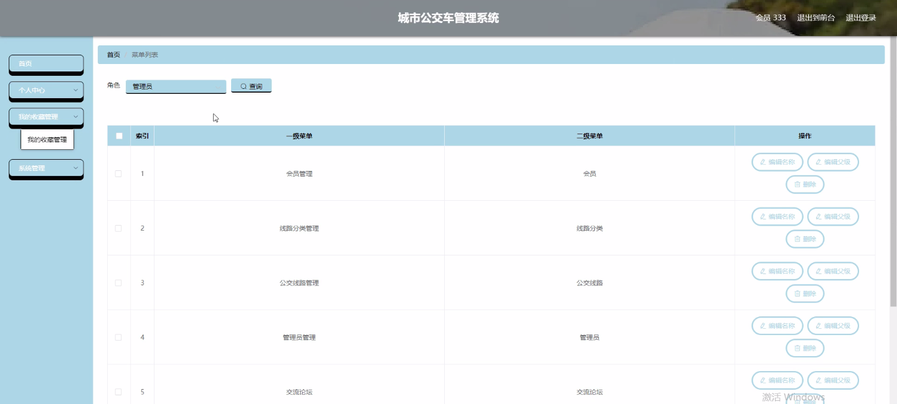

****本项目包含程序+源码+数据库+LW+调试部署环境，文末可获取一份本项目的java源码和数据库参考。****

## ******开题报告******

研究背景：
随着城市化进程的不断加快，城市公交系统作为人们出行的重要方式之一，承担着越来越重要的角色。然而，随着城市人口的增加和交通需求的增长，传统的公交车管理方式已经无法满足日益增长的需求。因此，建立一个高效、智能的城市公交车管理系统变得尤为重要。

研究意义：
城市公交车管理系统的建立对于提升城市公交服务质量、优化公交线路规划、提高运营效率具有重要意义。通过引入会员制度、线路分类等系统功能，可以更好地满足乘客的个性化需求，提供更便捷、舒适的出行体验。同时，通过数据分析和智能调度，可以实现公交车的合理运营，减少拥堵和排队时间，提高城市交通的整体效率。

研究目的：
本研究旨在设计和开发一套城市公交车管理系统，以提升城市公交服务水平和运营效率。通过引入会员制度，可以建立乘客档案，实现个性化服务和精准推送；通过线路分类，可以根据不同的需求和特点，合理规划公交线路，提高运输效率；通过智能调度，可以根据实时数据进行车辆调度和优化，减少拥堵和排队时间。

研究内容：
本研究的主要内容包括会员系统、线路分类系统和公交线路系统。会员系统将建立乘客档案，记录乘客的个人信息和出行偏好，为乘客提供个性化服务和精准推送。线路分类系统将根据不同的需求和特点，对公交线路进行分类，如快速线、环线、支线等，以满足不同乘客群体的出行需求。公交线路系统将通过智能调度和数据分析，实现公交车辆的合理运营和优化，提高运输效率。

拟解决的主要问题：

  1. 如何建立高效的会员系统，实现个性化服务和精准推送？
  2. 如何进行公交线路的分类，以满足不同乘客群体的出行需求？
  3. 如何通过智能调度和数据分析，实现公交车辆的合理运营和优化？
  4. 如何提高城市公交服务质量，提升乘客出行体验？
  5. 如何减少拥堵和排队时间，提高城市交通的整体效率？

研究方案：
本研究将采用综合性的研究方法，包括文献调研、需求分析、系统设计和实验验证等。首先，通过对现有公交车管理系统的研究和分析，了解其优缺点和存在的问题。然后，根据需求分析，设计并开发一个高效、智能的城市公交车管理系统。最后，通过实验验证和数据分析，评估系统的性能和效果。

预期成果：
本研究预期将设计和开发一套高效、智能的城市公交车管理系统，以提升城市公交服务质量和运营效率。通过引入会员制度、线路分类等系统功能，可以满足乘客的个性化需求，提供更便捷、舒适的出行体验。同时，通过智能调度和数据分析，可以实现公交车的合理运营，减少拥堵和排队时间，提高城市交通的整体效率。

进度安排：

2022年9月至10月：需求分析和规划，进行用户需求调研和分析，确定系统功能和目标。

2022年11月至2023年1月：系统设计和开发，完成系统架构设计和技术选型，并开始编写代码。

2023年2月至3月：测试和优化，进行单元测试和集成测试，修复问题并优化系统性能。

2023年4月至5月：文档编写和培训，编写用户手册和系统文档，并进行相关人员的培训。

2023年5月：上线部署和维护，将系统部署到生产环境中，并定期进行维护和升级。

参考文献：

[1]王振华.SpringBoot在教学效果评估系统中的应用[J].电子技术,2023,(05):67-69.

[2]王明泉.基于SpringBoot远程热部署的探索和应用[J].信息与电脑(理论版),2023,(07):1-4.

[3]王亚东,李晓霞,陈强强,剡美娜.基于SpringBoot的需求发布平台设计[J].信息与电脑(理论版),2023,(01):105-107.

[4]陈新府豪.基于SpringBoot和Vue框架的创新方法推理系统的设计与实现[D].导师：黄静.浙江理工大学,2022.

[5]霍福华,韩慧.基于SpringBoot微服务架构下前后端分离的MVVM模型[J].电子技术与软件工程,2022,(01):73-76.

[6]韩策,张娜,王松亭,张凯,何方,袁峰.SpringBoot OPC客户端设计与研究[J].电子世界,2021,(19):25-26.

****以上是本项目程序开发之前开题报告内容，最终成品以下面界面为准，大家可以酌情参考使用。要源码参考请在文末进行获取！！****

## ******本项目的界面展示******

