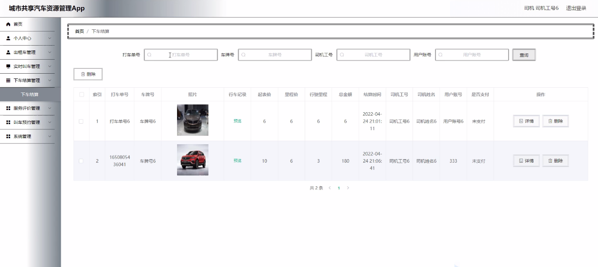

****本项目包含程序+源码+数据库+LW+调试部署环境，文末可获取一份本项目的java源码和数据库参考。****

## ******开题报告******

研究背景：
随着城市化进程的加速和人口增长，交通拥堵和环境污染等问题日益突出。传统的私家车模式已经无法满足人们对出行的需求，因此共享汽车作为一种新型的出行方式逐渐兴起。共享汽车资源管理是指通过科技手段对共享汽车进行有效的调度和管理，以提高资源利用率、减少交通拥堵和环境污染，改善城市居民的出行体验。

研究意义：
共享汽车资源管理具有重要的现实意义。首先，它可以有效解决城市交通拥堵问题，提高道路通行效率，减少交通事故发生率。其次，共享汽车可以减少私家车的使用，降低能源消耗和环境污染，有助于构建可持续发展的城市交通系统。此外，共享汽车还可以提供更便捷、经济的出行选择，提高城市居民的出行效率和生活质量。

研究目的：
本研究旨在探索和优化城市共享汽车资源管理的方法和策略，以提高共享汽车的利用率和服务质量。具体目标包括：1）优化共享汽车的调度算法，实现合理的资源分配和动态调度；2）提升用户体验，改善叫车预约、下车结算等功能的便利性和效率；3）建立有效的司机管理机制，提高司机服务质量和安全意识；4）加强汽车品牌管理，提升共享汽车的形象和品质。

研究内容： 本研究将围绕以下系统功能展开研究：

  1. 用户管理：包括用户注册、身份认证、个人信息管理等，旨在提供便捷的用户使用体验。
  2. 司机管理：包括司机招募、培训、考核等，以确保司机的服务质量和安全意识。
  3. 汽车品牌管理：包括汽车选型、维护、更新等，以提供高品质的共享汽车服务。
  4. 出租车管理：包括出租车调度、计费、行程记录等，以保障用户的出行需求。
  5. 实时叫车：通过智能调度算法，实现用户快速叫车和准确定位的功能。
  6. 下车结算：提供多种支付方式和灵活的结算方式，方便用户完成支付流程。
  7. 服务评价：用户可以对司机和服务进行评价，以提供参考和改进的依据。
  8. 叫车预约：用户可以提前预约共享汽车，提高出行的灵活性和可预测性。

拟解决的主要问题：

  1. 如何实现合理的共享汽车资源调度和动态分配？
  2. 如何提高用户叫车预约、下车结算等功能的便利性和效率？
  3. 如何建立有效的司机管理机制，提高司机服务质量和安全意识？
  4. 如何加强汽车品牌管理，提升共享汽车的形象和品质？
  5. 如何优化系统算法，提高共享汽车的利用率和服务质量？

研究方案和预期成果：
本研究将采用综合研究方法，包括文献调研、数据分析、模型构建和实证研究等。通过对城市共享汽车资源管理的各个方面进行深入研究，预期能够提出一套完善的管理策略和技术方案，以提高共享汽车的利用率和服务质量。同时，预计能够减少交通拥堵和环境污染，改善城市居民的出行体验，为城市交通管理和可持续发展提供参考和借鉴。

进度安排：

2022年9月至10月：需求分析和规划，进行用户需求调研和分析，确定系统功能和目标。

2022年11月至2023年1月：系统设计和开发，完成系统架构设计和技术选型，并开始编写代码。

2023年2月至3月：测试和优化，进行单元测试和集成测试，修复问题并优化系统性能。

2023年4月至5月：文档编写和培训，编写用户手册和系统文档，并进行相关人员的培训。

2023年5月：上线部署和维护，将系统部署到生产环境中，并定期进行维护和升级。

参考文献：

[1]王振华.SpringBoot在教学效果评估系统中的应用[J].电子技术,2023,(05):67-69.

[2]王明泉.基于SpringBoot远程热部署的探索和应用[J].信息与电脑(理论版),2023,(07):1-4.

[3]王亚东,李晓霞,陈强强,剡美娜.基于SpringBoot的需求发布平台设计[J].信息与电脑(理论版),2023,(01):105-107.

[4]陈新府豪.基于SpringBoot和Vue框架的创新方法推理系统的设计与实现[D].导师：黄静.浙江理工大学,2022.

[5]霍福华,韩慧.基于SpringBoot微服务架构下前后端分离的MVVM模型[J].电子技术与软件工程,2022,(01):73-76.

[6]韩策,张娜,王松亭,张凯,何方,袁峰.SpringBoot OPC客户端设计与研究[J].电子世界,2021,(19):25-26.

****以上是本项目程序开发之前开题报告内容，最终成品以下面界面为准，大家可以酌情参考使用。要源码参考请在文末进行获取！！****

## ******本项目的界面展示******

