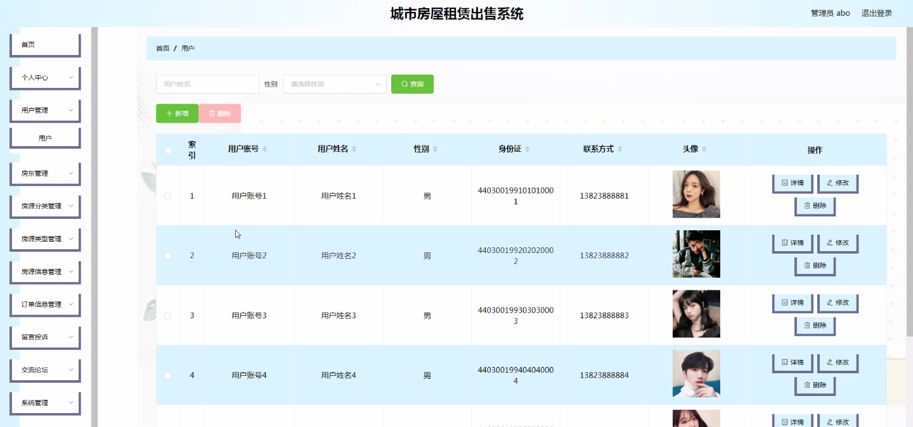

****本项目包含程序+源码+数据库+LW+调试部署环境，文末可获取一份本项目的java源码和数据库参考。****

## ******开题报告******

研究背景：
随着城市化进程的加快和人口的不断增长，城市房屋租赁和出售需求日益旺盛。然而，传统的房屋租赁和出售方式存在诸多问题，如信息不对称、交易流程繁琐、合同纠纷等，给用户和房东带来了很大的困扰。因此，建立一个高效、便捷、安全的城市房屋租赁出售系统具有重要的现实意义。

研究意义：
城市房屋租赁出售系统的建立可以有效解决传统方式存在的问题，提供更好的服务体验和交易保障。首先，通过系统的信息共享和整合，可以提高房源信息的透明度，减少信息不对称，使用户和房东能够更准确地了解市场行情和房源情况。其次，系统可以简化交易流程，提供在线签约、支付等功能，节省时间和精力。最后，系统还可以建立评价和投诉机制，促进交易的诚信和公平性，提升用户满意度。

研究目的：
本研究旨在设计和开发一套城市房屋租赁出售系统，通过整合用户、房东、房源分类、房源信息、房源类型、订单信息、投诉留言等系统功能，实现房屋租赁和出售的全流程管理。具体目标包括提高房源信息的透明度和准确性、简化交易流程、保障交易安全和权益、提升用户满意度。

研究内容： 本研究的主要内容包括以下系统功能的设计和开发：

  1. 用户管理：包括用户注册、登录、个人信息管理等功能，为用户提供个性化的服务和便捷的操作界面。
  2. 房东管理：包括房东认证、房源发布、房源管理等功能，为房东提供方便快捷的房屋租赁和出售服务。
  3. 房源分类：根据不同的房屋类型和用途，对房源进行分类管理，方便用户按需搜索和筛选。
  4. 房源信息：包括房屋基本信息、价格、位置、配套设施等详细信息的展示，帮助用户全面了解房源情况。
  5. 房源类型：根据租赁和出售的不同需求，对房源进行分类管理，提供相应的交易方式和流程。
  6. 订单信息：包括用户提交订单、支付、签约等环节的管理，确保交易的顺利进行。
  7. 投诉留言：建立用户投诉和留言机制，及时解决用户遇到的问题和纠纷。

拟解决的主要问题：
本研究旨在解决传统城市房屋租赁和出售方式存在的信息不对称、交易流程繁琐、合同纠纷等问题。通过系统的设计和开发，提高房源信息的透明度和准确性，简化交易流程，保障交易安全和权益，提升用户满意度。

研究方案和预期成果：
本研究将采用软件工程的方法，包括需求分析、系统设计、编码实现、测试和部署等阶段，开发一套城市房屋租赁出售系统。预期成果包括一个功能完善、操作便捷、安全可靠的系统，能够满足用户和房东的需求，提供高效的房屋租赁和出售服务。同时，预计该系统能够促进房屋租赁和出售市场的健康发展，提升整个行业的效率和信誉。

进度安排：

2022年9月至10月：需求分析和规划，明确系统功能和目标，制定项目计划。

2022年11月至2023年1月：系统设计和编码，完成详细的系统设计并开始编写代码。

2023年2月至3月：用户界面开发和数据库开发，开发用户友好的界面和设计数据库结构。

2023年4月至5月：功能测试、文档编写和上线部署，对系统进行全面的功能测试并编写用户手册。

2023年5月：维护和升级，定期对系统进行维护和升级，修复bug和添加新功能。

参考文献：

[1]邱小群,邓丽艳,陈海潮.基于B/S的信息管理系统设计和实现[J].信息与电脑(理论版),2022,(20):146-148.

[2]谢霜.基于Java技术的网络管理体系结构的应用[J].网络安全技术与应用,2022,(10):14-15.

[3]宋锦华.高职院校Java程序设计课程改革研究[J].科技视界,2022,(20):133-135.

[4]曹嵩彭,王鹏宇.浅析Java语言在软件开发中的应用[J].信息记录材料,2022,(03):114-116.

[5]朱澈,余俊达.武汉东湖学院.基于Java的软硬件信息管理系统V1.0[Z].项目立项编号.鉴定单位.鉴定日期:

****以上是本项目程序开发之前开题报告内容，最终成品以下面界面为准，大家可以酌情参考使用。要源码参考请在文末进行获取！！****

## ******本项目的界面展示******

