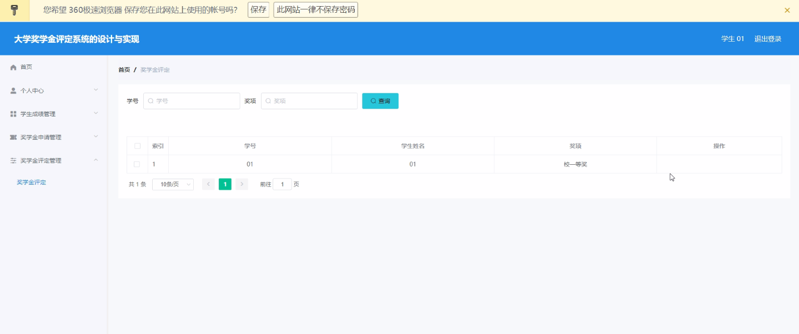

****本项目包含程序+源码+数据库+LW+调试部署环境，文末可获取一份本项目的java源码和数据库参考。****

## ******开题报告******

研究背景、意义和目的：

在现代高等教育中，奖学金评定是一项重要的工作，它旨在激励学生取得优异的学业成绩和全面发展。然而，传统的奖学金评定方式往往存在一些问题，如评定过程繁琐、主观性较强、效率低下等。因此，开发一个基于大数据和人工智能技术的大学奖学金评定系统具有重要的研究意义和实际应用价值。

该研究的目的是设计并实现一个高效、准确、公正的大学奖学金评定系统，以提高奖学金评定的科学性和公平性。通过引入学生、学生成绩、学科信息、奖学金申请、奖学金评定、评定标准、学院信息、班级信息等系统功能，将大数据和人工智能技术应用于奖学金评定过程中，从而提高评定结果的客观性和准确性，为学生提供更好的奖学金申请和评定服务。

研究内容：

本研究的核心内容包括以下方面：

  1. 数据收集与处理：建立学生、学生成绩、学科信息、奖学金申请、评定标准、学院信息、班级信息等相关数据的数据库，并对这些数据进行收集和整理，以便后续的分析和应用。

  2. 奖学金评定模型构建：基于大数据和人工智能技术，设计并构建奖学金评定模型。该模型将综合考虑学生的学业成绩、学科竞赛成绩、社会实践经历等多个因素，通过算法和模型的运算，得出每位学生的奖学金评定结果。

  3. 系统开发与实现：根据研究目标和需求，开发一个大学奖学金评定系统。该系统将包括学生信息管理、奖学金申请管理、评定标准管理、评定结果生成等功能模块，实现对奖学金评定全过程的自动化管理和操作。

拟解决的主要问题：

本研究旨在解决传统奖学金评定方式存在的主观性强、效率低下等问题。通过引入大数据和人工智能技术，构建一个科学、公正、高效的奖学金评定系统，从而提高评定结果的客观性和准确性，为学生提供更好的奖学金申请和评定服务。

研究方案和预期成果：

本研究将采用综合性的研究方法，包括文献调研、数据分析、模型构建和系统开发等。预期成果包括一个完善的大学奖学金评定系统，并通过实际应用验证其科学性和实用性。该系统将能够提高奖学金评定的公正性和准确性，为学生提供更好的奖学金申请和评定服务。

进度安排：

2022年9月至10月：需求分析和规划，进行用户需求调研和分析，确定系统功能和目标。

2022年11月至2023年1月：系统设计和开发，完成系统架构设计和技术选型，并开始编写代码。

2023年2月至3月：测试和优化，进行单元测试和集成测试，修复问题并优化系统性能。

2023年4月至5月：文档编写和培训，编写用户手册和系统文档，并进行相关人员的培训。

2023年5月：上线部署和维护，将系统部署到生产环境中，并定期进行维护和升级。

参考文献：

[1]王振华.SpringBoot在教学效果评估系统中的应用[J].电子技术,2023,(05):67-69.

[2]王明泉.基于SpringBoot远程热部署的探索和应用[J].信息与电脑(理论版),2023,(07):1-4.

[3]王亚东,李晓霞,陈强强,剡美娜.基于SpringBoot的需求发布平台设计[J].信息与电脑(理论版),2023,(01):105-107.

[4]陈新府豪.基于SpringBoot和Vue框架的创新方法推理系统的设计与实现[D].导师：黄静.浙江理工大学,2022.

[5]霍福华,韩慧.基于SpringBoot微服务架构下前后端分离的MVVM模型[J].电子技术与软件工程,2022,(01):73-76.

[6]韩策,张娜,王松亭,张凯,何方,袁峰.SpringBoot OPC客户端设计与研究[J].电子世界,2021,(19):25-26.

****以上是本项目程序开发之前开题报告内容，最终成品以下面界面为准，大家可以酌情参考使用。要源码参考请在文末进行获取！！****

## ******本项目的界面展示******

