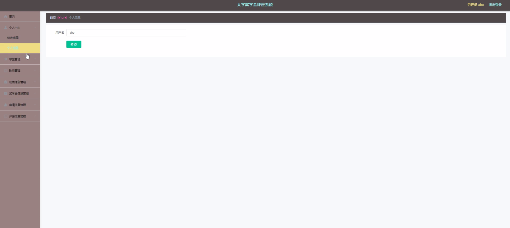
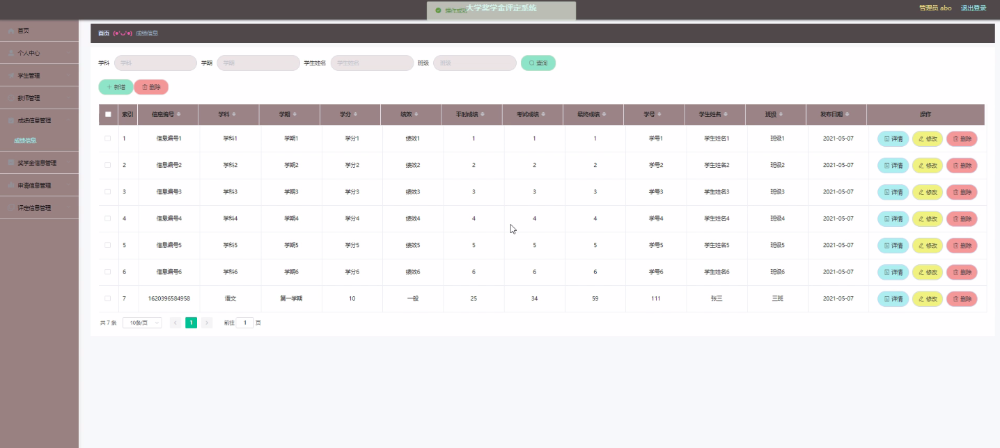
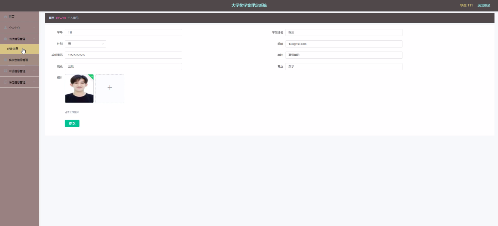
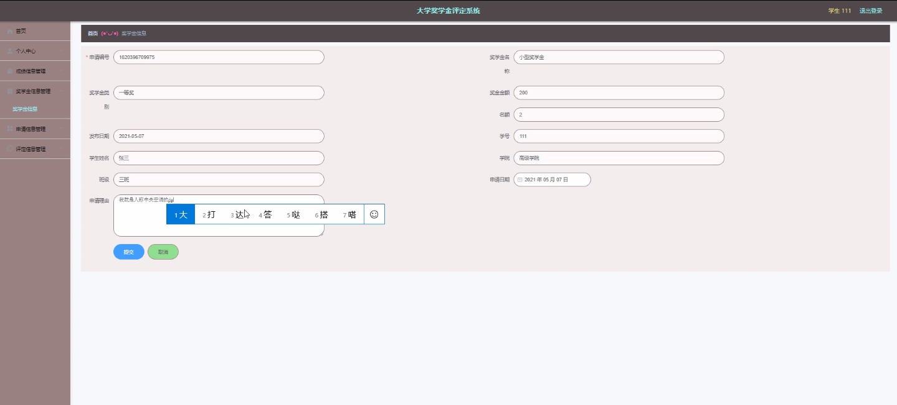
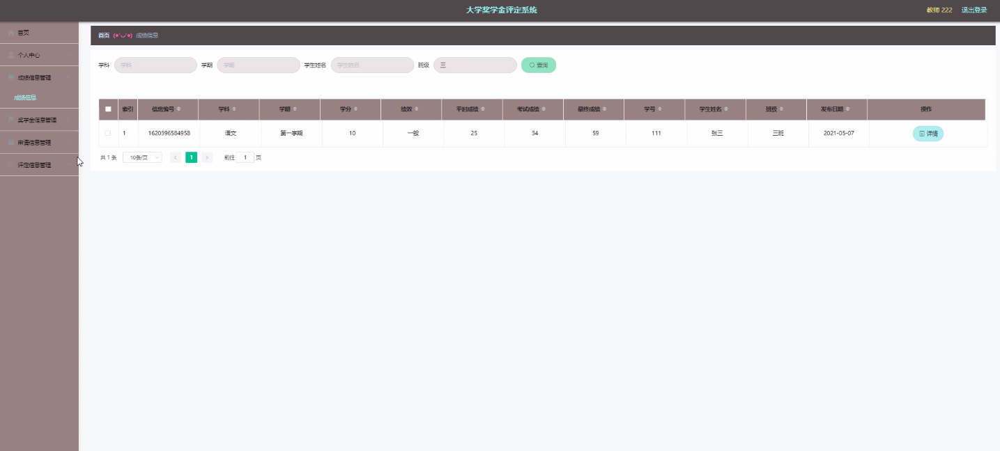
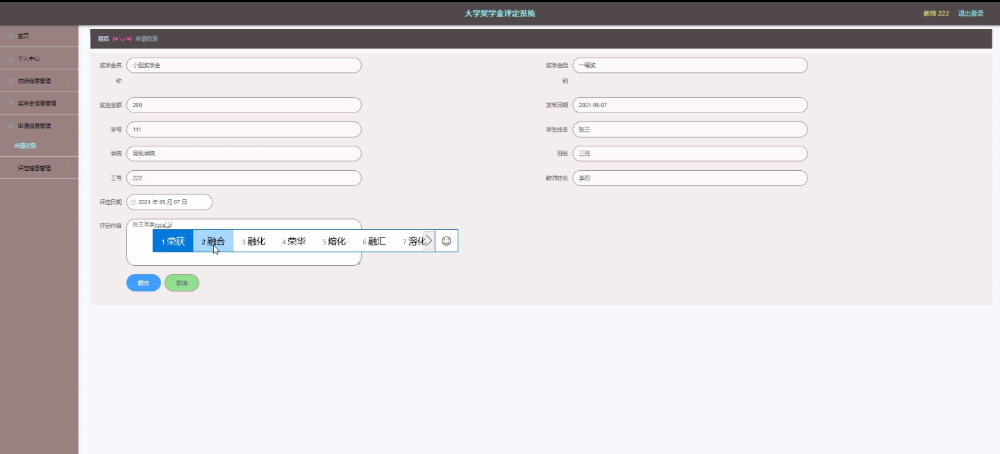

****本项目包含程序+源码+数据库+LW+调试部署环境，文末可获取一份本项目的java源码和数据库参考。****

## ******开题报告******

研究背景：
随着高等教育的普及和竞争的加剧，大学奖学金评定成为了一个重要的课题。传统的奖学金评定方式主要依靠人工操作，效率低下且容易出现主观偏差。因此，建立一套科学、公正、高效的大学奖学金评定系统具有重要意义。

研究意义：
大学奖学金评定系统的建立可以有效提高奖学金评定的公平性和准确性。通过引入计算机技术和数据分析方法，可以更加客观地评估学生的综合素质和表现，避免了主观因素对评定结果的影响。同时，该系统还能够提高评定的效率，节省人力资源，为学校管理部门提供决策支持。

研究目的：
本研究旨在设计和开发一套基于大数据和人工智能技术的大学奖学金评定系统，以实现奖学金评定的科学化、规范化和自动化。通过系统的应用，可以提高奖学金评定的公正性和透明度，激励学生积极向上，推动学校教育质量的提升。

研究内容： 本研究的主要内容包括以下系统功能：

  1. 学生信息管理：对学生的个人信息进行录入、存储和管理，包括学生的基本信息、学习成绩、奖励情况等。

  2. 教师信息管理：对教师的个人信息进行录入、存储和管理，包括教师的基本信息、教学经验、科研成果等。

  3. 成绩信息管理：对学生的学习成绩进行录入、存储和管理，包括课程成绩、综合评价等。

  4. 奖学金信息管理：对奖学金的相关信息进行录入、存储和管理，包括奖学金的名称、金额、评定标准等。

  5. 申请信息管理：对学生申请奖学金的相关信息进行录入、存储和管理，包括申请材料、推荐信等。

  6. 评定信息管理：对奖学金评定过程中的相关信息进行录入、存储和管理，包括评审意见、评定结果等。

  7. 学院信息管理：对学院的相关信息进行录入、存储和管理，包括学院的名称、专业设置、师资力量等。

  8. 专业信息管理：对专业的相关信息进行录入、存储和管理，包括专业的名称、培养目标、课程设置等。

  9. 班级信息管理：对班级的相关信息进行录入、存储和管理，包括班级的名称、学生人数、班主任等。

  10. 学科信息管理：对学科的相关信息进行录入、存储和管理，包括学科的名称、学科代码、学科方向等。

拟解决的主要问题：
本研究旨在解决传统大学奖学金评定方式存在的主观性、低效性和不公平性等问题。通过引入大数据和人工智能技术，建立科学、公正、高效的奖学金评定系统，实现奖学金评定的客观化和自动化，提高评定结果的准确性和公正性。

研究方案：
本研究将采用数据分析方法和机器学习算法，结合大学奖学金评定的特点和需求，设计并开发一套符合实际应用场景的大学奖学金评定系统。系统将基于学生的个人信息、学习成绩、奖励情况等多维度数据，通过算法模型进行综合评估和排序，得出最终的奖学金评定结果。

预期成果：
预计本研究将设计和开发一套科学、公正、高效的大学奖学金评定系统，实现奖学金评定的自动化和规范化。该系统将提高奖学金评定的准确性和公正性，节省人力资源，为学校管理部门提供决策支持。同时，该系统还将激励学生积极向上，推动学校教育质量的提升。

进度安排：

2022年9月至10月：开题报告编写和提交，完成开题报告的撰写并提交给指导教师进行审核。

2022年11月至2023年1月：系统设计和开发，根据开题报告的要求，进行系统设计和编码工作。

2023年2月至3月：论文撰写和初稿完成，开始撰写论文，并在这个阶段完成论文的初稿。

2023年4月至5月：论文修改和最终定稿，根据指导教师的意见对论文进行修改，并完成最终的定稿。

2023年5月：论文答辩和提交，参加论文答辩并根据答辩结果进行修改，最后将论文提交给学院或学校。

参考文献：

[1]喻佳,吴丹新.基于SpringBoot的Web快速开发框架[J].电脑编程技巧与维护,2021,(09):31-33.

[2]李鹏.基于SpringBoot快速开发平台的实现[J].电子技术与软件工程,2021,(12):36-37.

[3]叶开平,蔡维晟,陈家敏,邓斯妮.基于SpringBoot的综测可视化管理系统的研究与设计[J].电脑知识与技术,2021,(12):100-104.

[4]江健锋,徐振平.Springboot最小系统的设计与实现[J].电脑知识与技术,2021,(04):62-63.

[5]赵炯,司圣杰,周奇才,熊肖磊.通用信息获取系统设计与实现[J].起重运输机械,2020,(16):89-97.

[6]吴英宾.一种内外网数据交互系统的设计与实现[J].软件工程,2020,(08):25-27.

****以上是本项目程序开发之前开题报告内容，最终成品以下面界面为准，大家可以酌情参考使用。要源码参考请在文末进行获取！！****

## ******本项目的界面展示******

