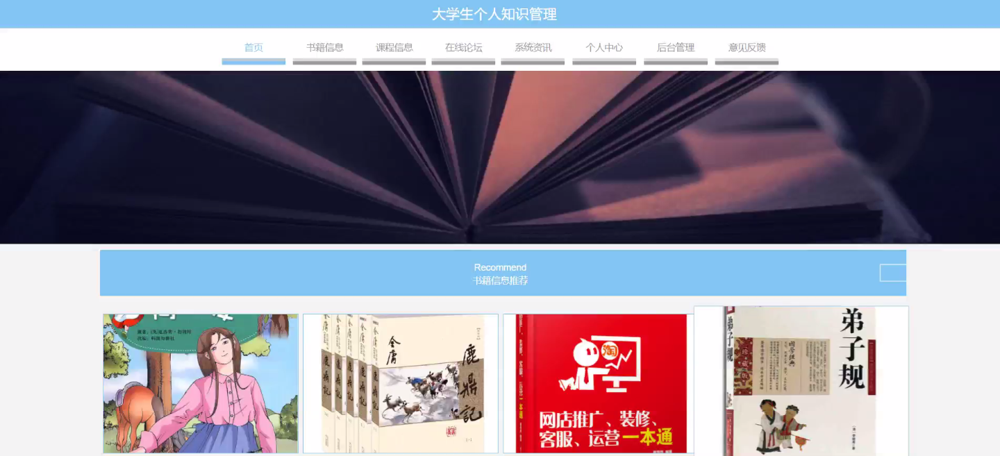
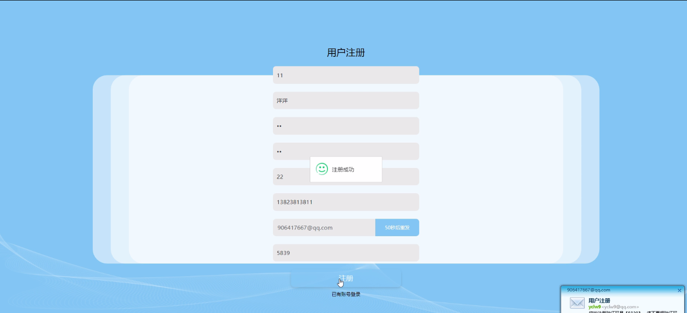
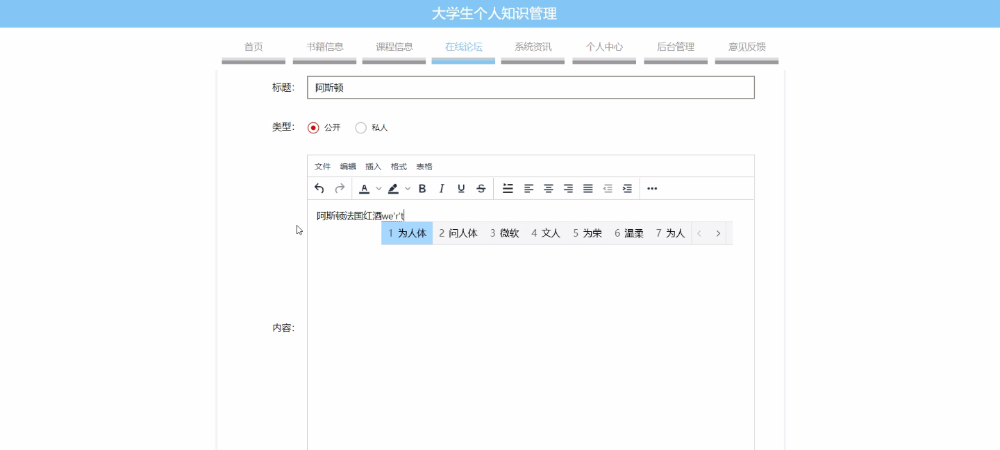
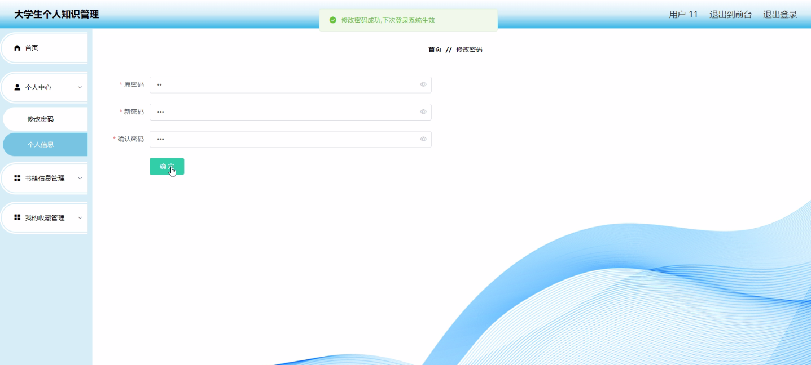
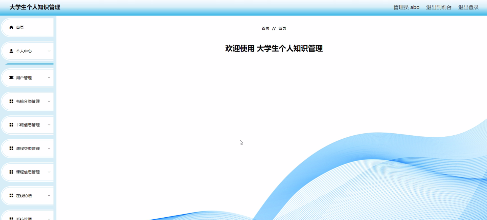
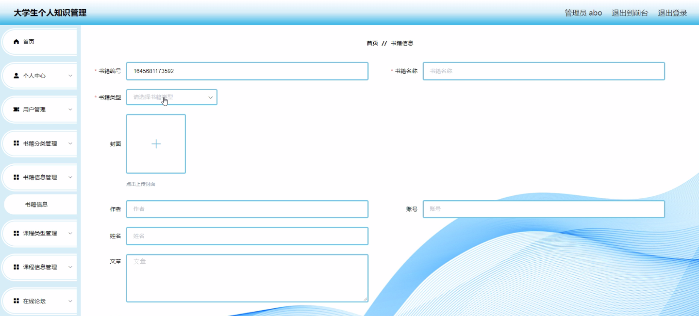
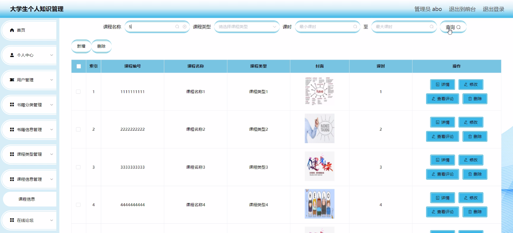
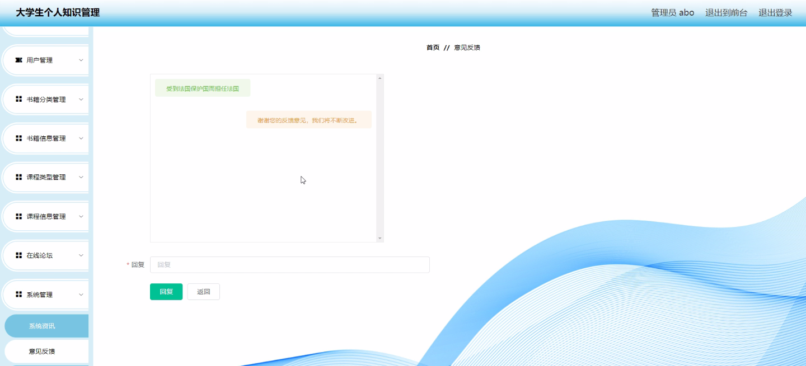

****本项目包含程序+源码+数据库+LW+调试部署环境，文末可获取一份本项目的java源码和数据库参考。****

## ******开题报告******

研究背景：
随着信息时代的到来，大学生面临着海量的知识和信息，如何高效地管理个人知识成为了一个亟待解决的问题。传统的学习方式已经无法满足大学生对知识获取、整理和应用的需求。因此，建立一种有效的大学生个人知识管理系统具有重要的现实意义。

研究意义：
大学生个人知识管理系统的建立可以帮助学生更好地组织和利用所学知识，提高学习效率和质量。通过合理的分类和整理，可以使得知识更易于查找和回顾，从而提升学习的连贯性和深度。此外，个人知识管理系统还可以促进学生之间的交流与合作，激发创新思维和学术研究的活力。

研究目的：
本研究旨在设计和开发一种适用于大学生的个人知识管理系统，以提高大学生的学习效果和知识管理能力。通过该系统，学生可以方便地记录、整理和分享自己的学习笔记、阅读材料、课程资料等，实现个性化的知识管理和学习支持。

研究内容： 本研究的主要内容包括以下几个方面：

  1. 用户管理：设计用户注册、登录和权限管理等功能，确保系统的安全性和可靠性。
  2. 书籍分类：建立一套科学合理的书籍分类体系，使得学生可以根据自己的需求进行分类整理。
  3. 书籍信息：提供书籍的基本信息和相关评价，帮助学生选择适合自己的学习资料。
  4. 课程类型：建立课程分类体系，方便学生查找和选择感兴趣的课程。
  5. 课程信息：提供课程的详细信息和学习资源，支持学生的在线学习和知识获取。

拟解决的主要问题：
在大学生个人知识管理过程中，存在着信息碎片化、知识整理困难、学习资源分散等问题。本研究旨在通过建立个人知识管理系统，解决以上问题，提高大学生的学习效果和知识管理能力。

研究方案和预期成果：
本研究将采用软件开发方法，结合用户需求调研和系统设计原则，设计和开发一款适用于大学生的个人知识管理系统。预期成果包括系统的设计与实现、用户界面的优化、功能的完善和性能的提升等方面。通过实际应用和用户反馈，验证系统的可行性和有效性，并为大学生个人知识管理提供一种新的解决方案。

进度安排：

2022年9月至10月：需求分析和规划，明确系统功能和目标，制定项目计划。

2022年11月至2023年1月：系统设计和编码，完成详细的系统设计并开始编写代码。

2023年2月至3月：用户界面开发和数据库开发，开发用户友好的界面和设计数据库结构。

2023年4月至5月：功能测试、文档编写和上线部署，对系统进行全面的功能测试并编写用户手册。

2023年5月：维护和升级，定期对系统进行维护和升级，修复bug和添加新功能。

参考文献：

[1]邱小群,邓丽艳,陈海潮.基于B/S的信息管理系统设计和实现[J].信息与电脑(理论版),2022,(20):146-148.

[2]谢霜.基于Java技术的网络管理体系结构的应用[J].网络安全技术与应用,2022,(10):14-15.

[3]宋锦华.高职院校Java程序设计课程改革研究[J].科技视界,2022,(20):133-135.

[4]曹嵩彭,王鹏宇.浅析Java语言在软件开发中的应用[J].信息记录材料,2022,(03):114-116.

[5]朱澈,余俊达.武汉东湖学院.基于Java的软硬件信息管理系统V1.0[Z].项目立项编号.鉴定单位.鉴定日期:

****以上是本项目程序开发之前开题报告内容，最终成品以下面界面为准，大家可以酌情参考使用。要源码参考请在文末进行获取！！****

## ******本项目的界面展示******

