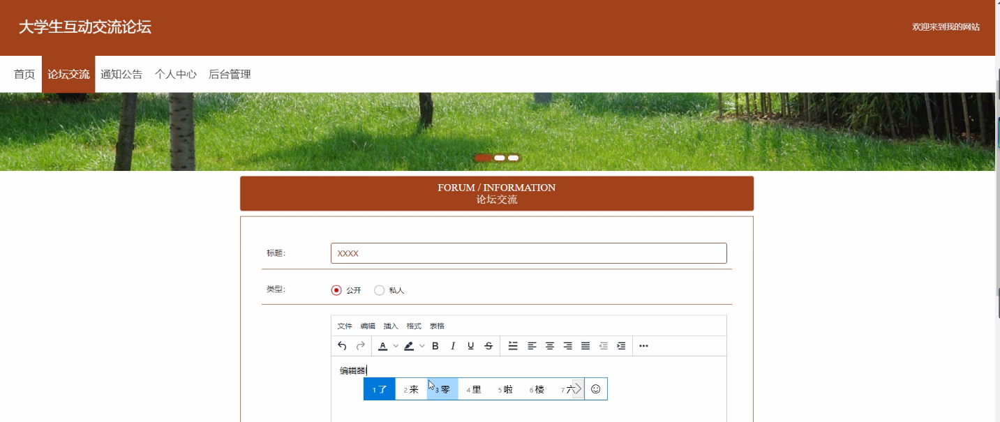

****本项目包含程序+源码+数据库+LW+调试部署环境，文末可获取一份本项目的java源码和数据库参考。****

## ******开题报告******

研究背景：
随着互联网的快速发展和普及，大学生互动交流论坛作为一种重要的网络社交平台，已经成为大学生们广泛参与的重要场所。在这个论坛上，大学生们可以分享自己的学习、生活经验，交流思想观点，寻求帮助和建议。然而，随之而来的是一系列问题，如信息质量不高、言论不当、敏感词汇的滥用等，给论坛的健康发展带来了一定的挑战。

研究意义：
针对大学生互动交流论坛存在的问题，进行深入研究具有重要的现实意义。首先，通过研究可以提高大学生互动交流论坛的管理水平，保证论坛信息的准确性和可靠性，提升用户体验。其次，研究可以促进大学生们更加理性地表达自己的观点，增强他们的批判思维和辨别能力。最后，研究还可以为相关政府部门和社会组织提供参考，制定更加科学合理的管理措施，推动网络社交平台的良性发展。

研究目的：
本研究旨在探索大学生互动交流论坛中的问题，并提出相应的解决方案，以促进论坛的健康发展。具体目标包括：1.分析大学生互动交流论坛存在的问题和挑战；2.研究用户管理和敏感词管理等系统功能的设计与实施；3.提出针对问题的解决方案，改善论坛的管理和用户体验。

研究内容： 本研究将重点围绕大学生互动交流论坛的用户管理和敏感词管理等系统功能展开研究。具体内容包括：

  1. 用户管理：研究如何建立有效的用户管理机制，包括用户注册、身份验证、权限管理等方面。通过合理的用户管理，可以筛选出高质量的用户，提高论坛信息的可信度和准确性。

  2. 敏感词管理：研究如何设计和实施敏感词管理系统，及时过滤和处理论坛中存在的敏感词汇。通过敏感词管理，可以有效防止不良信息的传播，维护论坛的良好氛围。

拟解决的主要问题：
本研究拟解决的主要问题包括：1.大学生互动交流论坛中信息质量不高的问题；2.言论不当和敏感词汇滥用的问题；3.用户管理和权限控制不完善的问题。

研究方案：
本研究将采用文献研究、实地调查、问卷调查等方法，对大学生互动交流论坛进行全面深入的调研。在此基础上，结合相关理论和技术，提出相应的解决方案，并进行系统设计与实施。同时，还将通过实验和数据分析，评估解决方案的有效性和可行性。

预期成果：
本研究的预期成果包括：1.针对大学生互动交流论坛存在的问题，提出相应的解决方案，改善论坛的管理和用户体验；2.设计和实施用户管理和敏感词管理等系统功能，提高论坛信息的准确性和可靠性；3.为相关政府部门和社会组织提供参考，推动网络社交平台的良性发展。

进度安排：

2022年9月至10月：开题报告编写和提交，完成开题报告的撰写并提交给指导教师进行审核。

2022年11月至2023年1月：系统设计和开发，根据开题报告的要求，进行系统设计和编码工作。

2023年2月至3月：论文撰写和初稿完成，开始撰写论文，并在这个阶段完成论文的初稿。

2023年4月至5月：论文修改和最终定稿，根据指导教师的意见对论文进行修改，并完成最终的定稿。

2023年5月：论文答辩和提交，参加论文答辩并根据答辩结果进行修改，最后将论文提交给学院或学校。

参考文献：

[1]喻佳,吴丹新.基于SpringBoot的Web快速开发框架[J].电脑编程技巧与维护,2021,(09):31-33.

[2]李鹏.基于SpringBoot快速开发平台的实现[J].电子技术与软件工程,2021,(12):36-37.

[3]叶开平,蔡维晟,陈家敏,邓斯妮.基于SpringBoot的综测可视化管理系统的研究与设计[J].电脑知识与技术,2021,(12):100-104.

[4]江健锋,徐振平.Springboot最小系统的设计与实现[J].电脑知识与技术,2021,(04):62-63.

[5]赵炯,司圣杰,周奇才,熊肖磊.通用信息获取系统设计与实现[J].起重运输机械,2020,(16):89-97.

[6]吴英宾.一种内外网数据交互系统的设计与实现[J].软件工程,2020,(08):25-27.

****以上是本项目程序开发之前开题报告内容，最终成品以下面界面为准，大家可以酌情参考使用。要源码参考请在文末进行获取！！****

## ******本项目的界面展示******

