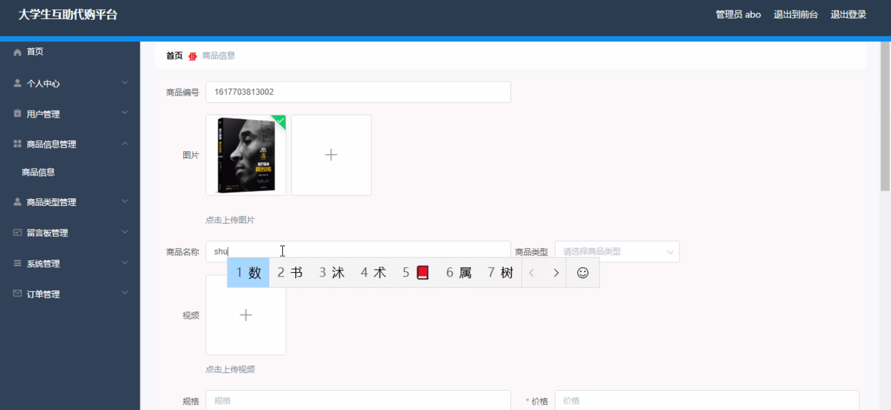

****本项目包含程序+源码+数据库+LW+调试部署环境，文末可获取一份本项目的java源码和数据库参考。****

## ******开题报告******

研究背景：
随着互联网的快速发展和普及，电子商务已经成为了人们购物的主要方式之一。然而，在大学生群体中，由于经济条件有限以及时间和精力的限制，很多大学生并没有充分利用电子商务平台进行购物。同时，大学生之间也存在着相互帮助的需求，例如代购、团购等。因此，建立一个专门针对大学生的互助代购平台具有重要的现实意义。

研究意义：
大学生互助代购平台的建立可以满足大学生在购物方面的需求，提供更加便捷、高效的购物方式。通过这个平台，大学生可以相互协助，共同解决购物中遇到的问题，如价格比较、商品选择等。同时，这个平台也可以促进大学生之间的交流和合作，增强彼此之间的社交网络。

研究目的：
本研究旨在探索大学生互助代购平台的建立与应用，通过分析用户需求和行为，设计出适合大学生群体的功能模块，并提供相应的解决方案。通过这个平台，大学生可以方便地进行代购、团购等活动，提高购物的效率和满意度。

研究内容：
本研究的主要内容包括用户、商品信息和商品类型等系统功能。首先，我们将分析大学生在购物过程中的需求和行为特点，设计出符合其需求的用户功能模块。其次，我们将建立商品信息数据库，包括商品的名称、价格、品牌、产地等信息，并提供搜索和筛选功能，方便用户查找所需商品。最后，我们将对商品进行分类，根据不同的商品类型提供相应的推荐和评价功能，帮助用户做出更加明智的购物决策。

拟解决的主要问题：

  1. 大学生购物过程中存在信息不对称的问题，如何提供准确、全面的商品信息？
  2. 大学生之间存在信任问题，如何建立起可靠的互助代购关系？
  3. 大学生购物需求多样化，如何根据个性化需求提供定制化的服务？

研究方案：
本研究将采用问卷调查、访谈和实地观察等方法，收集大学生在购物过程中的需求和行为数据。基于这些数据，我们将设计和开发大学生互助代购平台的功能模块，并进行系统测试和优化。同时，我们还将与大学生群体进行合作，收集他们的反馈意见，并根据反馈意见不断改进平台的功能和用户体验。

预期成果：
通过本研究，我们预计可以建立一个适用于大学生的互助代购平台，满足大学生在购物方面的需求。该平台将提供准确、全面的商品信息，帮助大学生做出明智的购物决策。同时，该平台还将促进大学生之间的交流和合作，增强彼此之间的社交网络。预计该平台的应用将极大地提高大学生的购物效率和满意度，为大学生提供更好的购物体验。

进度安排：

2022年9月至10月：需求分析和规划，进行用户需求调研和分析，确定系统功能和目标。

2022年11月至2023年1月：系统设计和开发，完成系统架构设计和技术选型，并开始编写代码。

2023年2月至3月：测试和优化，进行单元测试和集成测试，修复问题并优化系统性能。

2023年4月至5月：文档编写和培训，编写用户手册和系统文档，并进行相关人员的培训。

2023年5月：上线部署和维护，将系统部署到生产环境中，并定期进行维护和升级。

参考文献：

[1]王振华.SpringBoot在教学效果评估系统中的应用[J].电子技术,2023,(05):67-69.

[2]王明泉.基于SpringBoot远程热部署的探索和应用[J].信息与电脑(理论版),2023,(07):1-4.

[3]王亚东,李晓霞,陈强强,剡美娜.基于SpringBoot的需求发布平台设计[J].信息与电脑(理论版),2023,(01):105-107.

[4]陈新府豪.基于SpringBoot和Vue框架的创新方法推理系统的设计与实现[D].导师：黄静.浙江理工大学,2022.

[5]霍福华,韩慧.基于SpringBoot微服务架构下前后端分离的MVVM模型[J].电子技术与软件工程,2022,(01):73-76.

[6]韩策,张娜,王松亭,张凯,何方,袁峰.SpringBoot OPC客户端设计与研究[J].电子世界,2021,(19):25-26.

****以上是本项目程序开发之前开题报告内容，最终成品以下面界面为准，大家可以酌情参考使用。要源码参考请在文末进行获取！！****

## ******本项目的界面展示******

