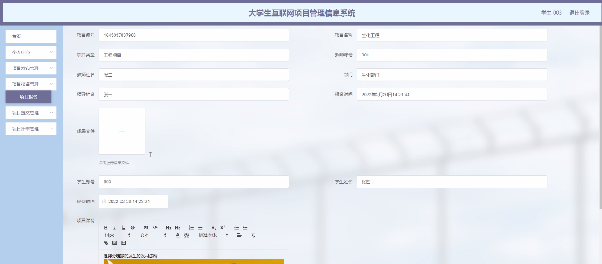

****本项目包含程序+源码+数据库+LW+调试部署环境，文末可获取一份本项目的java源码和数据库参考。****

## ******开题报告******

研究背景：
随着互联网的快速发展和普及，大学生互联网项目管理信息系统在高校中得到了广泛应用。传统的项目管理方式存在着信息不对称、流程繁琐、效率低下等问题，无法满足大学生项目管理的需求。因此，开发一个针对大学生互联网项目管理的信息系统具有重要的现实意义。

研究意义：
大学生互联网项目管理信息系统的建立可以提高大学生项目管理的效率和质量，促进大学生创新创业能力的培养。通过系统化的管理和协同工作，可以更好地整合资源，提高项目的可行性和成功率。同时，该系统还可以为学生提供更多的交流和学习机会，促进跨学科合作和知识共享。

研究目的：
本研究旨在设计和开发一种适用于大学生互联网项目管理的信息系统，以解决传统项目管理方式存在的问题，并提高大学生项目管理的效率和质量。通过该系统，可以实现项目信息的集中管理、流程的规范化、任务的分配与跟踪、团队协作与沟通等功能，从而提升大学生项目管理的水平和能力。

研究内容：
本研究的主要内容包括以下系统功能：学生管理、教师管理、评审专家管理、部门领导管理、项目发布、项目报名、项目提交、项目评审等。通过对这些功能的设计和实现，可以实现项目信息的录入与查询、任务的分配与跟踪、团队协作与沟通等操作，从而提高大学生互联网项目管理的效率和质量。

拟解决的主要问题：

  1. 传统项目管理方式存在信息不对称、流程繁琐等问题，如何通过信息系统来解决这些问题？
  2. 如何实现项目信息的集中管理、流程的规范化、任务的分配与跟踪、团队协作与沟通等功能，以提高大学生项目管理的效率和质量？
  3. 如何设计一个用户友好、易于操作的大学生互联网项目管理信息系统，满足用户的需求并提升用户体验？

研究方案：
本研究将采用软件工程的方法，结合需求分析、系统设计、系统开发和系统测试等步骤，设计和开发一种适用于大学生互联网项目管理的信息系统。在需求分析阶段，将充分了解用户需求，并根据需求进行系统设计；在系统开发阶段，将采用合适的开发工具和技术进行系统实现；在系统测试阶段，将对系统进行全面的功能测试和性能测试，确保系统的稳定性和可靠性。

预期成果：
通过本研究，预期可以设计和开发一种适用于大学生互联网项目管理的信息系统，实现项目信息的集中管理、流程的规范化、任务的分配与跟踪、团队协作与沟通等功能。该系统将提高大学生项目管理的效率和质量，促进大学生创新创业能力的培养，并为学生提供更多的交流和学习机会。同时，该系统的成功应用还将为其他高校和相关领域的项目管理提供借鉴和参考。

进度安排：

2022年9月至10月：需求分析和规划，明确系统功能和目标，制定项目计划。

2022年11月至2023年1月：系统设计和编码，完成详细的系统设计并开始编写代码。

2023年2月至3月：用户界面开发和数据库开发，开发用户友好的界面和设计数据库结构。

2023年4月至5月：功能测试、文档编写和上线部署，对系统进行全面的功能测试并编写用户手册。

2023年5月：维护和升级，定期对系统进行维护和升级，修复bug和添加新功能。

参考文献：

[1]邱小群,邓丽艳,陈海潮.基于B/S的信息管理系统设计和实现[J].信息与电脑(理论版),2022,(20):146-148.

[2]谢霜.基于Java技术的网络管理体系结构的应用[J].网络安全技术与应用,2022,(10):14-15.

[3]宋锦华.高职院校Java程序设计课程改革研究[J].科技视界,2022,(20):133-135.

[4]曹嵩彭,王鹏宇.浅析Java语言在软件开发中的应用[J].信息记录材料,2022,(03):114-116.

[5]朱澈,余俊达.武汉东湖学院.基于Java的软硬件信息管理系统V1.0[Z].项目立项编号.鉴定单位.鉴定日期:

****以上是本项目程序开发之前开题报告内容，最终成品以下面界面为准，大家可以酌情参考使用。要源码参考请在文末进行获取！！****

## ******本项目的界面展示******

