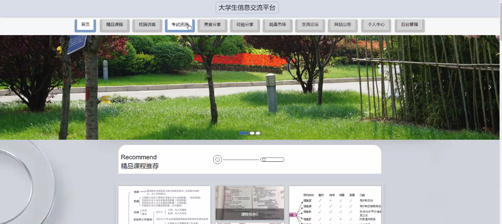
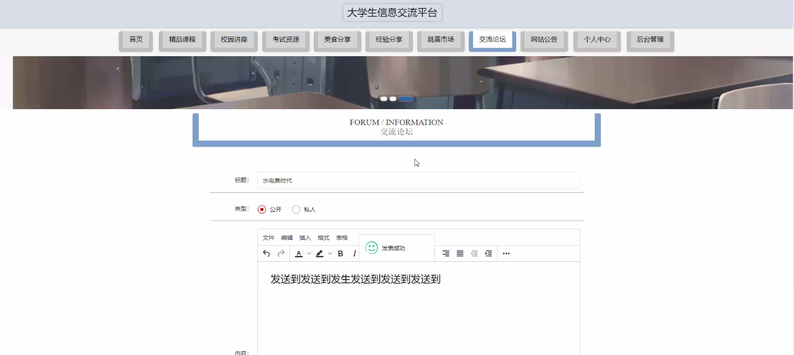
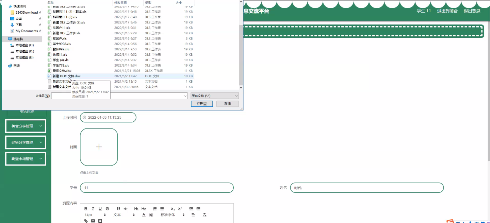
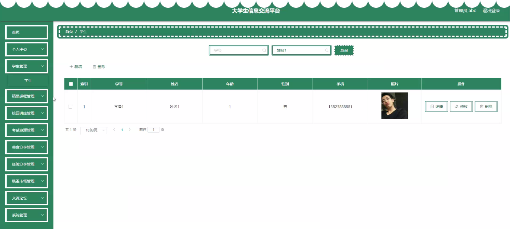
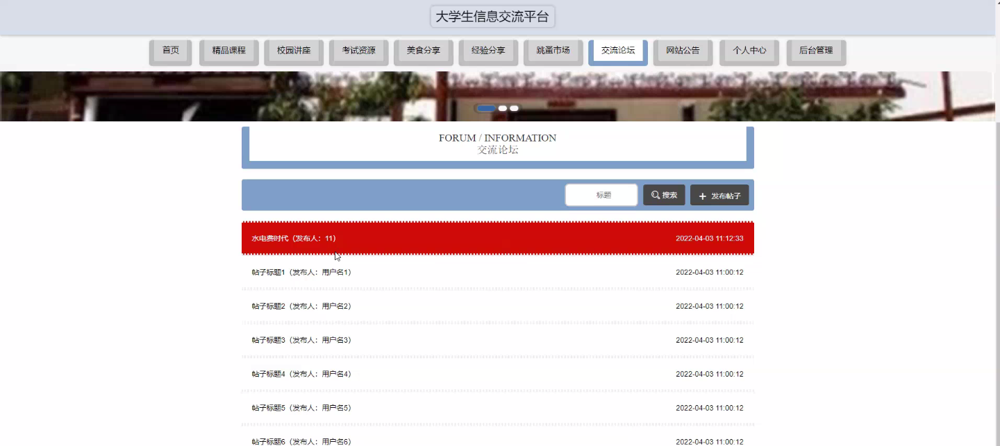
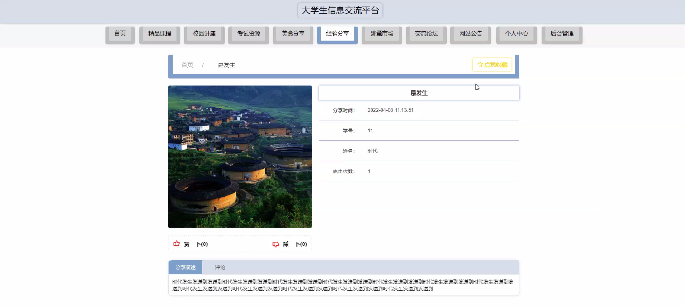
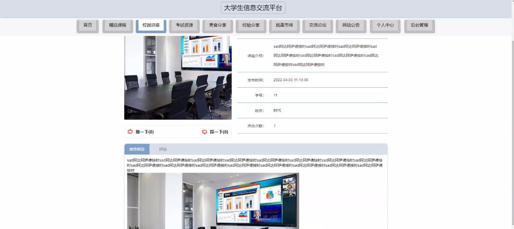
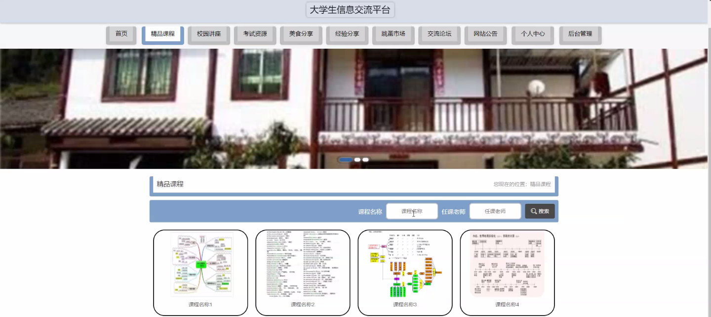

****本项目包含程序+源码+数据库+LW+调试部署环境，文末可获取一份本项目的java源码和数据库参考。****

## ******开题报告******

研究背景：
随着大学生人数的不断增加，信息交流成为大学生们日常生活中必不可少的一部分。然而，传统的信息交流方式存在诸多问题，如信息不对称、信息获取困难等。因此，建立一个大学生信息交流平台具有重要的现实意义。

研究意义：
大学生信息交流平台的建立可以有效地解决大学生们在信息获取和交流方面的困扰。通过该平台，学生们可以快速获取到各类信息，如精品课程、校园讲座、考试资源、美食分享、经验分享以及跳蚤市场等。这将极大地提高学生们的信息获取效率，丰富他们的校园生活。

研究目的：
本研究旨在设计并构建一个大学生信息交流平台，以满足大学生们在信息获取和交流方面的需求。通过该平台，学生们可以方便地获取到各类信息，并与其他同学进行交流和分享。同时，该平台也将为学校提供一个良好的信息交流平台，促进学校内部的信息共享和合作。

研究内容：
本研究的主要内容包括以下系统功能：学生、精品课程、校园讲座、考试资源、美食分享、经验分享和跳蚤市场。其中，学生功能旨在提供学生们的个人信息和联系方式，方便他们之间的交流和互动；精品课程功能旨在收集和展示优质的课程资源，帮助学生们选择适合自己的课程；校园讲座功能旨在发布和推广校内外的讲座活动信息；考试资源功能旨在整理和分享各类考试资料和经验；美食分享功能旨在推荐和分享校园周边的美食信息；经验分享功能旨在学生们之间分享学习、生活等方面的经验；跳蚤市场功能旨在提供一个二手物品交易平台，方便学生们出售和购买物品。

拟解决的主要问题：
通过建立大学生信息交流平台，本研究旨在解决以下问题：一是学生们在信息获取方面存在的困难和不便；二是学生们之间信息交流的不畅和不便；三是学校内部信息共享和合作的不足。

研究方案和预期成果：
本研究将采用系统设计与开发的方法，结合用户需求调研和技术实现，构建一个功能完善、易用性强的大学生信息交流平台。预期成果包括：一是建立一个覆盖多个系统功能的大学生信息交流平台；二是提高学生们的信息获取效率和交流便利性；三是促进学校内部的信息共享和合作。通过该平台的建立和应用，预计能够有效提升大学生们的信息交流体验，丰富他们的校园生活。

进度安排：

2022年9月至10月：开题报告编写和提交，完成开题报告的撰写并提交给指导教师进行审核。

2022年11月至2023年1月：系统设计和开发，根据开题报告的要求，进行系统设计和编码工作。

2023年2月至3月：论文撰写和初稿完成，开始撰写论文，并在这个阶段完成论文的初稿。

2023年4月至5月：论文修改和最终定稿，根据指导教师的意见对论文进行修改，并完成最终的定稿。

2023年5月：论文答辩和提交，参加论文答辩并根据答辩结果进行修改，最后将论文提交给学院或学校。

参考文献：

[1]喻佳,吴丹新.基于SpringBoot的Web快速开发框架[J].电脑编程技巧与维护,2021,(09):31-33.

[2]李鹏.基于SpringBoot快速开发平台的实现[J].电子技术与软件工程,2021,(12):36-37.

[3]叶开平,蔡维晟,陈家敏,邓斯妮.基于SpringBoot的综测可视化管理系统的研究与设计[J].电脑知识与技术,2021,(12):100-104.

[4]江健锋,徐振平.Springboot最小系统的设计与实现[J].电脑知识与技术,2021,(04):62-63.

[5]赵炯,司圣杰,周奇才,熊肖磊.通用信息获取系统设计与实现[J].起重运输机械,2020,(16):89-97.

[6]吴英宾.一种内外网数据交互系统的设计与实现[J].软件工程,2020,(08):25-27.

****以上是本项目程序开发之前开题报告内容，最终成品以下面界面为准，大家可以酌情参考使用。要源码参考请在文末进行获取！！****

## ******本项目的界面展示******

