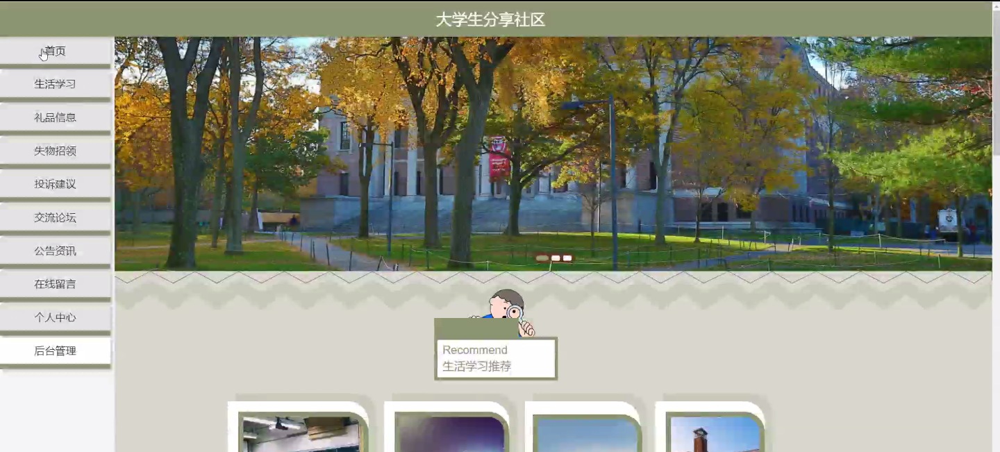
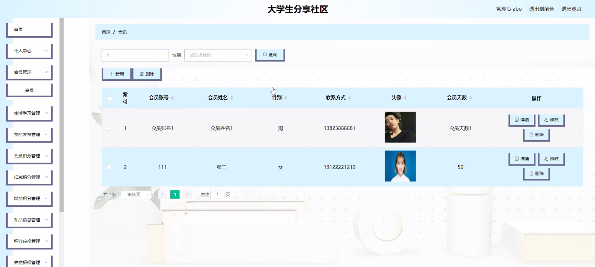
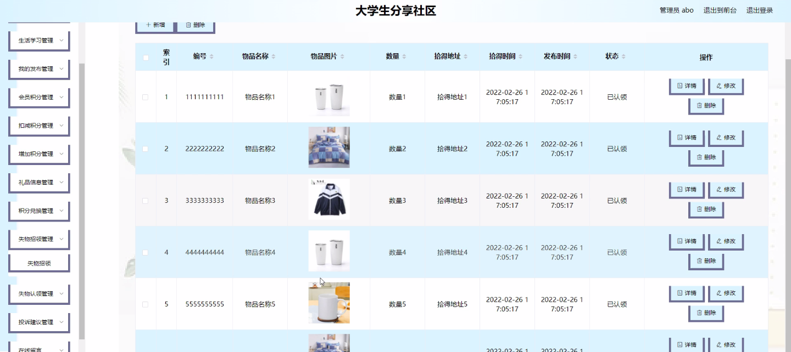
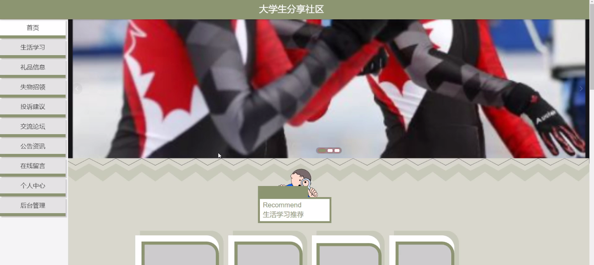
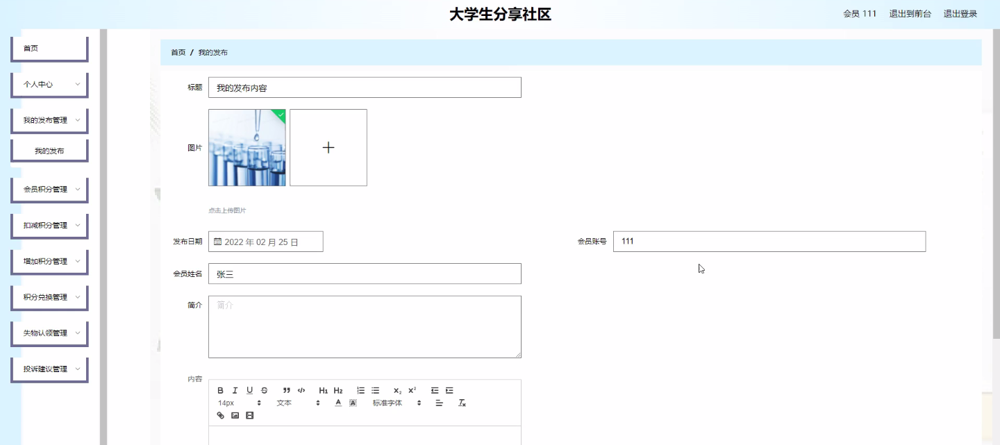
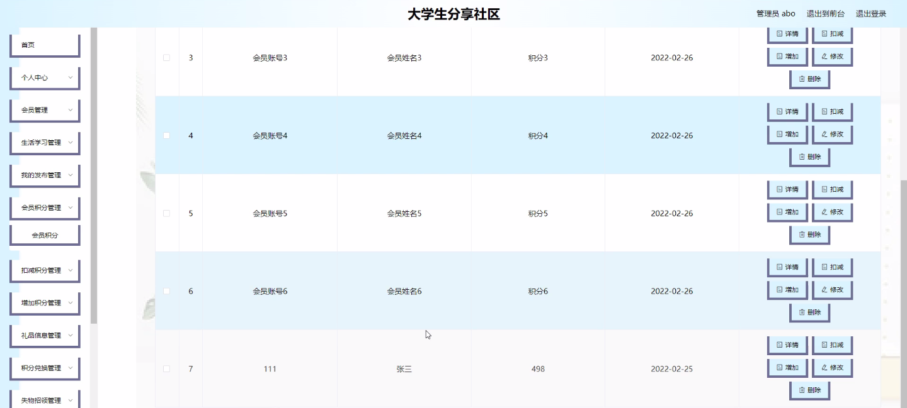
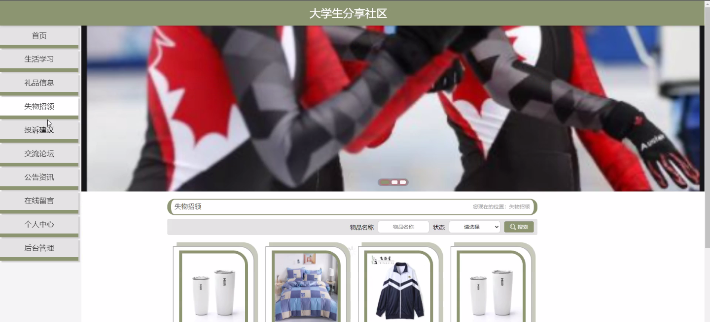

****本项目包含程序+源码+数据库+LW+调试部署环境，文末可获取一份本项目的java源码和数据库参考。****

## ******开题报告******

研究背景：
随着互联网的快速发展和普及，大学生分享社区逐渐成为了大学生们交流、分享和获取信息的重要平台。在这个社区中，大学生可以发布自己的学习心得、生活经验、失物招领等信息，并与其他大学生进行互动和交流。然而，目前存在一些问题，如会员积分管理不规范、系统功能不完善等，这些问题影响了大学生分享社区的正常运行和用户体验。

研究意义：
通过对大学生分享社区的研究，可以进一步提升社区的服务质量和用户体验，满足大学生们的需求，促进他们之间的交流和共享。同时，研究还可以为相关企业和组织提供参考，帮助他们改进现有的社区平台或开发新的社区产品，推动大学生分享社区的发展。

研究目的： 本研究旨在深入探讨大学生分享社区的运营模式和用户需求，分析现有社区平台存在的问题，并提出相应的解决方案，以期改善社区的功能和服务，提升用户体验。

研究内容： 本研究将围绕大学生分享社区的系统功能展开研究，主要包括以下方面：

  1. 会员管理：分析现有社区平台的会员管理机制，探讨如何提升会员服务质量和用户黏性。

  2. 生活学习：研究社区中关于生活和学习的信息发布和交流方式，探索如何提供更丰富、实用的内容。

  3. 我的发布：分析用户在社区中发布信息的需求和行为特点，优化发布功能，提高信息传播效果。

  4. 会员积分：研究社区中的积分管理机制，探讨如何合理设置积分规则，激励用户参与社区活动。

  5. 礼品信息和积分兑换：研究社区中的礼品信息发布和积分兑换机制，提出改进方案，增加用户参与度。

  6. 失物招领和认领：分析社区中失物招领和认领的情况，探讨如何提高失物归还率和认领成功率。

  7. 投诉建议：研究社区中用户投诉和建议的处理方式，提出改进措施，增强用户满意度。

拟解决的主要问题：
本研究旨在解决大学生分享社区存在的问题，如会员管理不规范、系统功能不完善、用户体验不佳等。通过对现有社区平台的分析和用户需求的调研，提出相应的解决方案，以期改进社区的运营模式和服务质量。

研究方案和预期成果：
本研究将采用文献研究、问卷调查、访谈等方法进行数据收集和分析，结合实际案例和专家意见，提出针对性的改进方案。预期成果包括优化的会员管理机制、完善的系统功能、提升的用户体验等，从而推动大学生分享社区的发展和进步。

进度安排：

2022年9月至10月：需求分析和规划，进行用户需求调研和分析，确定系统功能和目标。

2022年11月至2023年1月：系统设计和开发，完成系统架构设计和技术选型，并开始编写代码。

2023年2月至3月：测试和优化，进行单元测试和集成测试，修复问题并优化系统性能。

2023年4月至5月：文档编写和培训，编写用户手册和系统文档，并进行相关人员的培训。

2023年5月：上线部署和维护，将系统部署到生产环境中，并定期进行维护和升级。

参考文献：

[1]王振华.SpringBoot在教学效果评估系统中的应用[J].电子技术,2023,(05):67-69.

[2]王明泉.基于SpringBoot远程热部署的探索和应用[J].信息与电脑(理论版),2023,(07):1-4.

[3]王亚东,李晓霞,陈强强,剡美娜.基于SpringBoot的需求发布平台设计[J].信息与电脑(理论版),2023,(01):105-107.

[4]陈新府豪.基于SpringBoot和Vue框架的创新方法推理系统的设计与实现[D].导师：黄静.浙江理工大学,2022.

[5]霍福华,韩慧.基于SpringBoot微服务架构下前后端分离的MVVM模型[J].电子技术与软件工程,2022,(01):73-76.

[6]韩策,张娜,王松亭,张凯,何方,袁峰.SpringBoot OPC客户端设计与研究[J].电子世界,2021,(19):25-26.

****以上是本项目程序开发之前开题报告内容，最终成品以下面界面为准，大家可以酌情参考使用。要源码参考请在文末进行获取！！****

## ******本项目的界面展示******

