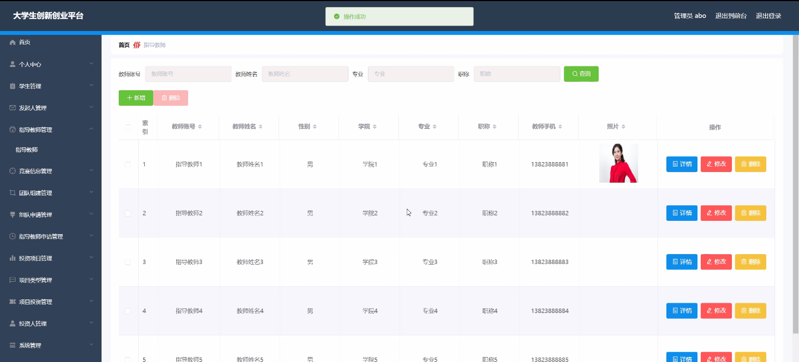

****本项目包含程序+源码+数据库+LW+调试部署环境，文末可获取一份本项目的java源码和数据库参考。****

## ******开题报告******

研究背景：
随着社会的发展和经济的进步，创新创业已成为大学生求职就业的重要方式之一。然而，目前大学生创新创业面临着一些问题，如信息不对称、资源匮乏、团队组建困难等。因此，建立一个大学生创新创业平台是十分必要的。

研究意义：
大学生创新创业平台的建立有着重要的意义。首先，它可以提供给大学生一个全面的创新创业信息平台，帮助他们了解最新的竞赛信息、项目投资等相关信息。其次，通过该平台，大学生可以方便地找到合适的团队成员，共同组建团队并开展创新创业项目。最后，该平台还可以提供指导教师申请、投资项目等功能，为大学生创新创业提供更多的支持和资源。

研究目的：
本研究旨在设计和开发一个大学生创新创业平台，以解决大学生创新创业过程中遇到的问题，并提供便捷的服务和资源。通过该平台，大学生可以更加高效地获取创新创业信息，找到合适的团队成员，申请指导教师的支持，并获得项目投资等资源。

研究内容：
本研究的主要内容是设计和开发一个大学生创新创业平台，其中包括以下系统功能：学生功能、发起人功能、指导教师功能、竞赛信息功能、团队组建功能、组队申请功能、指导教师申请功能、投资项目功能、项目类型功能、项目投资功能、投资人功能等。通过这些功能的设计和实现，可以满足大学生在创新创业过程中的各种需求。

拟解决的主要问题：
该平台旨在解决大学生创新创业过程中的一系列问题，包括信息不对称、资源匮乏、团队组建困难等。通过提供全面的创新创业信息、便捷的团队组建和指导教师申请服务，以及项目投资等资源，可以帮助大学生更好地开展创新创业活动。

研究方案和预期成果：
本研究将采用设计科学的方法，结合用户需求调研和技术实现，设计和开发一个大学生创新创业平台。预期成果包括一个功能完善、操作简便的平台系统，能够满足大学生在创新创业过程中的各种需求。通过该平台的使用，预期可以提高大学生创新创业的效率和成功率，促进创新创业教育的发展。

进度安排：

2022年9月至10月：需求分析和规划，进行用户需求调研和分析，确定系统功能和目标。

2022年11月至2023年1月：系统设计和开发，完成系统架构设计和技术选型，并开始编写代码。

2023年2月至3月：测试和优化，进行单元测试和集成测试，修复问题并优化系统性能。

2023年4月至5月：文档编写和培训，编写用户手册和系统文档，并进行相关人员的培训。

2023年5月：上线部署和维护，将系统部署到生产环境中，并定期进行维护和升级。

参考文献：

[1]王振华.SpringBoot在教学效果评估系统中的应用[J].电子技术,2023,(05):67-69.

[2]王明泉.基于SpringBoot远程热部署的探索和应用[J].信息与电脑(理论版),2023,(07):1-4.

[3]王亚东,李晓霞,陈强强,剡美娜.基于SpringBoot的需求发布平台设计[J].信息与电脑(理论版),2023,(01):105-107.

[4]陈新府豪.基于SpringBoot和Vue框架的创新方法推理系统的设计与实现[D].导师：黄静.浙江理工大学,2022.

[5]霍福华,韩慧.基于SpringBoot微服务架构下前后端分离的MVVM模型[J].电子技术与软件工程,2022,(01):73-76.

[6]韩策,张娜,王松亭,张凯,何方,袁峰.SpringBoot OPC客户端设计与研究[J].电子世界,2021,(19):25-26.

****以上是本项目程序开发之前开题报告内容，最终成品以下面界面为准，大家可以酌情参考使用。要源码参考请在文末进行获取！！****

## ******本项目的界面展示******

