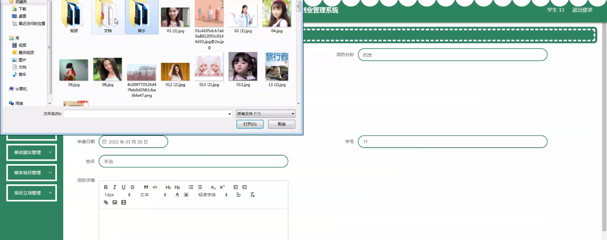
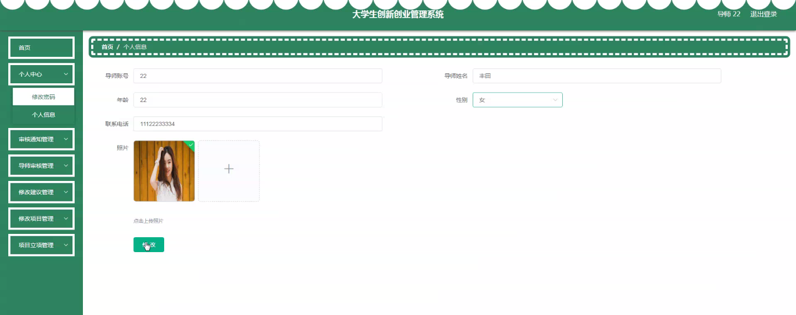
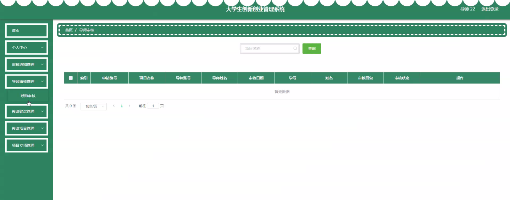
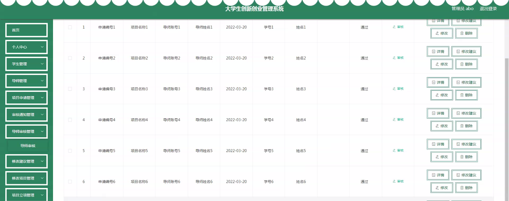
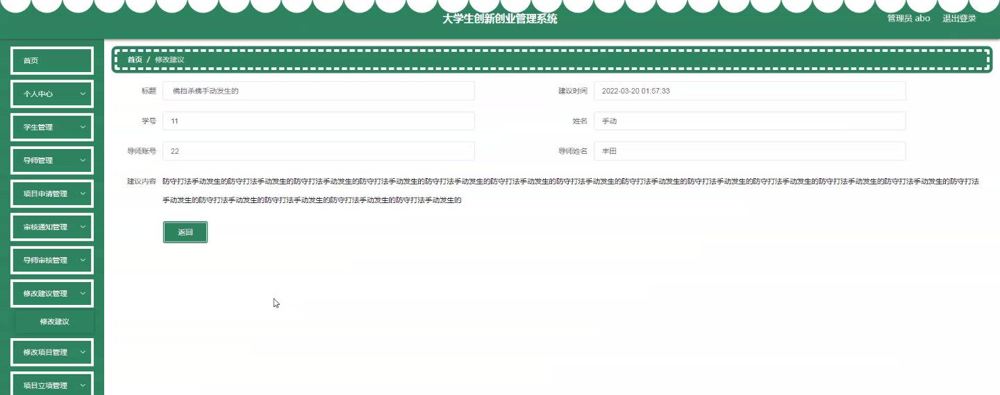
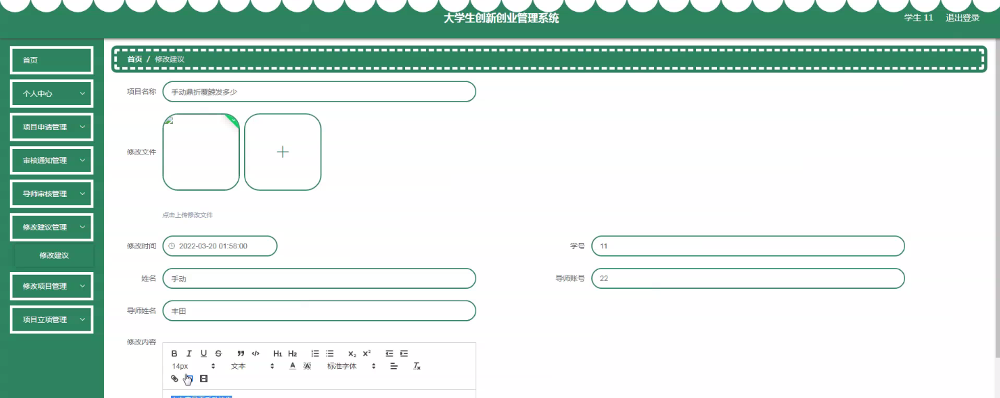

****本项目包含程序+源码+数据库+LW+调试部署环境，文末可获取一份本项目的java源码和数据库参考。****

## ******开题报告******

研究背景：
随着社会的发展和经济的进步，创新创业已成为推动国家发展的重要力量。尤其是在大学生群体中，创新创业意识逐渐增强，越来越多的大学生积极参与到创新创业活动中。然而，目前大学生创新创业管理仍存在一些问题，如信息不对称、资源匮乏、管理混乱等，这给大学生的创新创业活动带来了一定的困扰。

研究意义：
针对大学生创新创业管理中存在的问题，建立一个科学有效的管理系统具有重要的意义。通过该系统，可以提供全面的信息支持，促进学生与导师之间的沟通与合作，规范项目申请和审核流程，提高创新创业项目的质量和效益。同时，该系统还能够为大学生提供更多的机会和平台，激发他们的创新创业潜能，培养创新创业能力，为社会经济发展注入新的活力。

研究目的：
本研究旨在设计和开发一套大学生创新创业管理系统，以解决目前存在的问题，并提供更好的支持和服务。通过该系统，可以实现学生、导师、项目申请、审核通知、导师审核、修改建议、项目立项、修改项目等多个功能模块的协同工作，从而提高创新创业管理的效率和质量。

研究内容： 本研究的主要内容是基于大学生创新创业管理系统的设计与开发。根据系统功能需求，主要包括以下几个方面：

  1. 学生模块：为学生提供注册、登录、个人信息管理等功能，使其能够方便地参与到创新创业活动中。
  2. 导师模块：为导师提供注册、登录、指导学生、审核项目等功能，促进导师与学生之间的有效沟通与合作。
  3. 项目申请模块：学生可以在该模块中提交创新创业项目申请，填写相关信息并上传必要的材料。
  4. 审核通知模块：系统将自动发送审核通知给相关人员，提醒他们及时处理待审核的项目申请。
  5. 导师审核模块：导师可以在该模块中对学生提交的项目进行审核，并提出修改建议或意见。
  6. 修改建议模块：学生可以根据导师的审核意见对项目进行修改，并重新提交审核。
  7. 项目立项模块：经过审核通过的项目将在该模块中进行立项，为学生提供后续的支持和服务。
  8. 修改项目模块：已立项的项目可以在该模块中进行修改，以适应实际情况的变化。

拟解决的主要问题：
通过设计和开发大学生创新创业管理系统，旨在解决目前大学生创新创业活动中存在的信息不对称、资源匮乏、管理混乱等问题。通过系统的协同工作，可以提供全面的信息支持，促进学生与导师之间的沟通与合作，规范项目申请和审核流程，从而提高创新创业项目的质量和效益。

研究方案和预期成果：
本研究将采用软件工程的方法，结合需求分析、系统设计和编码实现等技术手段，设计和开发大学生创新创业管理系统。预期成果包括一个功能完善、界面友好、操作简便的系统原型，并进行相应的测试和优化。该系统将能够有效地支持大学生创新创业活动，提高管理效率和质量，为大学生的创新创业提供更好的支持和服务。

进度安排：

2022年9月至10月：需求分析和规划，明确系统功能和目标，制定项目计划。

2022年11月至2023年1月：系统设计和编码，完成详细的系统设计并开始编写代码。

2023年2月至3月：用户界面开发和数据库开发，开发用户友好的界面和设计数据库结构。

2023年4月至5月：功能测试、文档编写和上线部署，对系统进行全面的功能测试并编写用户手册。

2023年5月：维护和升级，定期对系统进行维护和升级，修复bug和添加新功能。

参考文献：

[1]邱小群,邓丽艳,陈海潮.基于B/S的信息管理系统设计和实现[J].信息与电脑(理论版),2022,(20):146-148.

[2]谢霜.基于Java技术的网络管理体系结构的应用[J].网络安全技术与应用,2022,(10):14-15.

[3]宋锦华.高职院校Java程序设计课程改革研究[J].科技视界,2022,(20):133-135.

[4]曹嵩彭,王鹏宇.浅析Java语言在软件开发中的应用[J].信息记录材料,2022,(03):114-116.

[5]朱澈,余俊达.武汉东湖学院.基于Java的软硬件信息管理系统V1.0[Z].项目立项编号.鉴定单位.鉴定日期:

****以上是本项目程序开发之前开题报告内容，最终成品以下面界面为准，大家可以酌情参考使用。要源码参考请在文末进行获取！！****

## ******本项目的界面展示******

