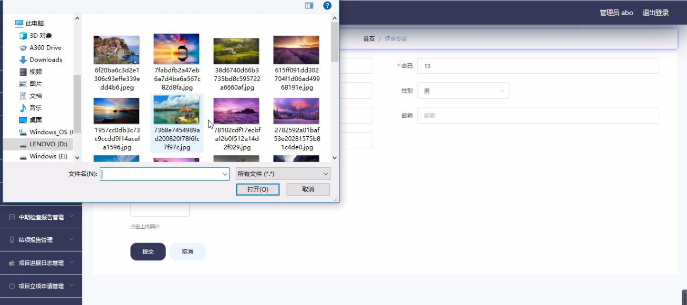
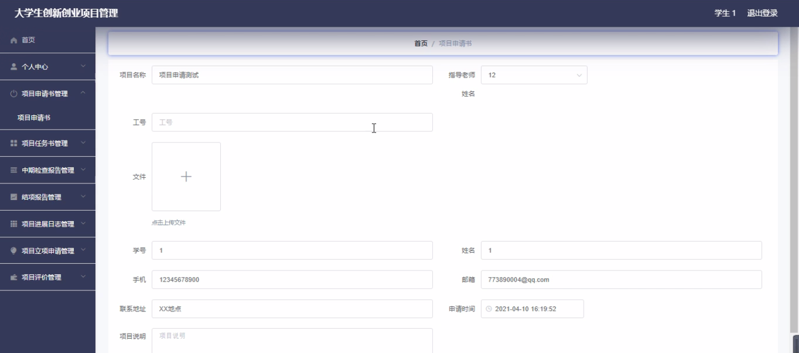
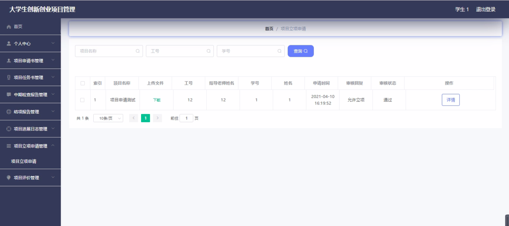
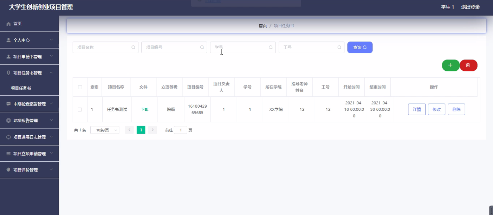
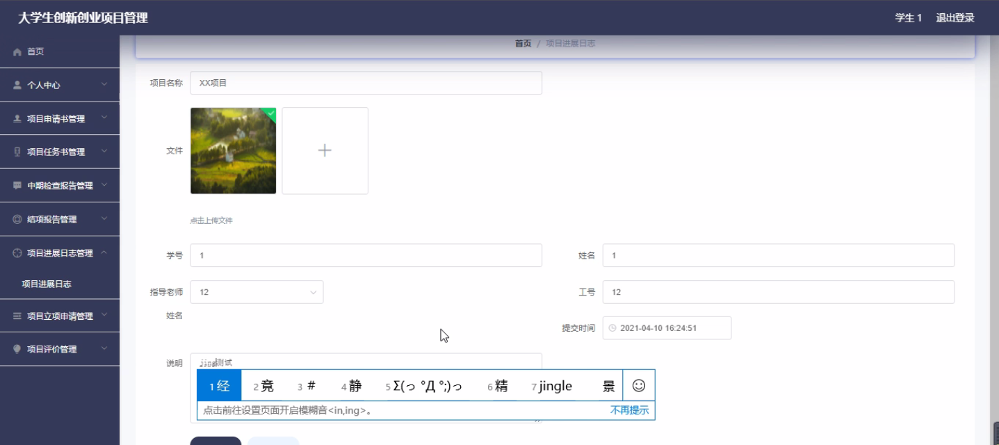
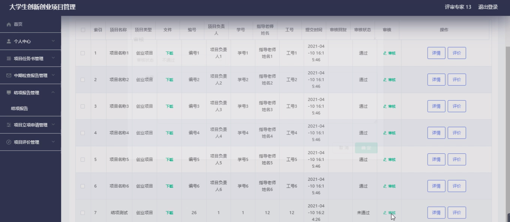

****本项目包含程序+源码+数据库+LW+调试部署环境，文末可获取一份本项目的java源码和数据库参考。****

## ******开题报告******

研究背景：
随着社会的不断发展和进步，大学生创新创业项目管理成为了高校教育中一个重要的组成部分。大学生创新创业项目的培养和管理对于培养学生的创新意识、实践能力以及创业精神具有重要意义。然而，在实际操作中，我们也面临着一些问题，如项目管理过程中的信息共享不畅、任务分配不明确等。因此，开展大学生创新创业项目管理的研究具有重要的现实意义。

研究意义：
本研究旨在通过对大学生创新创业项目管理进行深入研究，探索有效的管理方法和策略，提高项目管理的效率和质量。通过对项目管理中存在的问题进行分析和解决，可以为大学生创新创业项目的顺利进行提供有力的支持，同时也有助于推动大学生创新创业教育的发展。

研究目的：
本研究的目的是建立一个完善的大学生创新创业项目管理体系，提供一套科学、规范的管理模式和方法，以提高项目管理的效率和质量。通过对项目管理中的各个环节进行优化和改进，使得大学生创新创业项目能够更好地发挥其应有的作用，为学生提供更好的创新创业平台。

研究内容：
本研究将重点关注以下系统功能：学生、指导老师、评审专家、项目申请书、项目任务书、中期检查报告、结项报告、项目进展日志、项目立项申请、项目评价等。通过对这些系统功能的分析和研究，我们将探索如何优化和改进这些功能，以提高大学生创新创业项目管理的效率和质量。

拟解决的主要问题：
在大学生创新创业项目管理过程中，存在信息共享不畅、任务分配不明确等问题。本研究旨在通过优化和改进项目管理的各个环节，解决这些问题，提高项目管理的效率和质量。

研究方案：
针对上述问题，我们将采取多种研究方法，包括文献综述、实地调研、案例分析等。通过对现有的管理模式和方法进行总结和归纳，结合实际情况，提出一套科学、规范的大学生创新创业项目管理方案。

预期成果：
本研究的预期成果包括建立一个完善的大学生创新创业项目管理体系，提供一套科学、规范的管理模式和方法。通过优化和改进项目管理的各个环节，提高项目管理的效率和质量，为大学生创新创业项目的顺利进行提供有力的支持，推动大学生创新创业教育的发展。

进度安排：

2022年9月至10月：开题报告编写和提交，完成开题报告的撰写并提交给指导教师进行审核。

2022年11月至2023年1月：系统设计和开发，根据开题报告的要求，进行系统设计和编码工作。

2023年2月至3月：论文撰写和初稿完成，开始撰写论文，并在这个阶段完成论文的初稿。

2023年4月至5月：论文修改和最终定稿，根据指导教师的意见对论文进行修改，并完成最终的定稿。

2023年5月：论文答辩和提交，参加论文答辩并根据答辩结果进行修改，最后将论文提交给学院或学校。

参考文献：

[1]喻佳,吴丹新.基于SpringBoot的Web快速开发框架[J].电脑编程技巧与维护,2021,(09):31-33.

[2]李鹏.基于SpringBoot快速开发平台的实现[J].电子技术与软件工程,2021,(12):36-37.

[3]叶开平,蔡维晟,陈家敏,邓斯妮.基于SpringBoot的综测可视化管理系统的研究与设计[J].电脑知识与技术,2021,(12):100-104.

[4]江健锋,徐振平.Springboot最小系统的设计与实现[J].电脑知识与技术,2021,(04):62-63.

[5]赵炯,司圣杰,周奇才,熊肖磊.通用信息获取系统设计与实现[J].起重运输机械,2020,(16):89-97.

[6]吴英宾.一种内外网数据交互系统的设计与实现[J].软件工程,2020,(08):25-27.

****以上是本项目程序开发之前开题报告内容，最终成品以下面界面为准，大家可以酌情参考使用。要源码参考请在文末进行获取！！****

## ******本项目的界面展示******

